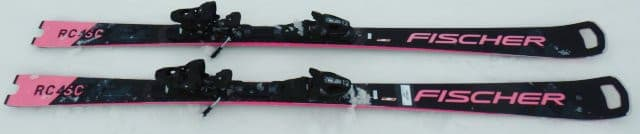
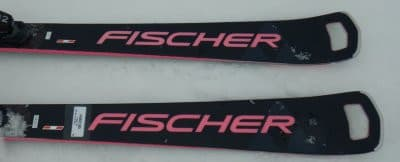
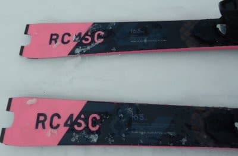
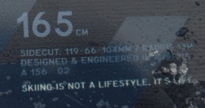
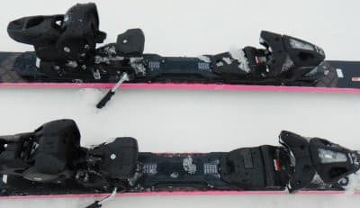

# 2022シーズンモデルのスキー板，試乗レポートその5…FISCHER RC4 Worldcup SC M-track

📅 投稿日時: 2021-06-05 01:58:32

苦難の一週間を終えて，

週末がやってきましたが．

この週末もいろいろやらねばならぬ

ことがあり，スキーには行けない

Skier_Sです．

…まぁ，今行くとすれば月山しか

ないわけですが…

まだ月山はリフトまで滑りこめて，

リフトから板を履いてゲレンデに出られる

ようですね！

今週末までは，おそらくリフト乗り場・

降り場へ板を履いたまま出入りが

出来そうな感じみたいですが．

うーん．

来週，月山に行けるといいなぁ…

そろそろ白い粉を断った禁断症状が…

ううう…白い粉…

白い粉が切れてきた…（はぁはぁ）←そしてだんだん白い粉の上で滑る幻覚を見るようになる

ってなことで．

白い粉の禁断症状と戦いながら．

今日も2022シーズンのスキー板の試乗レポート，

昨日に引き続きフィッシャー編です．

では，どうぞ～！

○FISCHER RC4 Worldcup SC M-track　165cm

基礎小回り用

前回のRCが大回り用でしたが．

こちらのSCは小回り用．

そして，こちらは強いM/Oプレートではなく，

優しいM-trackが着いた，Proじゃないモデルです…

基本的なスペックは2021シーズンからの

キャリーオーバーですが．

カラーバリエーションが変わりました…

2021シーズンも，SCにピンクモデルがありましたが．

2021シーズンはProがイエローorピンクが選べ，

ProじゃないM-trackはイエローしかなかったのに．

2022シーズンは，Proがイエローのみ，

M-trackがイエローorピンクが選べるように

なります…

…つまり，今回試乗したピンクモデルは，

2022シーズンはM-trackしか選べません…

で．

2021シーズンモデルのピンクバージョンは，

FISCHERロゴが白だったけど．

（[この記事](e4e5024053ccc2b9178b5913f1840086c.md)の最後の方に写真あり)

2022シーズンモデルはトップのFISCHER 

ロゴもピンクになって．

ピンク感が増してますね…

ということで．

滑ってみたところ…

これはよくたわんで良く回る！

サイドカーブじゃなく，たわみに

乗って曲がる板．

谷回りですっと板がたわみ，

たわみに沿って小さい半径で

キュンと回ります．

板のエッジのトップからテールまで，

すごく長く使える感じで，

長いエッジが全面に渡りしっかり

雪面を捉える感じ

かといって，ガッツリグリップしすぎて

板を動かせないということは無くて．

ターンの途中でも比較的自由に

板を動かしに行けます．

で．たわんだ際に，メタルの張りと

ばね感を感じますが…

ばね感は，やはり「Pro」の方が

強いですね．

小回り板らしい，元気な早い返りも

あるけど，Proに比べると返りは

優しい感じ．

板のテールの張りもProの方が強く，

ターンからの抜け，走りはProの方が

気持いいけど．

Proはテールの張りと返りが強くて

手ごわい…

という人にはこっちがいいかも．

良くたわむ板だけど，スピードを出しても

板がたわみきってしまう感じは無く．

そこそこのスピードまで耐えてくれますが．

ただ，私がトップスピードを出していくと，

ちょっとテールのグリップが弱いかな…？

圧をかけすぎないようにしていかないと，

テールのグリップがちょっと抜けていく…

と感じる時も．

体重と脚力がある人はProの方を

おススメしますが．

あまりガッツリ体力を使いたくないけど，

そこそこのスピードでぴしっとカービング

ショートを決めたい，

あるいはコブも滑りたい…

という人は，こちらのM-trackがお勧めかな．

いや．

やっぱり最近のFISCHER，いいなぁ…

## 💬 コメント一覧

### 💬 コメント by (Northfox)
**タイトル**: Unknown
**投稿日**: 2021-06-05 09:25:42

私、以前は「ピンクの板なんて履いてらっか！」と拒否反応を示していたのですが、この頃はピンク色も良いなぁと思うようになってきました。

考えてみると野球やサッカーとのユニフォームにもピンクが入っていたり、クルマでもSUBARUのSTIのエンブレムがピンクだったり。

この板もピンクが恰好良いですね。ゲレンデで映えそうです。

...最後の一行は意味深に感じます。物欲の予感が(^^;

### 💬 コメント by (Skier_S)
**タイトル**: ＞Northfoxさま
**投稿日**: 2021-06-06 00:04:35

このFISCHERのピンクの使い方，結構いい感じですよね…！

昨年のFISCHERロゴが白より，来季のロゴがピンクの方がかっこいいかも？

と思ってます…

そして．

やっぱりFISCHERはいいですよね…

え？物欲？

いや，昨年ちゃんとFISCHERのSC買ってますから（笑）

### 💬 コメント by (ゆあの父)
**タイトル**: Unknown
**投稿日**: 2021-06-08 10:25:55

Skier_S様こんにちは。

いつも楽しく読ませていただいております。

久しぶりにスキーを購入しようと思っております。

試乗会には参加出来ていないので、S様の試乗レポートがとっても分かりやすく大変参考になります！ありがとうございます。

今はだいぶ前のVolklプラチナムSCに乗っていますが、もう少ししっかり板が欲しくて、

FICSHER RC4 SC M-trackか、SC Pro M/O Plateにするかですごく迷っています。

M-trackの方が操作性良さそうだから、こっちがいいかなぁ、迷います...。

### 💬 コメント by (Skier_S)
**タイトル**: ＞ゆあの父さま
**投稿日**: 2021-06-09 01:16:52

もしかするとコメント初めてでしたっけ？

コメントありがとうございます．

もう少ししっかりした板が欲しいなら，SC M-trackおススメです！

M/OプレートはちょっとプラチナムSCからだと差が大きすぎるし，

春雪とか荒れた雪での扱いやすさは，M-trackの方が上です．

そして，M-trackの方が安いですから…

M-trackを履いて，この板が物足りない！と思ったら，

その時にM/Oプレートの板に買い替えればよいと

思います…！

### 💬 コメント by (ゆあの父)
**タイトル**: Unknown
**投稿日**: 2021-06-09 17:29:35

コメントへの返信ありがとうございます。

前に一度だけ、コメントしたことありました（ゆあの父ではなく、そらって名前でしたと思います）。

やっぱりM/O Plateだとがっちりしすぎて手ごわそうですね。

柔らかい雪やグサグサの荒れた雪でも滑りますし、扱いやすそうなM-Trackにしようと思います！

Volklの新しいSCに買い替えようか考えていたのですが、同じのもなんですし、だいぶ前からずっとアトミックかFICSHERの板が気になっていました。

FICSHERの板は試乗していないので、ものすごく参考になりました。

思い切って相談してみて本当に良かったです。

ありがとうございました！

### 💬 コメント by (Skier_S)
**タイトル**: ＞ゆあの父さま
**投稿日**: 2021-06-10 02:12:21

もし，スピードを出したカービング性能が欲しいなら，M/Oプレートですが，

コブも柔らかい春雪も新雪も…となると，M-trackのほうがつぶしが効くと思います．

どちらにしろ，FISCHERは強くおススメしておきます．

