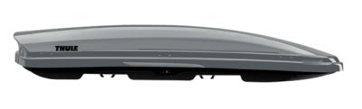

# スキーヤーの必須アイテム・ジェットバッグ

📅 投稿日時: 2011-12-07 01:41:38

🏷️ カテゴリ: [日記](cc4b5682fb7b8b144980957a978653fb0.md)

えー．

マイカー派の本格スキーヤーなら，大体車の屋根に積んでる，

そう．あのルーフボックス．

ルーフボックスでも，THULEのやつは商品名を「ジェットバッグ」って言うので．

普通のルーフボックスも，ジェットバッグって言う人がいますね．たまに．

…でも．

ジェットバッグって聞くと．

私はいつも，あるイメージが脳内に浮かびます．

それは…

こういうイメージだ～っ！

…

しかし．

この画像を作ってみて．

[以前と同じ間違い](http://blog.goo.ne.jp/skier_nobu/e/6c60a46038f281b064b3a453d31fa72f)をしていることに気づきました．

この画像だと…

ジェットバッグじゃなく，ロケットバッグだよ…（涙）．

どーでもいいですけど，ジェットパックっていう[こういうの](http://japanese.engadget.com/2007/06/24/jetpacks-for-sale/)があるらしいですが．
