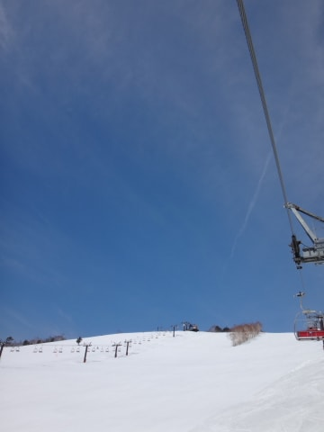
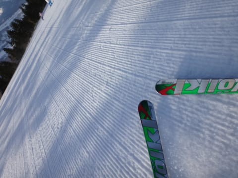
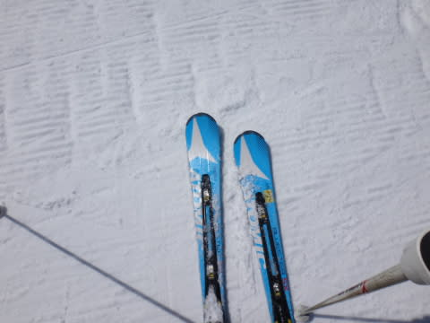
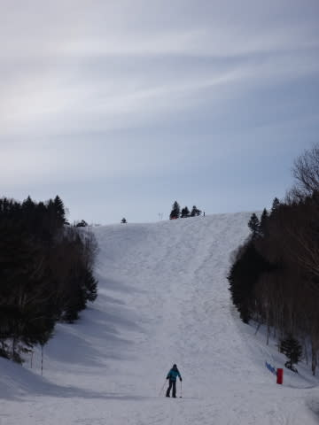
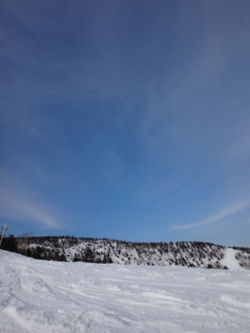

# 4月13日の志賀高原のゲレンデ状況，速報モード

📅 投稿日時: 2014-04-14 02:04:07

🏷️ カテゴリ: [2014スキー滑走日記](c992167609b6415052179ee69ea1ea7d8.md)

あー．

昨晩，ナイターへ行ったので．

今日は．

やはり．

早朝スキーに行くのはやめておこうかな…

と，思ったのですが．

なぜか気づくと，

6時半に焼額第2ゴンドラ乗り場に立っていた

自分を発見したのでした…

…はい．

いろんな意味で，人間として終わってますね．

終わってます…

…

…あ，みなさん，もう知ってますか．そうですか．

で．

さらに．

当然のごとく，今日もリフトストップまで

滑ってしまったので．

帰宅が遅く，死ぬほど眠いです．

ってことで．

定番の速報モードで…

えー．

本日も，朝から晴天！

朝はアイスバーンの表面が緩んで，

エッジが気持ちよく食い込む，

快適シマシマバーン！

そして，昼間も比較的気温が低く…

昼頃までは，この時期としてはいい雪をキープ！

午後はさすがにちょっと荒れ始めてきたけど…

でも，午後まで日が射したというのに．

板が潜ったり，汚れや水が浮くような雪にはなり

ませんでしたね～．

…先週が良すぎたので，基準がずれちゃいますが．

4月としては，恵まれたコンディションでしたね～！

…詳細は，また明日…

おやすみなさい…

## 💬 コメント一覧

### 💬 コメント by (komu)
**タイトル**: やはりロボットですね
**投稿日**: 2014-04-14 17:32:14

前日にナイター滑り切り早朝リフトしてその日もラストまで滑ったとは…

さすがロボットですね…

### 💬 コメント by (Skier_S)
**タイトル**: komuさま
**投稿日**: 2014-04-15 01:03:18

この日，朝10時から3時ごろまで，

娘と滑っていたので．

なんだか滑り足りず．

ついつい娘が上がった午後3時から，

4時のリフトストップまで1時間，

一人でかっとばし続けてました…

一人で滑ってたら，おそらくリフトストップまで

滑ったら死んでたかと．

…いちおう，人間ですので（笑）．

