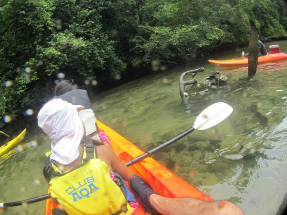
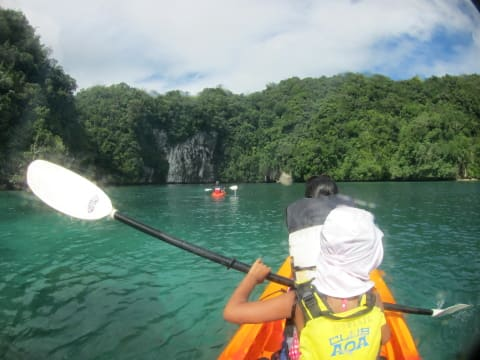

# 2014年10月，小学生の子連れでパラオへダイビングに行ってみた，その35…カヤックツアーへ

📅 投稿日時: 2015-10-01 01:55:20

なんだか．

山間部で，早くも[初冠雪があった](http://www.news24.jp/articles/2015/09/30/07311041.html)みたいですね～．

…もう，冬がやってきますよ．

冬ですよっ！

ふははははは．

スキーシーズンは，もうすぐなのだっ！！

…って話題を振っておきながら．

こちらは夏の話題へ，Go!

---

ということで．

シーカヤックに乗り込み，パラオの海へ繰り出したわけですが…

ガイドにつれられてしばらく進んでいくと，

洞窟みたいな場所が出てきました…

洞窟に入ってみます…

この，ちょっと探検気分が

娘は面白かったようで…

ただひたすら水面を漕ぎ続けるツアーだと，

子供は飽きちゃいそうですが，

こういう変化があると，子供でも飽きずに

長時間ツアーも楽しめますね～．

＃フルーツ村のカヤックでは，娘は川面をひたすら1時間

＃飽きずに漕いでいたので，これが杞憂だと後で気づく

さらに進んでいくと．

今度は，太平洋戦争で沈んだ戦闘機の残骸が…

エンジンとプロペラの残骸が目立ちますが…

その下には，機体も沈んでますね～．

そして，またのんびりと海の上を進んでいきます…

海がきれいですね～．

こんな海を気持ちよく漕いでいくと．

あれ？

また，洞窟です…

この洞窟は，さっきの洞窟より奥が深く．

洞窟の中の，こういう狭い穴を通って，奥に行くと…

おお！

なんと．暗い奥の洞窟の中に，光が差し込んで．

まるで，青の洞窟みたいだっ！

（ガイドさんは青の洞窟って言っていたけど…）

カプリ島に行った時の，青の洞窟を思いだすなぁ～．

娘も

「きれい～」

と喜んでいたし．

こーゆーところを，自分でカヤックを漕いで

見に行くのも．

また楽しからずや…

と言った感じで．

洞窟を出ると…

もうそろそろ，カヤックツアーも終盤．

カヤックを漕ぐこと，1時間ちょっと．

カヤックツアーの目的地に，到着です…

カヤックツアーは，ここに上陸で，終了になりますけど．

まだまだ終わらないこのツアー．

ここから，まだ陸上探索が続くのだ…
