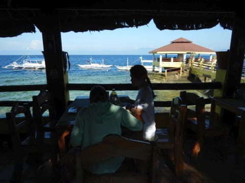
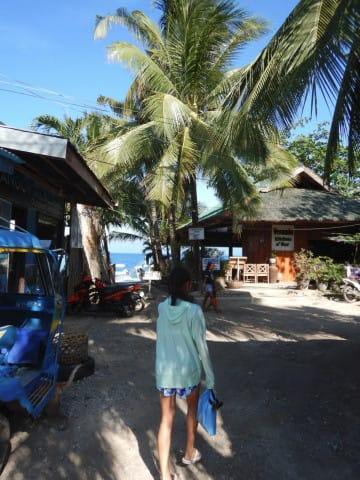
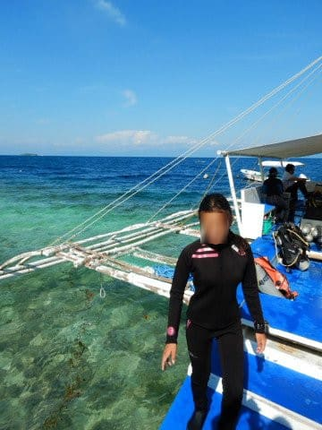

# 2019年8月，4度目のモアルボアル・小6の娘Cカード取得1周年！その10…ダイビング2日目は快晴のスタート！

📅 投稿日時: 2020-08-07 00:18:30

🏷️ カテゴリ: [ダイビング日記](ce3a7a8d424d112fce83ee85c81a0e344.md)

えー．

本来，明日の金曜が夏休み前の最後の

出社のはずなのに．

昨日，今日で

「できれば来週．最悪でも，再来週まで」

という仕事を3件も放り込まれた

気がするんだけど…

…罠かな？

もう，夏休み明けすぐ提出の宿題が

大量に溜まってて．

「小学校の夏休みか！？？」という

状況なんですけど…（涙）．

とりあえず．

この状況で，例年通り8月に

2回のダイビング遠征に行ってたら

間違いなく死んでた．

うん．

良かった．

例年通りの8月に2回のダイビング遠征に

行けなくて，よかった……←行けなかった言い訳を強引に自分に納得させているだけでは…？

…ってなことで．

本日も，昨年のシアワセだったモアルボアル遠征を，

遠い目をしながら振り返るダイビング旅行記です…

では，どうぞ～！

ーーー

で．

明けて2日目…

うお！

今日は朝からすっきり晴天っ！！

部屋を出ると，海が朝日に照らされて

いい感じ…

いつも通りの朝7時からの朝食ですが…

今日は一番乗り！

…もう，慣れた感じのカバナホテルの朝食．

アメリカンブレックファースト，

フィリピーノブレックファースト，

フルーツの3種類があり，

我が家は3人がそれぞれ違うものを

頼むといういつものパターン．

…我が家は別に，

仲が悪くて全員違うものを頼む

わけではなく，

みんなで分け合っていろんなモノを食べられる

ように…という仲の良さの現れ（？）です（笑）．

いやー．

しかし．

朝から，こんなすっきり晴天の南国の

海の景色を眺めながらの朝食は，

いかにもリゾートに来たという

ホリデー感があっていいですね…

ってなことで．

朝食が終わったら，水着に着替えて

準備して．

8時過ぎにホテルを出て，いつもの道を

歩いて…

ダイビングショップへ向かいます．

ダイビングショップについたら，

いつもの体調確認その他のアンケートに

回答して．

ウエットスーツに着替えたら，

いざ，ボート乗り場へ…

いや，今日はホントに雲一つない

いい天気…！

ボートに乗りこんだら…

いざ，出発！

…南国の日差しの中．

トロピカルな海を進んで行くボートは，

まさにザ・夏休みな感じの

非日常空間…

ってな中を，15分ほどボートに

乗っていると．

本日の1本目のポイント，

「トブレサンクチュアリ」に到着です！

…昨日の1本目と同じポイントですが．

昨日はちょっと風と波が強かったので，

移動に30分近くかかりましたが．

今日は15分ちょいで到着しましたね…

ってなことで，いざ，本日の1本目へ！
