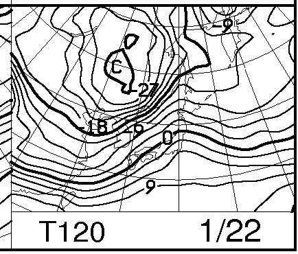
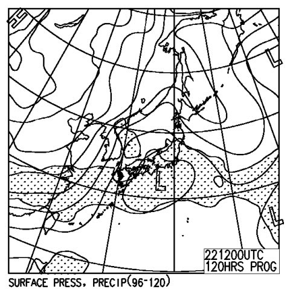
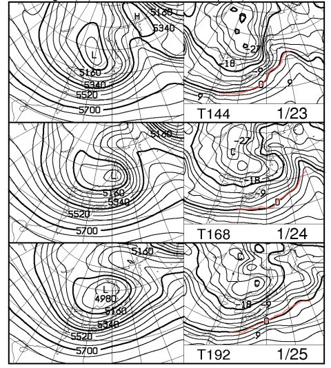
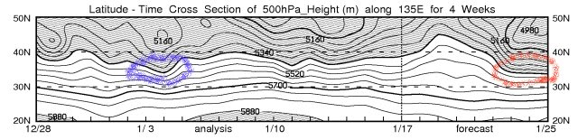

# この週末のスキー場の天気は

📅 投稿日時: 2012-01-19 01:06:39

信州ではあまり雪が積もらない今シーズン．

今週末はパフパフが楽しめるかな～．

…と，天気図を見たところ．

うげげげげ．

まずい．

この週末．

まぁ，土曜日の21日は，少なくとも午前中は

スキー場は概ね晴れそうな感じなんですがね．

午後になると，ちょっと雲が増えてくるところもあるだろうけど…

でも，ちょいと昼間の気温は上がりそうですね．

日差しで，雪がかなり緩むかも…

ここしばらく寒い日が続いていたんですけどね．

んで，日曜．

この日は…

ちょいと危険ですね．

もしかすると…

標高が低いところは雨かも．

志賀高原でも，もしかすると雨か？？

こんな感じで…

850hpaの0度線が結構北に上がってます．

この線は，標高1500mくらいのスキー場で雪になる目安の線．

これが北陸の北側くらいまで上がってるし，

こんな感じで…

降水量があるエリア(網掛け部分)が日本全域にかかってるし．

…まだ，22日の低気圧の位置が現時点の予想から多少ずれる可能性があり，

位置が100kmもずれると全く予報が変わるので，

雨にならない可能性もあり，なんともいえませんが…

現時点で，標高が低いスキー場や，信州南側，群馬などの

スキー場では，雨が降る可能性は否定できない…

まぁ，運が良くて雪だったとしても，霙っぽい

すごい重い雪で，軽いパウダーでは無いですね～．

で，だ．

なんかの嫌がらせとしか思えないのだが．

週末が終わってから，積もるのだ．

すごい降りそうなのだ．

こんな感じで，赤線で記した850hpaの0度線は日本の南まで下がり，

日本はすっぽり寒気に覆われるし…

この図の網掛けされている5340m線の位置．

これの網掛けが，40Nより下に下がるとそこそこの雪，

さらに30N近くまで下がると大雪，というざっくりとした

目安があるんですが．

赤丸で示すように，1月23日から，かなり南側に下がりますね～．

年明けの1月4，5，6日に結構降ったのは記憶に新しい

ところかと思いますが．

青色の丸で示すように，このときも5340mの線は結構下に下がってます．

1月23，24，25日はこのときより下に下がっているので．

結構な積雪があるんじゃないかと思います．

うーん．週末前に降って欲しいものだけど…

月曜からそこそこつもり，火曜は最高パウダーデーでしょうか…

まぁ，今のところ，土曜は晴れそうではあるので

週末なら土曜が狙い目かな．

＃私は当然のように土日とも滑ってますが

## 💬 コメント一覧

### 💬 コメント by (のび太)
**タイトル**: 待ってました！
**投稿日**: 2012-01-19 12:35:08

待ちに待った今週末予報ですね！

でも天気悪そうですね。

関東地方でも久しぶりの雨のようだったから、心配しておりましたが。。。

ちょっとだけ、群馬の方の標高1000～1700mなんていうゲレンデで滑る予定なんですよね。

ここのところ、天気の良い週末が続いていたから、楽しめなさそうでちょっと残念です。

しかも暖かい＆低いところでは雨の可能性アリ、、、ですか。

ってことは、重い雪、引っかかる雪、凍る斜面を想定しないといけない状況となりそうですね。

う～ん、悪い雪質のイメトレも追加しておこうか、それともずっとレストハウスかな？

### 💬 コメント by (Skier_S)
**タイトル**: 今週末の天気はまだ流動的です…
**投稿日**: 2012-01-20 00:26:51

土曜は日が射すかなぁ，と思ったけど．

今日発表の予想天気図を見ると，プチ低気圧が新潟近辺に発生する予報に変わっており，土曜は曇り気味…

＃でもほとんど雪は降らないと思うし，

＃気温もそんなに上がらず雪も緩まなさそう．

で．

良いニュースとして．

日曜の雨の可能性はほぼ0になりました．

降っても雪です．雨にはならなさそう．

ただ，やっぱりちょっと重めの雪になりそう…

とりあえず．

群馬近辺の予測としては…

土曜は曇り，そこそこの雪質をキープ．

日曜は曇り時々雪，重めの雪が降り，

ちょっと雪が引っかかるゲレンデ状況になりそう…

というのが現時点の予想です．

さらに明日になると，予想精度がもう少し上がると思います…

