# 2020年10月，八ヶ岳の編笠山に登ってみた，その8

📅 投稿日時: 2021-08-15 02:32:25

🏷️ カテゴリ: [登山・旅行](c1d637a11a25b457ac978d197adbdafc5.md)

ってなことで．

思いのほか長くなった，昨年の編笠山の

レポートですが．

今回が最終回です…

いや．

今から振り返って見ると．

この時はあまりの膝の痛みに，

「もうこれから一生，長時間の山歩きは

　できない体になっちゃったのか…」

と，すごい絶望感に襲われたのを

思い出しながら書いてました…

とりあえず．悲しみの編笠山レポート最終回，

どうぞ～！！

ーーー

ってな感じで．

なんとか痛い膝をだましだまし，

西岳山頂までやってきましたが…

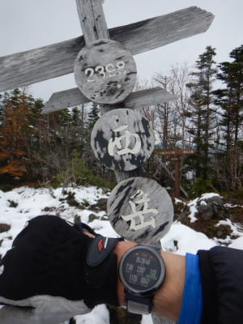

編笠山頂からここまで，標準コースタイム

17分＋47分で1時間4分のところ．

1時間40分かかってます…(涙)

山頂での20分休憩を入れると，トータル2時間．

休憩を入れて，大体コースタイムの倍の時間

かかってる計算ですね(泣）

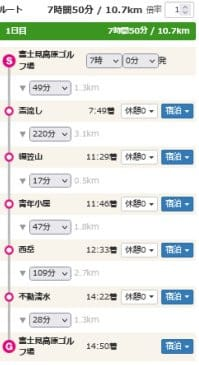

そして．ここからは膝の痛みが悪化する

下りがひたすら続き，

西岳山頂からゴールまでの標準

コースタイムは109分＋28分の137分，

つまり2時間17分．

そして，西岳下山開始時刻は13:20．

…順調にコースタイム通りに下山できれば，

午後3時半過ぎには駐車場に戻れる計算

ですが…

果たして，この膝の状態で，

下山に何時間かかるのか？

日没までに，下山できるのか…？？

とりあえず，下山開始！

雪の残る山頂からの道を降り始めます．

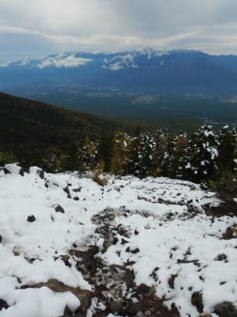

うむ．

ちょっと休憩して，膝を休ませたけど．

痛みは全く引いてませんね(涙）

普通にしてると痛くないけど，曲げた瞬間

痛みが走ります…(泣）

まぁ，膝を曲げなければ痛くないので．

膝を曲げないようにゆっくり歩いて行けば

なんとかなります．

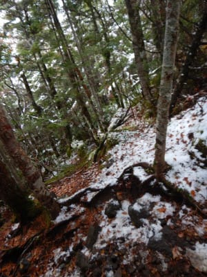

下山開始から5分も経つと，

雪はほとんどなくなってきて．

足元も良くなり，歩きやすくなってきますが…

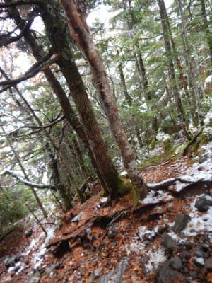

淡々とこんな感じの，そこそこの斜度がある

下り坂が続きます．

下りは膝にくる…（涙）

痛む足を後ろにけり出すと痛むので，

膝が痛まないよう，半歩ずつ前に

進んでいく感じなので，

普通に歩くのに比べて半分のペースに

なってる感じですね…（涙）

でも．

歩けてるだけマシだと言い聞かせ，

下山するまで，ひたすら前進あるのみ！！

で．

小広場とかいうポイントを通過し…

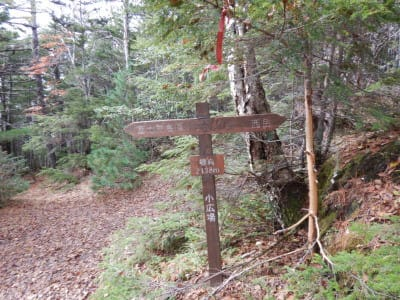

しばらく進むと，

針葉樹の中に，紅葉した木々がちらほらと

うかがえるようになってきました．

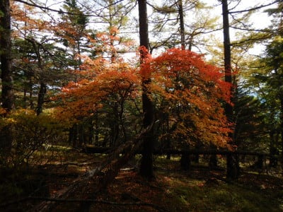

うむ．

淡々とした単調な下り坂で．

膝は痛いけど．

紅葉が綺麗で，癒される…！

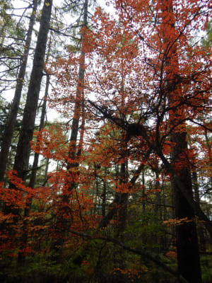

針葉樹が多いので，見事な三段紅葉とは

いきませんが．

積雪・紅葉の両方が見られるのは，

なかなかない経験ですね～！

…しばし，膝の痛みも忘れて

見事な紅葉を眺めます．

が．

紅葉を眺める以外は，ひたすら単調な

下り坂で．

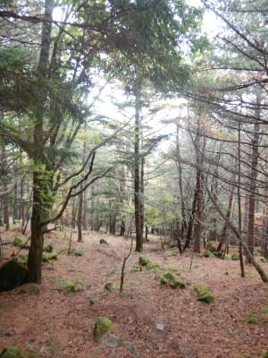

単調な下りを，膝の痛みと戦いつつ

ゆっくりと降りていくという，

自分の中での痛みとの戦い

を繰り広げながらの下山(激泣)

痛みがなければ，紅葉を見ながらの

サクサクお気楽ハイキングコースなのに…

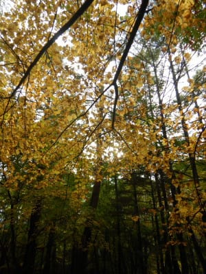

そして．

ゆっくりと痛みと戦いつつ休み休み

降りていき．

なんとか西岳山頂から標高差700mも

降りて，標高1500mまで下りてくると…

だんだん木々も紅葉前の緑色になって

いきますが．

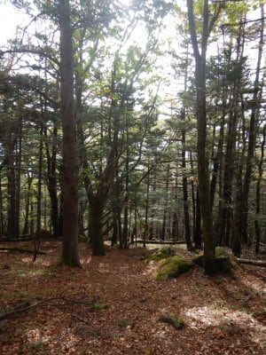

西岳山頂から次のポイントの不動清水まで，

標準コースタイムは109分…1時間49分のはずが．

ゆっくり歩いているので，2時間を過ぎても

全然不動清水に到着しません(涙）

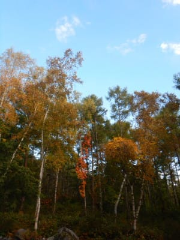

果たして，一体どれだけ歩けば

次のポイントに着くのかと，

ひたすら歩き続けた時…

目の前に広場が！

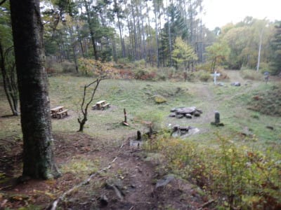

西岳から2時間35分．

コースタイムの1時間49分から，

実に40分遅れ．

コースタイムの1.5倍の時間をかけて，

ようやく次のポイント，不動清水へ到着！

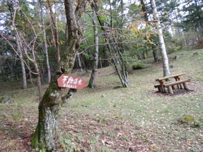

膝が痛くなる下り．

ひたすら歩き続けること2時間半．

遠かった…

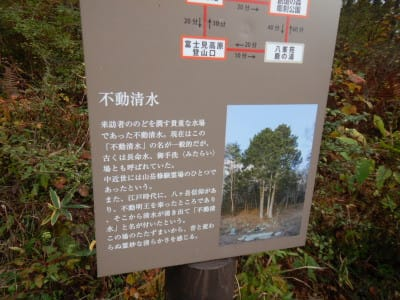

到着した不動清水は，その名の通り

水が湧き出ていますね…

「長命水」ですか．

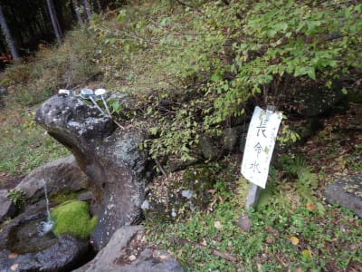

有り難く長命水をいただきますが．

今欲しいのは，長命水じゃなく，

膝の痛み止め水ですね…←そんなものないから

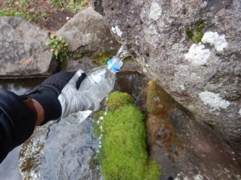

不動清水に到着した時点で，すでに

時間は16時近く．

この時期，山の中では17時を過ぎると

暗くなり始めるので．

あまりのんびりする暇もなく，

休憩は15分ほどで切り上げ，

先へ向かいます…

しばし林道を下ると，行きに通った

分岐点へ合流！

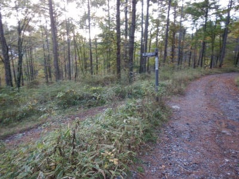

ここまでくれば，駐車場まではそう遠くない

はず！

ちょっと元気になりながら，山道を下って

行きますが…

もう，膝の痛みをかばって不自然な歩き方を

しているので，体中の筋肉が痛い…

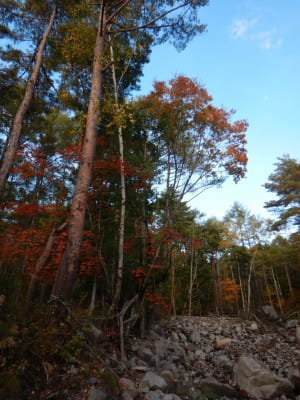

それでも，車まで歩いて戻らないとならないので．

残り体力を振り絞って歩く！

…もう，日も暮れかけて来てるので，

急がないと…！！

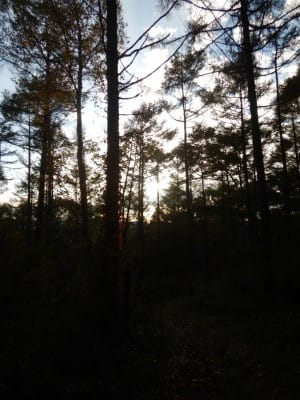

残りの体力を振り絞りながら，

行きも通ってきた道を下っていくと…

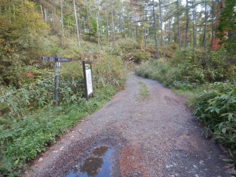

来た～！

登山道入り口！

ここまでくれば，もう大丈夫…

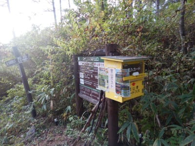

ってなことで．

不動清水から駐車場まで，

コースタイム28分のところ．

45分もかけて駐車場に到着！

やっと戻ってきたよ…

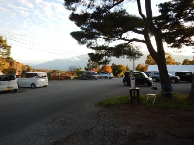

日も傾いた駐車場に到着したのは．

16時35分．

編笠山頂からここまで，

標準コースタイム3時間20分のところ

5時間20分かかりました…

まさか，標準タイムの6割増しの時間が

かかってしまうとは！！

…前回の岩菅山も，膝の痛みでコースタイム

ギリギリかわずかにオーバーだったし．

北八ヶ岳もかなり膝が痛くて，下りは次々

人に追い越されていったし．

昨年から引きずっていた膝の痛みが

かなり悪化した今回．

「さすがにこれだけ膝が痛くなると，

　もう山歩きは無理か…(涙）」

と．

今後一生，山歩きができない絶望的思いに．

下山後，かなり悲しい気分で帰宅の

車を走らせたのでした…

…しかし．

まさか，このどうしようもない痛みが，

[膝サポーターで簡単に解決する](e12c3a3b2ec073c3bbbc740b7eb3764cc.md)

とは…！

ってなことで．

次回以降，

膝サポーターを着けて編笠山リベンジ！

どれだけ復活できたのか？

の詳細登山レポートをお送りします～！
