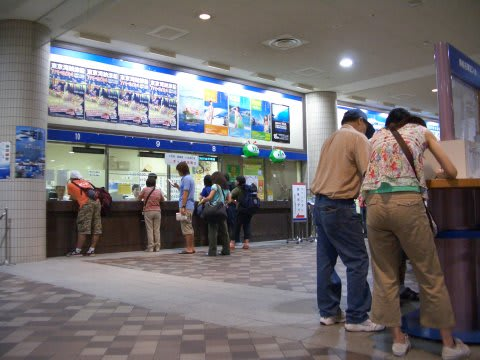
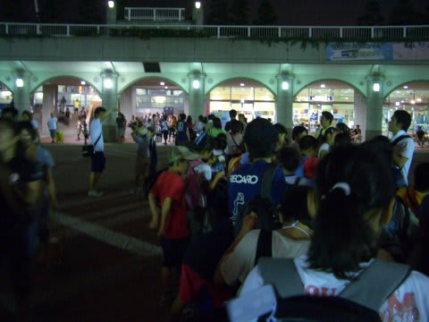
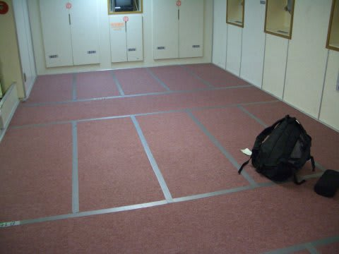
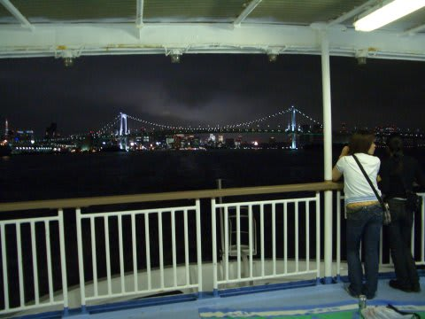

# 2007年8月　三宅島ドルフィンスイム＆ダイビング旅行記　その１

📅 投稿日時: 2013-09-08 01:20:40

ということで，出発日の金曜日．

夜10時半出航なので，10時過ぎに竹芝桟橋へ向かい，チケットを購入．

そして乗船の列に並びます…

さすがにこの時期，混んでるなぁ…

んで．

今回乗るのは，2等和室．

最初は2等座席の予定でしたが，帰りの便のキャンセル待ちが取れたときに，

「行きの便の和室，空いてませんか？」と聞いたら空きが出来ているとのことで，

和室が確保できました．

2等和室はこんな感じ．

カーペット敷きの部屋に，テープで2mx90cmほどの区画が複数切られてます．

区画にはちゃんと番号がついていて，指定席になってます．

狭いけど，座席と違って横になって寝れるので，深夜の移動にはありがたい…．

ということで，出航して1時間ほどデッキに出て去り行く東京湾の夜景を見ていると…

午後11時半に消灯．

明日は朝5時三宅島着で，ダイビング＆ドルフィンスイムなので．

明日に備えて，早めにねることに．

おやすみなさい～．
