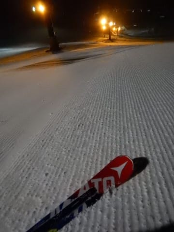

# 2019/2/16(土)の志賀高原，焼額山スキー場は…雪降り＆ガスの一日．冷え冷えで雪はまぁまぁ良かったけど，前が見にくかった（涙）

📅 投稿日時: 2019-02-17 01:04:53

ってなわけで．

本日も志賀高原を滑っていたわけですが．

…予想通り，終日雪降りの一日で．

前が見にくくて滑りにくい一日

でした…（涙）

とりあえず．

朝の志賀高原への登り坂は．

…このわだちが，すごいツルツルに

凍っていて，ちょいと危険レベル…

途中で登れなくて息絶えている車が

大量にありましたので．

明日上ってくる方はご注意を…

で．

いつも通りの焼額の朝イチゴンドラに乗って，

山頂に向かいますが…

　朝の気温は-7～8℃程度でスタート．

という予想がぴったりで，山頂は-7℃．

最近の私の予想精度，すごいぞ…！！←自画自賛

そして．

朝の天気は雪降りで…

圧雪バーンは，圧雪の上に

うっすら新雪が乗っていて．

これも見事に予想通りの天気！

…だけど．

予想では，柔らかめの圧雪としていたところが．

圧雪はやわらかめというより，

結構締まり気味の，硬めの圧雪で…

ここはちょいと外しましたか（涙）

…でも．しっかり締まった，スピードの乗る

いい感じの雪！

で．さらに．

どうやら本日．

やんごとなき方々が焼額にいらっしゃってるようで．

あさイチの焼額圧雪は，いつにもまして

超フラットの最高クオリティー圧雪！

段差が全くない，まさに完全フラットな，

超クオリティー圧雪で．

…毎週，こんな圧雪ならいいのに…

だけども…

バーンコンディションは最高ながら．

雪降り＆ガスのために，山頂付近の視界は悪く．

コースの状況が見えない…（涙）

山頂付近は，焼額を良く知っているはずの

某氏もコースを間違えるほどのガスで．

…惜しい．

雪はいいし．

圧雪は最高だから．

見えさえすれば，最高コンディションなのに…（涙）

まぁ．

先週が3連休だった反動か．

2月の週末としては，コースがガラガラだったのが

救いですか…

ゴンドラはピークはゲートの外に

ちょっとはみ出すくらいまで並ぶことが

数回あったかな～…

って程度で．

午後になると，飛び乗りに近かったし．

午前中はコース上にちょっと人が多い

タイミングもあったものの…

でも．せいぜいこの程度で．

3連休に比べれば，全然ガラガラで，

結構好きかってに滑れるレベルの

空き具合！！

昼間の気温も，

　昼間もほとんど気温が上がらず，最高気温も-5℃程度．

と，予想した通り，ぴったり-5℃で…←当たったところは必死にアピール

おかげで，昼間で雪質は結構良かったかな～！

今日は，天気はずっと雪降りで．

ゲレンデの上には，昼間でもうっすら

雪が積もっていくレベルで．

時折すごいガスが出て前が見えなくなったり…

雪は止まないけど，ガスが晴れて，

ちょっと見えるようになったり…

微妙な天気で．

バーンコンディションが見にく

かったのが，ちと残念…

とはいえ．

圧雪バーンはしっかり硬めだったため．

午後になってもそれほどバーンは荒れず．

急斜面のオリンピックコースは，

ところどころ硬めだったけど，アイスバーンって

ほどではなく．

視界が悪くても，何とか滑れたのが

良かったかな．

視界が悪い中で，アイスバーン＆凸凹だったら，

もうそれは悲惨ですから…

ってなことで．

本日もいつも通り，ゴンドラ終了まで

ガッツリ滑り．

しっかり義務を果たした後．

そうです．

まだ残業があります．

今日はダイヤモンドナイターにやってきました～！！

今日のダイヤモンドナイターは．

昼間と違って，視界すっきり！

そして…

シマシマっ！！！

昼間に積もった雪が圧雪された，

結構やわらかめの冷え冷え圧雪！！

…この柔らかい圧雪に，いつも通り

がっつりシュプールを刻み込み続け…

今日もお約束の，ナイター終了の9時まで．

しっかり滑ったのでした…

うーむ．

今日は視界が悪くて残念だったけど．

夜もちょっと積もったので．

明日の朝は，いい感じの圧雪で

スタートできそう！

朝のうちは曇ってそうだけど．

天気も回復傾向だから…

明日はいい感じのスキー日和になりそうかな～．

## 💬 コメント一覧

### 💬 コメント by (こじろう)
**タイトル**: Unknown
**投稿日**: 2019-02-17 09:01:19

昨日、多分ですが1ゴンで同じ搬器になったかと思います。 どちらも2という数字のステッカーが貼られているストックをお持ちのお二人とトーク炸裂されていましたのでお声がけできませんでした。 次回お見かけしましたらご挨拶できればと思います。

### 💬 コメント by (musi)
**タイトル**: Unknown
**投稿日**: 2019-02-17 20:28:20

日曜は、朝から圧雪の上に新雪の積もった最高のコンディションの中、一の瀬から焼額に向かったのですが、sさんらしきグループを発見出来ず、1ゴン二本滑って、初めて頂上じゃないルートで奥志賀に向かいこれまた初めてのプライベートレッスンを受けて来ました。水曜以降の高温と降雨を考えると、今シーズンのピークコンディションですかね？火曜まで会社休み、家族を置いて無理無理来た甲斐がありました。とはいえ何とか三月も寒気が入って降雪して欲しいですね、祈ります。

そしてやっぱり家族が一緒でないと寂しいmusi。

### 💬 コメント by (いか)
**タイトル**: Unknown
**投稿日**: 2019-02-17 22:15:42

昨日はどうもでした～

ガスは濃かったですが、志賀の雪質の良さに助けられました。SX三郎丸もよい感じに切れていました。

また、3月の2週目くらいをめどに、志賀にお伺いいたしますので、その際はぜひよろしくおねがいします！

### 💬 コメント by (Skier_S)
**タイトル**: 今日は良かった…
**投稿日**: 2019-02-18 02:22:34

＞こじろうさま

あら？？

ゴンドラ乗り合わせましたか！

うーむ．

状況から，おそらく午前中に乗り合わせたんでしょうか…

私が爆裂トークしている相手の方は，大体このBlog読者の方なので，

爆裂トーク中でも，ご安心して声をかけてください…

むしろ盛り上がると思います(笑)．

次の機会は，ぜひ声をかけて下さい～！！

＞musiさま

日曜は，朝10時ごろには焼額を脱出してました．

いや，今回子連れで来ていて．

日曜はスキーこどもの日だったので，子供は全山券がタダでしたから…

いつもは小学生無料の焼額オンリーの娘ですが．

こういう時は他のスキー場にも連れて行かないと…

ということで．

10時ごろから，一の瀬⇒寺子屋⇒東館⇒タンネでお昼⇒西館⇒ジャイアント⇒ブナ⇒東館⇒一の瀬⇒焼額⇒奥志賀…と．

いろいろさすらってました…

しかし．

3月は冷えてほしいところです．

＞いかさま

土曜は終礼まで参加，お疲れ様でした～！

また3月，お待ちしています！

…今度はいい天気の時に滑りたいですね…

