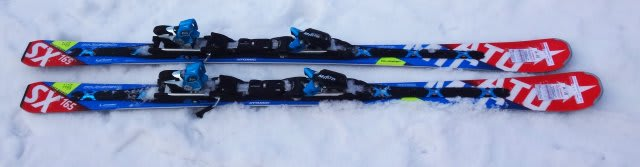
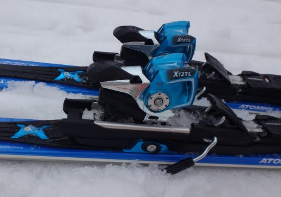

# おまたせっ！2016シーズンモデル，スキー試乗レポート第1回…ATOMIC編

📅 投稿日時: 2015-03-13 01:58:06

志賀高原でも，3月と思えない冷え冷えの雪が積もっているらしい今日この頃．

皆様いかがお過ごしでしょうか．

いやー．

今週末は，いい雪で滑れそう！！

…ってことで（何が？）

お待たせしました．

来シーズン，2016シーズンのニューモデルのスキー板，

試乗インプレッション第1回目．

まずは，ATOMIC編です．

…今日は時間がないので，まずは1機種だけで…

試乗のときのコンディションは，[ここ](e8d8515ef15e0de5854269614a0329844.md)を参考にしてください！

では，どうぞ～

○ATOMIC BLUESTER Doubledeck3.0 SX +X12TL 165cm

基礎小回り用．

基本的に，見た目の構造は今年モデルと同じですが．

来年モデルからプレートがちょいと変わり，多少ヒール部分が低くなるようです…．

うーん．

見てもあんまりわからないな．

板自体のラディウスや，レースロッカー構造は，今年モデルと全く一緒です．

んで．

滑ってみたところ…

板の動かしやすさが，今年モデルより上がった気がします．

履いてみた第一印象は，板がガッツリグリップするというより，

軽快で動かしやすい！という感じ．

私が履いている，'14モデルのSXに比べ，ずっと雪面グリップが

ソフトになっている気が…

荷重ポイントは相変わらずテール寄り．

板のトップに働きかけても何も起こらず，かかとからテール側を

抑えて行くとグリップして，板が回り始めます．

板のテールを踏んでいくと，素直にすっとたわんで，

そのたわみに乗って回っていく感じ．

切換えも，板のばね的な返りで切り替わっていくのではなく，

テールに乗り続けると板が回っていき，体の下を通り抜けて

そのまま切り替わっていく感じ．

グリップも比較的やさしめなので，ターンのどの局面からでも

板をずらして，思い通りのところに動かしていける

自由度の高さがあります．

…逆に言うと，トップスピードでガッツリグリップではなく，

比較的動かしやすい，マイルドな感じの板に感じます．

張りが強くて，それがビン！って感じで返ってくる

'14モデルと比べると，かなり優しくなってます．

かなりのスピードを出していくと，板のトップのグリップが

ちょっと抜け気味になるところもあり，トップスピードで

ガンガン飛ばす板というより，どんな斜面でも，リスクなく

しっかり深い弧を描いていくことを重視してるのかな～，

って感じです．

…今回試乗したビンディングが，優し目のX12TLだからかな～？

'14モデルと同じ，強めのX12VARビンディングにすると，もう少し

フレックス・返りが強くなるのかも…

ガッツリ張りが強いトップスピードギンギンの小回り板…

ってより，どんな雪質でも動かしやすくコントロールしやすい

という印象の板でした．

## 💬 コメント一覧

### 💬 コメント by (いか)
**タイトル**: Unknown
**投稿日**: 2015-03-13 06:47:47

やはりおとなしくなる傾向は変わらないんですかねー。1ターン目から、がっつりグリップで前に前にという13-14モデルが気に入ってるので、これは来季は買わなくて済みそうです(・_・;

### 💬 コメント by (Skier_S)
**タイトル**: いかさま
**投稿日**: 2015-03-13 23:27:04

基本的な乗り味は，今年のモデルと

ほとんど変わってない感じです…

'14モデルに比べると，かなり優しい板に

なっちゃってます．

うーん．

私も’14モデルがむちゃくちゃ気に入ってるので，

後継機をどうしようか悩んでます…

### 💬 コメント by (Unknown)
**タイトル**: 試乗しました
**投稿日**: 2015-03-22 21:00:41

私も試乗しましたが、ビンディングの違いでかなり板の印象は変わります。確かにTLビンディングだと、比較的操作がしやすい感じがありましたが、VARビンディングだと変わります。重厚感があり、板の印象は強くハリがあると感じました。技術が伴わないと扱いづらいと思います。

技術選手権を考えているなら、迷わず選択。

私は絶対にVARビンディングです。

### 💬 コメント by (Skier_S)
**タイトル**: Unknownさま
**投稿日**: 2015-03-23 01:41:28

あ，VARビンディング付き，試乗されたんですね！

…しかし，VARビンディング付きの板が

試乗できる試乗会があるんですね…

ぜひ履いてみたいんですが．

'13シーズンは，SとSXの2モデル，ビンディングが

VAR（Xビンディング）か，TLビンディングかの

違いだけのモデルでしたが，かなり板の印象が

変わるので，来年モデルも，VARビンディングを

つければしっかりした印象になるんだろうなぁ…

とは思っていたんですが．

うーーん．

技術選には出ないけど，私もSXを買うなら

VARビンディングかな～．

…でも．

VARビンディング付きモデル，高すぎ（涙）

### 💬 コメント by (Unknown)
**タイトル**: ビンディングの選択
**投稿日**: 2015-03-23 22:21:02

スキーショップによっては、TLの方でいいよというところもあり、迷ったことがあり、他のショップで聞いたり、アトミックデモに聞いたり、メーカーの人に聞いたりしました。(14-15モデル)

来年度も同様に、SXなら、VARビンディングの方がいいと思います。板の性能が発揮されるのではないかと思います。週末の試乗で確認しました。

昨年度モデルと比べると、トーションが強くなったということです。ベースエッジが1度から、0.8度にということで、エッジグリップをあげたとも言っていました。

私は、この10年アトミックを乗り続けているので、年度ごとに変化があるのが、少しは分かっているつもりです。ベースをテールのみ2度たらしたこともあります。(12ー13モデル)参考までに。

ちなみに、クラウンを所持しています。

### 💬 コメント by (Skier_S)
**タイトル**: Unknownさま
**投稿日**: 2015-03-24 00:10:40

そうなんですよ…

私もスキー屋で「SX，VARビンディング付きだといくらですか？」

と，聞いたところ．

「TLビンディング付きの方がバランスがいいですよ」

ってことで，VARビンディングはあまりお勧めじゃないように

言われました…．

で，来年度モデルはトーションも強くなってるんですね．

ビベルも0.8度ですか…

ぜんぜんそんな感じはしなかったです．

そんなグリップが強くなったようには思えず…

やっぱり，しっかり感を上げるには，

VARビンディングにするのが一番効きそうですね．

ちなみに，ビベルの話題が出たついでに．

'13SX，'14SXともに，メーカー出荷はビベル1度

だったはずですが，

ATOMICのエッジって出荷時は滑走面よりわずかに

低めになっているのか，普通に1度で仕上げると，

オリジナルより回しやすさが足りない感じが…

なので，チューンナップ後に，'14 SXのビベルを

1.2度くらいに，ちょっとだけ足しました．

あー．

でも．

私はクラウンどころかテクニカルすらもっていない

お気楽レジャースキーヤーですので，

私の感覚はかなりいい加減だと思います（笑）．

### 💬 コメント by (Unknown)
**タイトル**: 続き
**投稿日**: 2015-03-24 22:04:03

12ー13モデル、13ー14モデルとも、ビベル1度です。私の友人もアトミックのスキー板をはいていますが、チューンナップ仕方で乗り味が変わります。乗り比べたのでわかりました。

1度の状態だと板が動かしづらく、雪の状態によって引っかかります。何名かはいている人に聞いてみると、1.5度くらいたらしている人がいました。私は、2度でもいけました。

14-15モデルは、デモやメーカーの人に聞いて1度でいきました。これで問題がなかったです。ちなみに今年度モデルから、ロッカーの形状が変更しトップ部分が5%に反り具合が減りました。その方がトップの入りがわかりやすいと思います。以前は、トップをかまさないようにして、外へずらして使っていましたが、今はトップの部分を使います。SAJの指導によるところもありますが、滑り方にも変化がありました。

ちなみに、D2になってから、板が剥離しやすいと聞きました。実は10ー11モデル、12ー13モデル2年で剥離し、板も折れました。コブの衝撃で構造上剥離しやすいのではと思っています。いつもチューンナップを出しているショップで確認してもらうと、1年で、内部の芯が折れているかもと言われました。まさにその通りだと思いました。アトミックとサロモンは多そうです。コブが原因です。

どんな板も同じだと思いますが、消耗品ですから、しょうがないです。

### 💬 コメント by (Skier_S)
**タイトル**: Unknownさま
**投稿日**: 2015-03-25 00:35:35

いやー．

意外と盛り上がりますね～．この話題．

私も昔はビベルをいろいろいじって苦労した思い出が…

今年モデルから，トップのロッカー度合いが変わりましたが，

気のせいでなければ，今シーズンモデルよりさらに来シーズン

モデルの方が，多少トップよりにバランスが変わったかな…

という気がしています．

