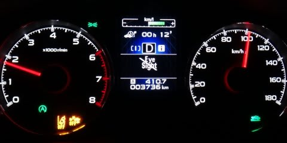
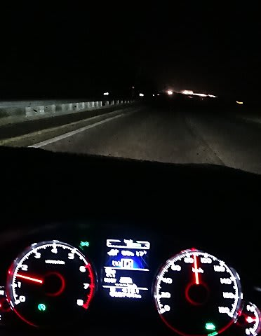
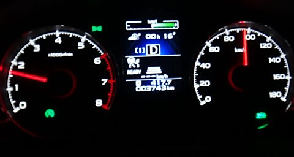

# なるほど．こういう状態ではアイサイトが止まるのか…

📅 投稿日時: 2013-07-28 02:31:57

🏷️ カテゴリ: [車](cba0e8330b3f2ded7c1addfacc75d4547.md)

えー．

今日は，娘にせがまれて，いわきのハワイアンズまで行ってきました…

いやー．すごい混みようでしたね～

でも，プール大好きな娘は大喜び．

夜9時半までの，最後のショーまで見て来ちゃったので…

朝6時に家を出たというのに，帰宅は深夜1時半…

…だもんで，今日はちょいとダイビング日記を更新するパワーは

無いのですが．

ちょっと面白い現象に遭遇したので，報告をば…

深夜．帰りの高速で．

真っ暗闇のかなりの豪雨に襲われ…

なんと．

アイサイトが停止するという現象に初めて見舞われました．

＃左下の黄色い警告灯，「レーン警告」と「緊急回避ブレーキ」が

＃OFFしている二つの警告がでて，真ん中のディスプレイにアイサイトが

＃止まっている表示が出ています…

いやー．

目で見ててもなんだか分からないほどの夜中の豪雨でしたから．

アイサイトを信頼するのはちょいとやばいかも…

と，オートクルーズは入れてなかったんですが．

それでも，アイサイト停止の警告画面が出てきました．

アイサイトが止まってもやむを得ず…

って感じの視界でしたが．

やっぱりこういう状態では止まるんだな～．

ちなみに．

雨が弱まると．

すぐにアイサイトは復活しましたよ～．

## 💬 コメント一覧

### 💬 コメント by (ゆうこ)
**タイトル**: 夏の志賀高原
**投稿日**: 2013-07-28 22:19:12

私は、この週末、夏の志賀高原にいって来ました。渋温泉に泊まって、大沼池などの池めぐりコースをトレッキングしてきました。

思ったよりたくさんの人がいてびっくりしました。

涼しくて快適でした。

癖になりそうです。

### 💬 コメント by (Skier_S)
**タイトル**: 夏の志賀高原ですか！
**投稿日**: 2013-07-28 22:29:03

トレッキングする人にはいいらしいですよね～．

涼しいらしいですし．

天気は大丈夫でしたか？？

私は，夏は禁断症状を発症させないように，

あえて山に行かないようにしています(笑）…

### 💬 コメント by (ゆうこ)
**タイトル**: 天気は…
**投稿日**: 2013-07-28 22:57:13

昨日は土砂降りの中で桃狩りして、プールに落ちたみたいに濡れました。

すぐに渋温泉で温まったので、大丈夫でした。

今日はいい天気で、パンフレットのようにキレイな大沼池がみれました。

ほんの3ヶ月前まで同じ志賀高原でスキーしていたなんて信じられませんでした。

### 💬 コメント by (Skier_S)
**タイトル**: 1日目は土砂降りですよね…
**投稿日**: 2013-07-29 00:32:41

2日目は天気がよかったようで何よりです…

私の場合，3ヶ月前まで同じ志賀高原で

スキーしていたことを思い出すと，「すべりたい～っ！」

ってなること確実なので，今は雪山を忘れるために

必死に海に通っています…

私の場合は，4週間前まで雪山にいたんですけどね(笑）．

今後もまた山へ行くんですか？

