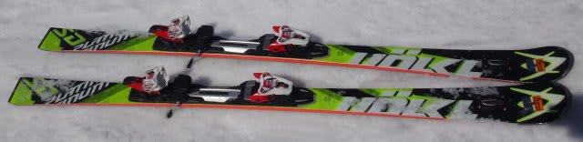
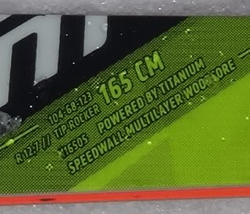
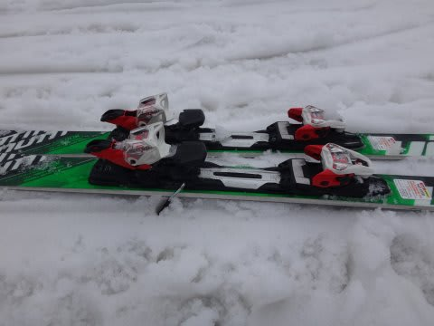

# 2017シーズンモデル，スキー試乗レポート第16回…VOLKL編その2

📅 投稿日時: 2016-06-09 04:24:50

🏷️ カテゴリ: [スキー板試乗](c0bd8048615710cee890e403a36cc9a2b.md)

うーむ．

帰宅すると，もう外が明るくなっているという．

わけ分からん時間に帰宅しているSkier_Sです．

…明日朝起きれるのかな（涙）．

それでも続く，2017シーズンスキー板の

試乗レポート．

今回は，フォルクル編．

Platinum SDとCDの2機種です．

では，どうぞ～！

○VOLKL PLATINUM SD 165cm

基礎小回り用．

基本的に，去年と同じ感じで，UVOも乗っており，

一見あまり変わってないように見えますが…

プレートが微妙に変わったのかな？？

荷重ポイントはセンター．

コアの張りが強く，固い斜面でも

トップとテールのエッジがガッツリ効いて，

エッジがしっかりグリップして，きれいに

小回りしていきます．

固い斜面を切り裂いていくように，

アイスバーンでもしっかりエッジが食いついて

回っていきます．

フレックスは強く，反発も強いので，

固い斜面では気持ちよい返りに乗って

板が左右に切り替わっていきます．

板のテールまで乗って回しこんでやる…

というより，反復横飛びをするような，

そういう感じで板が左右に切り替わっていきます．

この反発の早さゆえに，小回りスペシャルになります．

固い斜面でスピードを出していくと，

ひゅんひゅん切り替わっていき，小回り強制

マシンになります．

うーむ．大回りは厳しいか…

あと，ずらしても面白くもなんともない板です．

板の軽さゆえに，柔らかい斜面や，コブも

行けなくはないですが…

やはり，この板は固い整地でこそ本領を発揮します．

固い斜面を，この返りの速さに乗って

気持ちよいリズムの小回りで降りていきたくなる，

そういう板です．

…オールラウンドというより，かなりとがった

性能の小回り板として，かなり面白いです．

…ただ，乗り手には結構の技術と体力を

求めるかも…

○VOLKL PLATINUM CD　171cm

大回りベースオールラウンド．

大回りに特化したGDに比べ，センター幅を広めにし，

オールラウンド性を強めた板ですが…

この板も，見た目はあまり去年とは変わってません．

履いた感じ…

やっぱり，不思議な板です．

かなりテール荷重．

トップを抑えるより，テール側に乗っていくと

トップが浮いていくように回ります．

春のザク雪でも，その上に柔らかく浮かび

上がるような感じで回っていき，

荒れた雪の上を舐めるように滑っていきます．

…春の雪との相性はかなり良さそう．

海外では雪質を選ばないオールラウンド板として

売っているんじゃなかったかな？？

確かにそんな感じで，柔らかい雪・荒れた雪などの

走破性はかなりいいです．

171cmでセンターが太いってことも相まって，

そこそこのスピードで安定感高く荒れた雪の

上を滑っていけます．

フレックスも適度に柔らかく，柔らかい雪との

相性は極めて良いです．

固い斜面では…エッジグリップはそこそこかな．

テールをかませていけばエッジグリップします．

板自体がかなり軽いので，171cmという長さにも関わらず

結構動かしやすく，操作性は高いです．

ガンガン固い斜面でのトップスピードでは，

わずかに弱さを感じるところもありますが，

柔らかい雪，荒れた雪での走破性はかなり

特徴的で，板が飛ばされたり叩かれたり

する感じがなく，滑らかに乗り越えていきます．

うーむ．

久しぶりに乗ったけど．

やっぱり不思議な板だなぁ…
