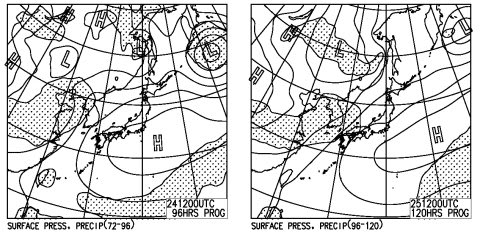
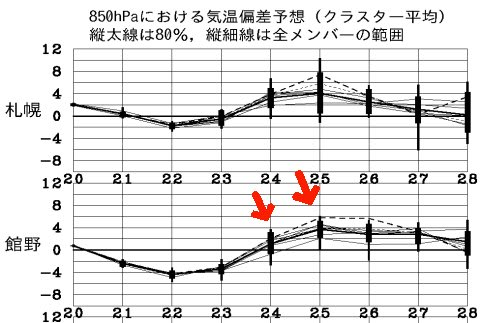

# 今シーズンラスト！今週末のスキー場の天気は…

📅 投稿日時: 2014-05-22 04:11:05

🏷️ カテゴリ: [スキー天気予想](c6554f5c3c106093b511a8daae23757e8.md)

えー．

この時期，もうほとんど期待している人はいないだろう，

週末のスキー場の天気予想ですが．

なんと．

今回で，シーズン恒例の天気予想は最終回です…

シーズンも終わりゆくなぁ…（涙）

＃6月に月山へ行く週末には，臨時で掲載予定ですが

あー．

でも．

この時期の天気予想．

雪が降るわけもなく．

雪質も冷え冷えの雪になるわけもないので．

気になるのは，晴れるか雨が降るか…という

一点だけなんですよね～．

ってことで．

天気図を見ると．

…

…

土日とも，晴れです．

以上．

…では，寂しいので．

ちょっと追加情報を…

…この2日間の天気図は．

太平洋高気圧が張り出してて．

「夏か？？」

って感じです．

こんな感じで，気温は高くなりそうなので…

Tシャツで滑れるくらいですね～．

暑くなりますよ～っ！！

## 💬 コメント一覧

### 💬 コメント by (komu)
**タイトル**: 予報待ってます
**投稿日**: 2014-05-22 23:50:19

たとえ予報が当たらなくても、

天気予報は最重要情報ですので、

月山までお願いしまする(´・Д・)」

今週は土曜日出撃の予定です。

### 💬 コメント by (Skier_S)
**タイトル**: komuさま
**投稿日**: 2014-05-23 01:37:22

私は，いろいろ都合により，

今週末は日曜の出撃です…

残念ながらご一緒はできなさそうで…

土曜も雪解けが進みそうなので，

日曜より土曜の方がわずかに

コンディションは良い気がするんですが…

うーむ．

残念です．

### 💬 コメント by (ひろちゃん)
**タイトル**: コブ学習残念
**投稿日**: 2014-05-23 20:20:11

スキーヤーエス残念(-。-;。明日、U+26C4U+FE0F心配だが、コブ学習がんばります。月山コブで、会いましよ（≧∇≦）

### 💬 コメント by (Skier_S)
**タイトル**: ひろちゃんさま
**投稿日**: 2014-05-24 04:17:34

うーむ．

お会いできずに残念です…

今日のかぐらはいかがでしょうか？

コブ練習頑張ってください！

＃月山に行くことは確定なんですね（笑）

