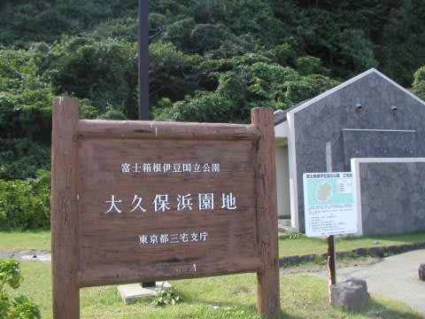

# 2007年8月　三宅島ドルフィンスイム＆ダイビング旅行記　その2

📅 投稿日時: 2013-09-10 01:24:31

🏷️ カテゴリ: [ダイビング日記](ce3a7a8d424d112fce83ee85c81a0e344.md)

えー．

この週末も．

娘をバイクの後ろに乗せて走り回ってたんですが．

…眠かったらしい娘．

信号待ちの時に寝かかって…カクン！

こら～！寝るな～っ！死ぬぞ～っ！

…信号待ちのとなりの車の人が．

小さい子供が後ろに乗っていることに最初は驚き．

続いて，カクン！となったところで笑われてました(汗)．

ってことで．

今日も三宅島レポート，続きます…

----

さて．

まだ薄暗い，朝5時．

空がだんだんと明るくなっていくなか，船は三宅島に入港します．

船を下りると，ダイビングショップの人が迎えに来てくれてました．

今回，ダイビングショップの，

「1泊3食（到着日の早朝休憩込み）&

ダイビング2本&ドルフィンスイムパック」

という，すべて込みこみの楽チンセットで申し込んであったので．

迎えに来てくれていたダイビングショップの車に乗って，

まずは早朝休憩のための宿へ…

さすが，2等船室で朝5時着，そのまま休憩なしでの

ダイビングはつらいので，お布団で寝れるのは幸せ…

これから三宅島へ行く人は，早朝休憩セットをお勧め！

んで．

2時間ほど一眠りした後，起きて朝食を食べたら．

ショップのお出迎えの車に乗って，ダイビングショップへ向かうのですが…

…だけど．

車窓からの景色が…なんだか．

ところどころ火山ガスのせいで，海岸付近から山頂まで

立ち枯れた木が並んでいて…

…うーーーん．

不思議な風景だ…．

そーいや，朝食中に．

島内放送で

「本日の火山ガスの濃度が高くなると予想される地域は…」

という放送がかかってたなぁ．

うーむ．噴火したての島なんだ…．

と，実感．

実は，三宅島への上陸の際は，現在もガスマスクの常時携帯が

義務付けられているんですねー．

(2013年現在でも実はガスマスクの携帯が必要みたい…)

港や役場で売っていて，観光客はそれを購入しなくてはならないらしいけど…

S「ガスマスク，持ってないとマズいですかね？」

ダイブショップの人「…島民でも，持ってる人ほとんどいない

　　んじゃないの？」

…そうですか．

島の人も，持ってないのね．

確かに，島の1/5ほどを占める火山ガスの高濃度地域以外は，

木が立ち枯れている様子も無く，ぜんぜん普通の景色なん

ですよね～

ってことで．

ダイビングショップに到着．

今回利用したショップは，「海猿隊」

噴火後に新築した新しい建物で，きれいなショップでした．

今日は，まず午前中にビーチダイビング1本の予定．

Cカードやログのチェックの後．器材の準備をしたら

午前中のビーチダイブの場所へ．

今回のビーチダイブ．

島の北にある大久保浜という，海水浴も出来るビーチで潜るんですが…

まぁ，ビーチといっても，いかにも火成岩といった真っ黒な

砂利のビーチで．

輝く白砂のリゾート，というイメージからは程遠いビーチです(笑）．

ほとんど誰もいない，貸切状態ですね～！

天気の良い，暑い中，人気の無いビーチから，

ざぶざぶと海に入って行きます．

…いざ行かん，三宅の海へ！

## 💬 コメント一覧

### 💬 コメント by (伽羅。)
**タイトル**: 大久保浜。
**投稿日**: 2013-09-10 07:01:22

大久保浜のExitが苦手なんです…

立ち上がれません(-_-)

三宅島もジェットホイルで行けると良いのですが。

### 💬 コメント by (Skier_S)
**タイトル**: 伽羅さま
**投稿日**: 2013-09-10 13:42:19

この日は波もなく、エグジットは楽でしたよ。

私はIOPのエグジットの方が苦手です…(^-^;

