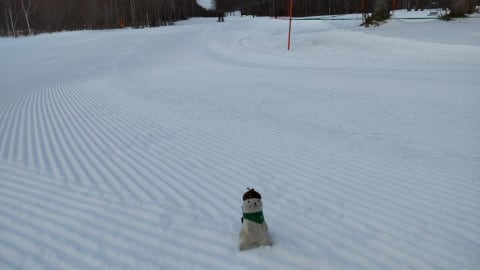
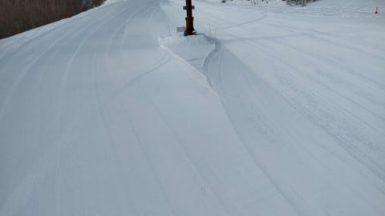
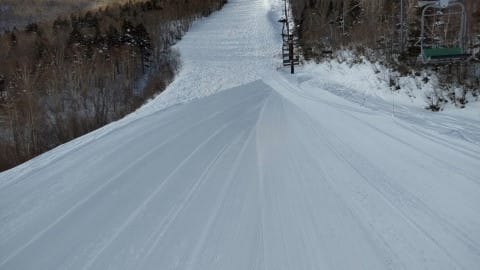
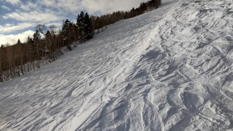
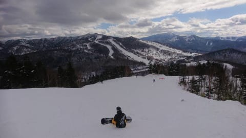
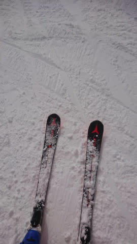
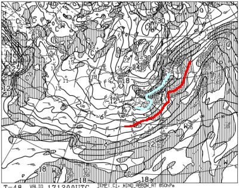
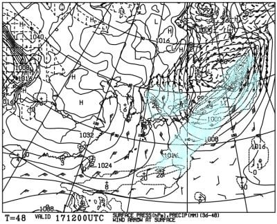
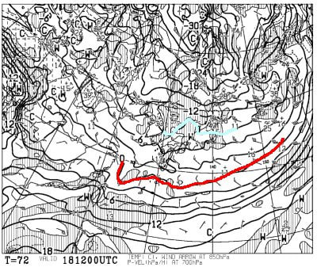
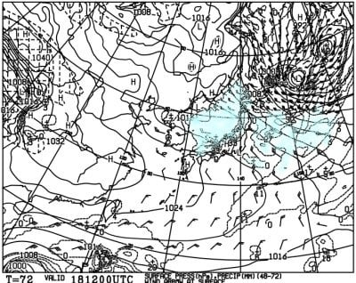

# やっぱり今週末18日（土）は激冷えパウダーデー！…脛～太ももパフくらいになりそうな予感！

📅 投稿日時: 2021-12-16 02:05:36

🏷️ カテゴリ: [日記](cc4b5682fb7b8b144980957a978653fb0.md)

…それは，本日の在宅勤務での仕事中のこと…

前の会議が終わる前に，次のWeb会議が

始まる時間になってしまい．

それも，次の時間では，どちらも外せない

大事な二つの会議が予定されていたので，

黙ってダブルで参加しよう…と，二つの

会議の両方にエントリーしていたら．

前の会議が終わる前に次の二つの会議が

始まってしまい．

同時に三つのウェブ会議に出る

という荒業を繰り出すことになって

しまったSkier_Sです…

そして．

三つの会議に同時参加という，

「一体だれが何を話しているんだ？」

と，脳内がこんがらがるカオス状態で

会議に出続けていたら．

三つの会議の全てから同時に呼び掛けられる

という想定外の危機的事態に陥り．

別の会議から何度も呼びかけられている中，

もう一つの会議の質問にあたふた回答するという

悲しい事態に陥り．

その後，別の会議には

「ちょっとネットワークの状態が悪かったようですね（しれっ）」

…と，とぼけていましたが．

今日は，

同時に三つのWeb会議に出てはいけない

という，教訓を得たのでした…←ホントに当たり前すぎて，何のオチにもなってないんですけど

しかし．

やったことがある人がいればわかると

思うけど．

三つの会議から同時に呼びかけられてたのが

分かっただけでもすごい

と，自慢してみようかな←自慢にならないから

ってなことで．

本日もいつものおこみん特派員と，

臨時特派員（？）から送られてきた志賀高原の

写真を見ると…

奥志賀は，朝イチシマシマ！

天気は終日晴れの予想を裏切り（涙）

曇ったり晴れたりを繰り返したようですが．

でも，バーンは見事に締まり気味のシマシマ！

ですが…シマシマなのは下半分の緩斜面だけ．

奥志賀エキスパートコースの急斜面，

今日も圧雪車が直っておらず，非圧雪だった

ようです…

でも，明日には圧雪車が直って圧雪が

復活する予定とのこと！

で．

焼額は…

見たところ，コース上にブッシュが出てくる

様子もなく，バーン状況も悪くなさそうに

見えますが…

でも，昼前には急斜面の一部にコロコロが出て

きちゃったとの報告でした…

うーん．明日も雪は降らないから．

やっぱり木曜の朝は，バーンは硬めの感じかな．

昼間は緩みそうだけど…

…だけども．

金曜の夜から，来ますよ～！

今日の最新の天気図を見ても，

17日金曜の夜9時の850hpa図は…

志賀高原には，水色の-9℃線がかかってます！

激烈な冷え込みです！！

そして，地上天気図は…

見事！見事な縦縞の天気図で，

日本海が寒気の吹き出しの雲で

完全に覆われてます！

これは，金曜夜から，志賀でも

かなり積もりそう！

で．18日日曜の850hpa天気図は…

これも，水色の-9℃線が志賀に

かかっているので．

終日-10℃近い気温が続く寒い日に

なりそう…！

そして，この日の地上天気図も，

完全に日本海全域が水色の降水域に

覆われる，積もりそうなパターン…

これなら大丈夫です！

最新の天気図でも，17日夜から

18日にかけて，冷えたパウダーが

ドサドサ積もり続けそうな天気図です！

18日土曜の朝までに，少なくとも30cm．

多ければ50cm…

最低でも脛パフ．多ければ太ももパフ

くらいにはなりそうな予感…っ！

…ただ．

風がちょっと強めなので，ウインドパック

気味でちょっと重く感じる雪になるかも？

そして．

19日の日曜はそれほど’積もらないけど．

10～20cm，ブーツパフくらい期待かな？

八方や新潟のスキー場では，日曜はもっと積もると思います…

中央エリアの運行予定では．

寺小屋，山の神，西館，東館，ブナ，

ジャイアント，丸池，サンバレーが

18日から営業予定なんだけど…

この積雪だったら，予定通り動いて

くれそうかな？

（少なくとも，山の神は動いて欲しい…）

ってなことなので．

昨日も予告しましたが．

金曜夜～土曜にかけて，おそらく内陸部でも

かなりの雪になると思います．

金曜夜から土曜朝に移動する方は．

高速道路も積雪で交通規制や除雪作業などが

入ると思うので．

時間にかなりの余裕をもって出発する

ことをおススメしておきます…！

## 💬 コメント一覧

### 💬 コメント by (アリス)
**タイトル**: コロコロ
**投稿日**: 2021-12-16 11:15:49

S様

お世話になっております。

web会議同時に3つは凄いです・・・

2つまでは私も経験ありますが・・・

無知な私に一つご教授お願いします♪

斜面で発生するのコロコロってどういう現象なのでしょうか？

また、スキーヤーにはどういう影響があるのでしょう？

普段全然気にしてかったのですが・・・

### 💬 コメント by (レインボー74)
**タイトル**: Unknown
**投稿日**: 2021-12-16 18:00:01

木曜日の志賀高原情報

朝の上林0℃　蓮池も0℃。晴れている。奥志賀への道はツルンツルンらしい。

朝一のパノラマコースは最高！

それにしてもコースに凸凹が一切ない。上手すぎます。ありがとう。

だけど３本滑って9時22分のバスで奥志賀へ。昨日の試みでわかったけど、10時16分のバスまでいかに多く三高に乗れるかが問題です。三高は5分弱で回せます。あとはダウンヒルからバス停へ、で4分強。必死に回してたら、なんか20000mの時を思い起こしました。

結局、昨日と同じバス3回し。

そうそう、今日、このブログの愛読者で、そのうち20000mをやりそうなかたと、ご一緒しましたよ。楽しみです。

### 💬 コメント by (Skier_S)
**タイトル**: 金曜早朝は一瞬雨っぽいかな
**投稿日**: 2021-12-17 02:50:59

＞アリスさま

コロコロは，硬いバーンの表面が崩れて，直径数cmの氷のカタマリが

発生する現象です…

板が氷の上に乗ると流されて安定せず，すごい怖いです（涙）

＞レインボー74さま

今日も良かったんですね…そして，今日も奥志賀ダウンヒルバス回しですか！

貸切りダウンヒル，いいんだろうなぁ…

そして，このブログ愛読者さんがいらっしゃったのは嬉しい限り．

週末まで滞在されるんでしょうか？

しかし，20000mチャレンジしようとは，なかなか危険発想ですね（笑）

