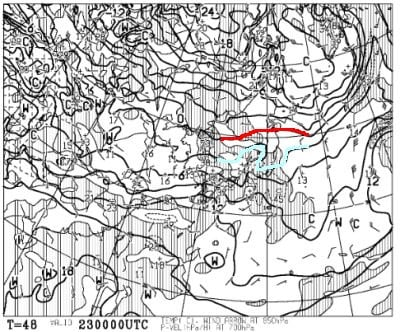
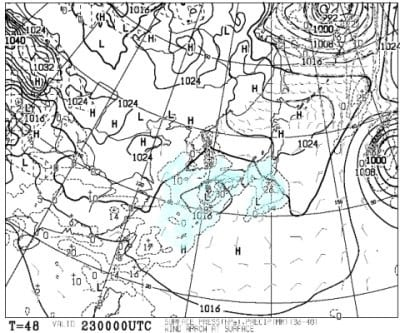
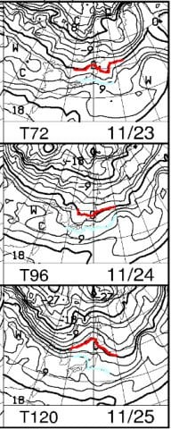
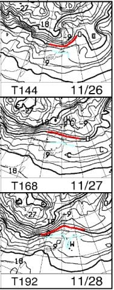
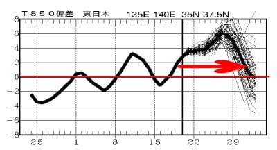
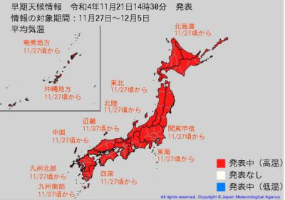
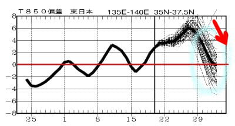

# 11月23日(祝)は横手も熊の湯もイエティも雨．そして気象庁が11月27日以降の高温早期天気情報を発表（涙）

📅 投稿日時: 2022-11-22 01:30:11

🏷️ カテゴリ: [日記](cc4b5682fb7b8b144980957a978653fb0.md)

濃厚接触者のために自宅待機中の

Skier_Sです．

…明日発症しなければ，無事解放

されて，水曜からは外出OK！！

で．

ちょうど水曜の23日は，勤労感謝の日で

祭日です！！

ってなわけなので，23日のスキー場の

天気を予想してみましょう…

まず，23日の850hPa気温図を見ると．

…赤い0℃線は青森近辺．

志賀高原には，かろうじて水色の

+3℃の線がかかっているので…

うーん．微妙な感じ…

そして，23日の地上天気図は…

…水色の降水域が，本州中心部に

かかってますね…(涙)

これは．

朝早くの標高が高い横手あたりは

ギリギリ雪になるかもしれないけど．

横手も昼間は雨になって．

それ以外のスキー場は軒並み雨ですね(泣)

ってなことで．

この23日の祭日の天気は…

23日(水・祝)：深夜から雨がぱらつく．

　志賀の横手・熊は夜中はギリギリ

　雪かも？

　でも，ぱらつく程度で積もらない．

　志賀高原も午前中には雨になり，

　それ以外のスキー場は夜中からずっと雨．

　ただ，横手・軽井沢はそこまで強く

　降らない．

　Yetiも終日雨．午後は時折強く降るかも．

　気温は平年より高めだけど，

　天気が悪いので寒く感じる．

　この日，かぐらオープンは絶対不可能

という感じでしょうか…

この水曜は，濃厚接触者の待機期間が

明けて滑りに行けそうなのに…

そういう日に限って雨ですか（涙）

滑りに行けなかった週末は天気が

よくて，待機期間が明けた祭日は

雨って…

どんな仕打ちだ（泣）

…でも．

その次の週末はいいコンディションに

回復してくれれば…

高峰高原（旧アサマ2000）や丸沼が

オープンしてくれるはず…！！！

と，850hpa気温図を見ると…

24日は赤い0℃線が志賀まで近づいて

くれるものの．

それ以外は長野県には水色の+6℃線が

かかっているような状態（涙）

24日，横手ならギリギリ朝に人工降雪

打てるかもしれないけど…

それ以外はダメですね（泣）

そして，26日以降を見ると…

なんじゃこりゃーーーーーっ！！！

26日は水色の+6℃線が志賀にかかる

レベルだし．

27，28日に至っては，+6℃線が

青森くらいまで上がっちゃうじゃないか！！！

なんだこりゃーーー！！

…これは．

ほとんどのスキー場．

28日まで人工降雪機が動かせる日が

ありませんね…（涙）

2週間の気温推移を見ても…

うぎゃーーーー！！

20日以降，12月1日ごろまで気温が

高い日が続き…

27，28日ごろには平年比+6℃だと！？？

ダメだ…

これは，ダメだ．

26日オープン予定のスキー場に

行こうと思っていた方，諦めて

ください．

26日オープンは不可能です…

そして．

月・木に発表される，[気象庁の早期天気情報](https://www.data.jma.go.jp/cpd/souten/)を

見てみると…

うげげげげげげ～っ！！！

11/27日頃から気温が平年よりかなり高くなる

という早期天気情報が出てます！！

ダメだ．

11月22日から12月頭まで．

全く冷える気配がない…

このままだと．

今オープンしているアイスクラッシュの

スキー場と，横手山以外は．

12月までオープンできないんじゃないか！？？

という，恐ろしい予想が…

ただ．

わずかな希望として．

2週間予想の気温トレンド．

水色で囲った29日以降，たくさん

引かれている線のほぼ全てのパターンで

気温が下がる傾向が見えているので．

予想がどうばらついても，間違いなく

気温が冷える方向に行くのだ．

おそらく，12月1日以降は急激に

冷える！！

冷えるはず！！

冷えるのだ！！！

そして．

12月3日の焼額オープンの直前に

激烈冷え冷えになり，

どっさり雪が降るはずなのだ！！！

…けど．

気温低下タイミングが遅いと

12月3日もヤバいかも…

とりあえず．

このBlog読者の皆様におかれましては．

これからしばらく，

日ごろの行いを極めてお行儀よく

過ごしてくださいますよう，

そして，毎晩寝る前にひたすら

寒気の歌を歌ってくださいますよう．

お願い申し上げます…

## 💬 コメント一覧

### 💬 コメント by (koi)
**タイトル**: Unknown
**投稿日**: 2022-11-22 07:06:30

なんと悲しい予報。1本グラフ範囲を突き抜けてプラス10とかに行きそうな点線がありますけど、この路線に行ったらとんでもないことになる、のですかね…

### 💬 コメント by (Skier_S)
**タイトル**: Unknown
**投稿日**: 2022-11-23 06:07:55

プラスに突き抜けてる線に行ったらやばいですよね…

それはないと信じたい…

