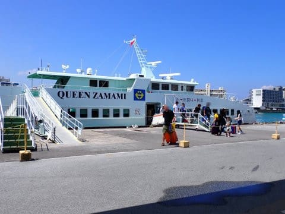

# 2024年8月，今年も座間味で親子ダイビング！その20…さよなら座間味！クイーン座間味で那覇到着

📅 投稿日時: 2024-09-21 01:59:11

🏷️ カテゴリ: [ダイビング日記](ce3a7a8d424d112fce83ee85c81a0e344.md)

えー．

今週も3連休ですね．

3連休なんですね．

ええ．関係ないです．

今週も3日間，家に籠って仕事です．

あぁ…この厳しい状況から早く脱出

したいんだけど，終わりが見えない（泣）

来週あたりは，せめて土日のどちらかが

休めると嬉しいなぁ…

とりあえず．

人間は夜寝て週末は遊んでリフレッシュ

しないといけない…ということを

改めて強く感じている今日この頃．

それでもBlogを書く！

ってなことで．

今日も座間味のダイビング旅行記です！

ーーーー

（[前回はこちら](e1f54634452906196e5319dc3cf5ee05f.md)）

そして．

ついにやってきてしまった最終日…

今日はもう，ダイビングはせず，家に

帰るだけの一日ですが．

朝，外を見ると

「今日も潜りたい～！！！」

と思わせる晴天．

あぁ…

潜りたい…

で．

最後の日も，いつも通り朝7時から

朝ごはん．

そうは見えないけど，かなり食べる量の

多い私でも，結構お腹いっぱいになる

いつもの朝ごはんを食べたら…

3階宿泊者の専用テラスに一晩干していた

ダイビング器材を回収して，パッキング

します．

あぁ…

ホントに憎いほどいい天気．

強い日差しで，昨日の夜はまだ半乾き

だったウェットスーツもすぐにカラカラに

乾いたし…

荷物を片付けてたら，あっという間に9時半．

高速船は10時出港なので，そろそろこの

部屋を立ち去る時間です…

3泊，お世話になりました！

重い荷物は，星砂さんの車で港まで

運んでくれるので．

身一つで港へ向かいます．

…いつもはウェットスーツを着て

歩く道だけど．

今日は帰るために歩いているのが

かなり寂しい…（涙）

そして．

港のいつもの場所にはティンガーラ号は

止まっておらず．

それもさみしさを倍加します…

まぁ，この時間だからダイビングに行って

ますよね．

ってことで．

高速船の桟橋で待っていると．

到着定刻の9:50に，クイーン座間味が

到着！

さすがにお盆休みの第1便．ほぼ満席の

大量のお客さんが乗ってました…

出発の10時までに手際よく大勢のお客さんを

おろし，今度は乗り込むお客さんが

乗り込んだら…

ちょうど出港の10時．

高速船は慌ただしく離岸して…

座間味の港を離れていきました…

あぁ…

さよなら座間味…

来年は娘が受験だから戻ってこれないけど．

再来年，また戻ってくるよ！！

…と，座間味に別れを告げてしばらく行くと．

おっと．さっき港にいなかったティンガーラ号が

港の目の前の安慶名敷島の前にいるのを発見！

いいなぁ…

今日行った人は，こんなきれいな海を

潜ってるんだろうなぁ…

あぁ…

帰らないで潜りたい…

キレイな海を眺めながら走ることしばし．

クイーン座間味は，中継点の阿嘉島に

一旦立ち寄って…

その後は一路那覇へ！

海の日3連休の終わりだけど，

これからお盆休み本番だからか，

朝いちばんの便だからか．

座間味から帰る高速船はガラガラ

でしたね…

去り行く慶良間諸島に別れを告げて．

沖縄の海を少しでも堪能したい私は，

船室には入らず，1時間ひたすら

デッキで海を眺めてました…

阿嘉島を出て，約50分．

高速船は那覇に到着しますが．

那覇って大都会だな…

と，座間味から帰ってくるといつも思う…

そして，定刻の12時10分に下船！

…いつもなら，ここからすぐに空港へ

向かうところですが．

今日は帰りの飛行機が16時過ぎで，

まだ4時間以上あるので…

空港による前に，ちょっと寄り道して

行くとしますか…

（[続く](eeb615befce4f9b63d44bd3f95b4eedb3.md)）
