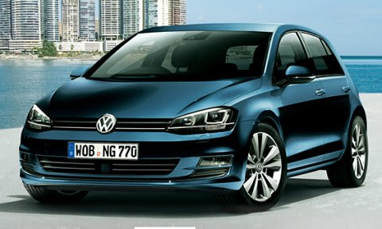

# VWのGOLFに試乗してきたよ…まずは1.2LのTSI Comfortlineから

📅 投稿日時: 2014-06-17 01:11:19

えー．

毎週末にスキーに行く時期が終わると．

終末…もとい．週末に時間があるので．

いろいろ車を試乗しに行ってしまうわけで．

…もう，2週間ほど前になりますか．

新型ゴルフの出来が良い，というウワサだったので．

ちょいと近所のフォルクスワーゲンまで試乗に

行ってみました…

乗ってきたのは，1.2Lターボのコンフォートラインと，

1.4Lターボのハイラインの2種類．

今日は，1.2Lターボのコンフォートラインの試乗レポートです．

では，どうぞ～

--

VW GOLF 1.2L TSI Comfortline 

(写真はVW公式HPより拝借）

まずは1.2リッターエンジンのコンフォートラインから

乗ってみましたが…

いや，エンジンは予想以上！

1.2リッターなのに，トルクは十分．

ボディが軽いからか，2L以上のトルク感で．

ターボラグを全くちっともこれっぽっちも感じさせることなく，

くいくい車を引っ張っていきます．

いや，これホントに1.2Lか？

これで十分．

これで不足を感じる場面，まったくなし．

アクセル踏み込めば，十分速い！

7速DSGも，シフトのつなぎ目を感じさせない

素早い，ショックなしの変速感．

秀逸なのは，アクセル踏み込み時のシフトダウンが

速く，アクセルを踏み込んだ時の加速感に

ラグがないこと．

日本車のこのクラスのCVTだと，アクセル踏み込んで

プーリーが動き出して，やおらギア比が変わって，

それから加速…

という，タイムラグが感じられるけど．

さすがDSGは，シフトダウンがすばやく，

ラグ感のないエンジンとともに，気持ちよく

エンジン回転が伸びて車を引っ張っていきます．

で．

足回りは，やっぱりドイツ車っぽい作りで．

ウェーブを超えた場合の足の収まりもよく．

ステアリング・ブレーキのフィールも，

剛性感の高い，かなりいい感じ．

日本車のブレーキペダルも，ストロークで効かせず，

踏力でコントロールできれば，コントロール性が

高いし，気持ちいいと思うんだけどな～．

エンジンルームを開けてみると．

フロントサスは，マクファーソンストラットだけど．

1.2Lとかなりエンジンがコンパクトなので．

バルクヘッドがストラットマウント直近に

まで前進してきているレイアウトで．

そのせいもあってか．

フロントの剛性感は十分高く．

フロントの突き上げ時にもボディがしっかり，

衝撃を受け止めている感じ．

んで．

排気＆ターボ系は後方にあるのに．

遮音がかなりしっかりしているのか？

ダッシュボード経由で伝わってくる

エンジン音は静か．

…エンジン自体がかなり静かなのか？

遮音がしっかりしているのか？

うーん．後方排気とは思えない…

って感じで．

ワクワク感がそんなにあるわけでないけど．

クラスを大きく超えた，高級車に乗っている

ような足回り＆フィーリング．

これは…

走る・曲がるって点では，よくできた車だわ．

…でも．

Cセグメントとはいえ．

コンフォートラインでも，280万円する車だと考えると．

このくらいの出来ではあってほしいかも…．

まぁ．

よくできた車とはいえ．

ちょいとコンパクトすぎて，後ろ座席やトランクも

必要十分って感じの，結構タイトな感じだし．

レギュラーじゃなくハイオク指定だし．

やっぱりレガシィの方が，我が家にあってるかな～

＃それ以前に，FFって時点で候補から落選なんだけど

## 💬 コメント一覧

### 💬 コメント by (ゆうこ)
**タイトル**: 試乗
**投稿日**: 2014-06-17 10:54:45

お久しぶりです。

スキーシーズン終わったので、車買い替えのために試乗しまくってます。

私の愛車フィットは、すでに16万キロ超えていい感じに熟成されてます。

私もスバリストになりたいなぁと思って、今のところフォレスターが第一候補です。

でも、運転が下手で自宅の車庫入れが不安でなかなか思い切れません。親には、ホンダのヴェゼルにしたら？と言われました。

Sさんの試乗インプレッション参考にさせてもらってます。

また他の車にも乗ったら教えてください！

### 💬 コメント by (Skier_S)
**タイトル**: ゆうこさま
**投稿日**: 2014-06-18 02:27:34

お久しぶりです～

16万kmですか…かなり熟成が進んでいるようですね．

ヴェゼルですが，ガソリン4WDにすると，

ちょいと物足りない感じがするかと…

インプレッサかXVという解もありますよ～．

ハイブリッド4WDだと250万円超えなので，

ガチでXVハイブリッドとバッティング．

燃費はヴェゼルですが，走りだとこれは

もう圧倒的にXVハイブリッドの完勝ですよ～

インプレッサ2.0，雪道ではすごくいい車

なんで，インプレッサも候補にどうぞ！

### 💬 コメント by (ゆうこ)
**タイトル**: XVは
**投稿日**: 2014-06-18 22:45:23

XVも乗ったんですが、ちょっと小さいかなぁと。

大きい車に乗るのが夢なんですよね。

でも、ヴェゼルと迷うなら確かにXVももう一回試乗して考えてみます。

フォレスターも捨てがたいですが。

### 💬 コメント by (Skier_S)
**タイトル**: ゆうこさま
**投稿日**: 2014-06-19 02:07:11

え？XVで小さいとなると…ヴェゼルはないですよね．

だとすると，レヴォーグですか～？（笑）

レヴォーグ2.0はすごいですよ～．

しかし，大きい車に乗るときには，車庫入れは

クリアしないといけませんが…

ちなみに，SUVタイプがお好みですか？？

