# 4月5日の志賀高原は…神様，ありがと～っ！！！4月にしては超Goodな一日っ！

📅 投稿日時: 2014-04-05 20:49:29

🏷️ カテゴリ: [2014スキー滑走日記](c992167609b6415052179ee69ea1ea7d8.md)

えー．

どうやら．

私の日ごろの行いが．

空前にして絶後なほど良かったようです．

なんてったって，今日．

すっかり晴れ晴れのなか．

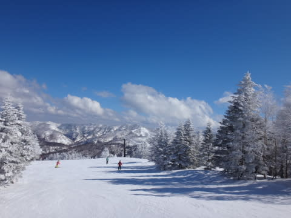

午後まで冷えひえのいい雪で…

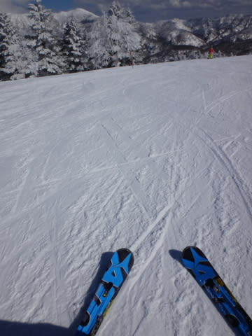

え？今日，何月？

2月だったっけ？？？

…って感じの一日で．

そうです．

そのとおりです．

こんな良い天気でいい雪だったのは．私のおかげです

今日，志賀高原で滑った人は．

私の日ごろの行いの良さに感謝…（ビシィ！)←神からの正義の鉄槌が下る音

ってことで．

今日のレポートを…

朝，志賀高原の上り坂は．

昨日の雨が凍った上に新雪という，

かなりヤバげな感じ…

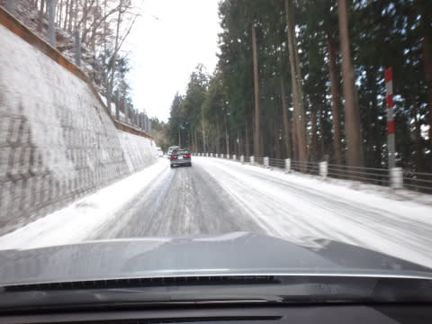

やっぱり，途中で息絶えてる車が多数…

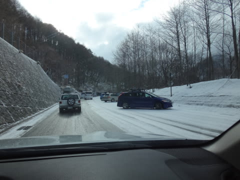

…この時期の志賀を舐めちゃいけませんね～

んで．

ゲレンデに着くと…

山頂は，予想通りマイナス10度近く！

冷え冷えです！！

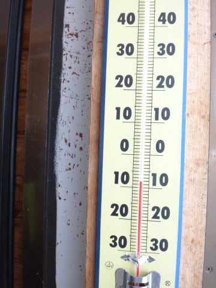

午前中のゲレンデは，ちょっと雲がかかり…

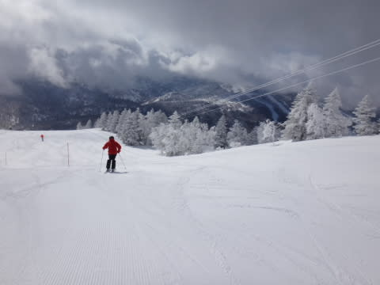

時折薄日が射したり

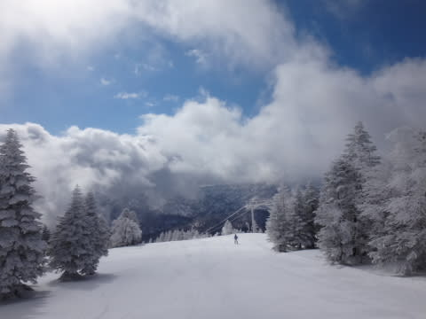

雪がちらついたりもしたけど．

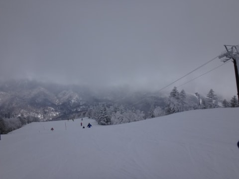

どちらにしろ，真冬の景色で．

朝イチは，私の日ごろの行いの良さを祝福するような．

冷え冷えシマシマバーン！

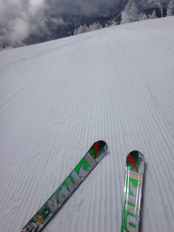

朝早いうちに圧雪されたところは，

明け方にうっすら雪が積もっていて…

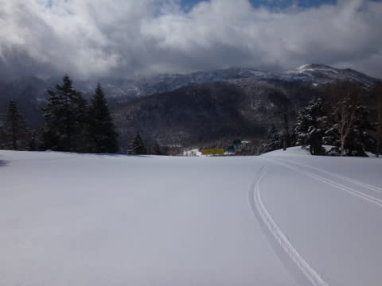

圧雪の上の軽い新雪を蹴散らして滑っていく快感！！

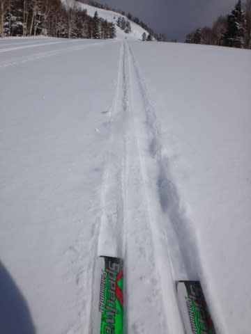

わははははははははっ！

ホントに今日は4月か？？

神様，カレンダー間違えてない？？

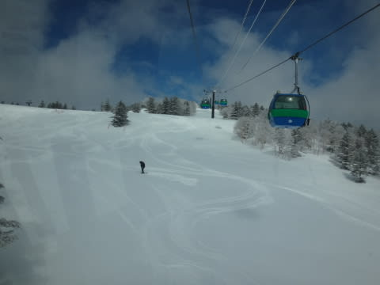

昼近くになっても．

気温は冷えひえで雪質はいいまま！

さらに，4月だから，人もがらがらなんですが…

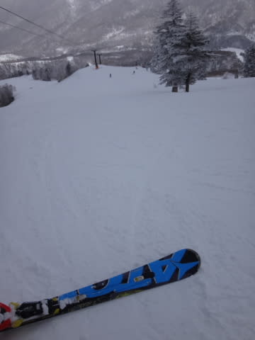

そして．

昼近くになってくると，雲が切れ始め…

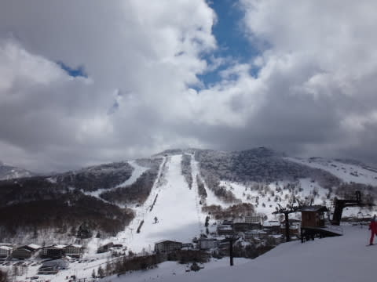

すっきりと太陽さんがコンニチハしてきました！

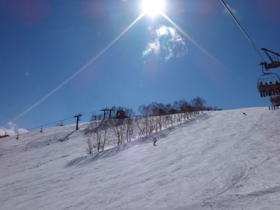

午後にはこんなに激烈な快晴に…

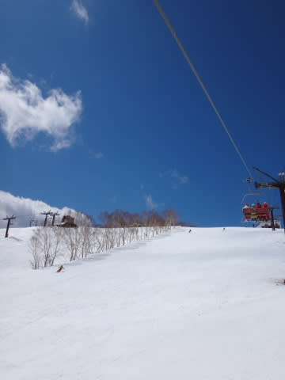

だのに．

4月の快晴なのに．

なんでこんなに雪がいいの？

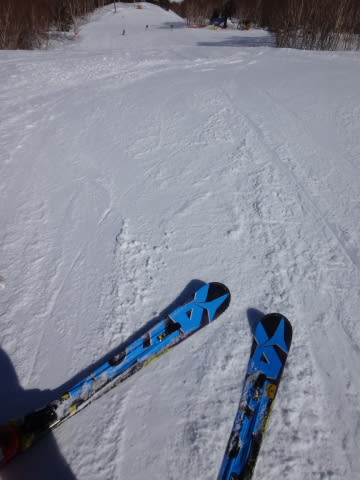

そして，こんなに人がいないの？

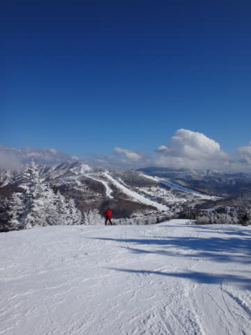

人がいないので，午後までゲレンデは完全に

フラットなままっ！！

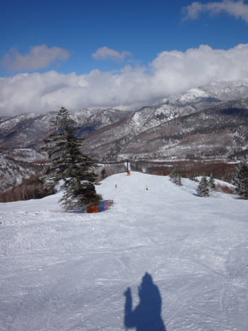

いいんですかっ！

4月というのに．

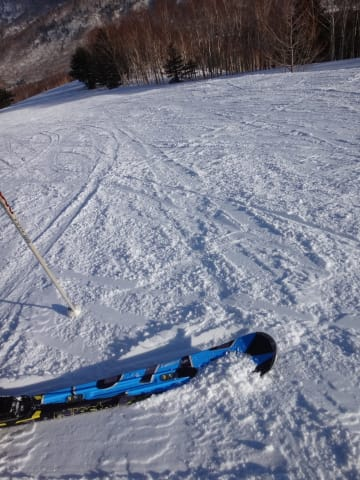

夕方までこんなに雪が良くて，良いんですか！

まぁ，標高の低い部分で，日が当たる部分はこんなところも

あったり．

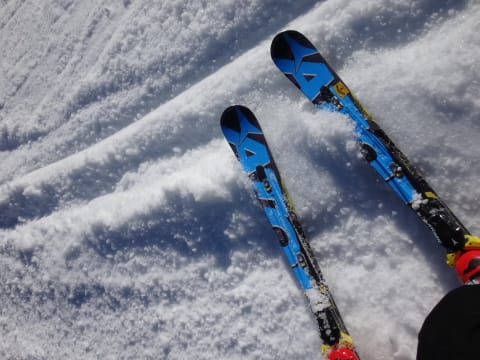

ちょっと固くなってるところもあったけど．

…でも．

でも．

焼額第1ゴンドラ側のコースは，終日良い雪で．

4月でこれは，恵まれすぎでしょ～．

っつーよりも．

明日で第1ゴンドラの営業が終了して．

このコースが滑れなくなるなんて…

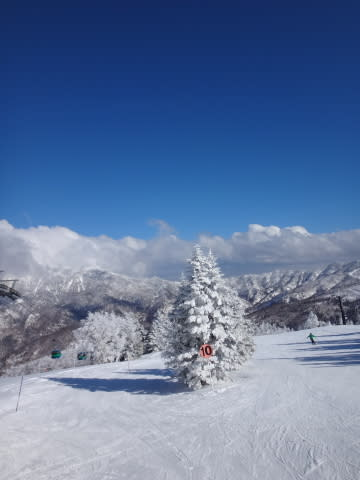

もったいないお化けが5万人くらいの軍団で

襲ってきても，全く不思議ではない気がするんだけど…

…もったいない(涙)

PS．れおさま，予想通り，朝イチゴンドラで

見事発見されちゃいましたね(笑）

息子さんとのスキー，楽しめましたか～？

## 💬 コメント一覧

### 💬 コメント by (れお)
**タイトル**: 念願かない
**投稿日**: 2014-04-05 23:13:59

やっと発見しました～(笑)

今日はサイコーでしたね♪

息子は、憧れ(？)のSさんに会えて、ちょっと緊張気味だったようです(笑)

今後の赤い靴のレポートも楽しみです。

板との相性とか、今まで気にしたことが無かったものですから。

明日も、コンディション良さそうですので、最後の1ゴン、名一杯楽しんで下さい～。

### 💬 コメント by (Skier_S)
**タイトル**: れおさま
**投稿日**: 2014-04-07 00:25:59

先日はお疲れ様でした～．

土曜も最高でしたが，日曜も結構良かったですよ～．

…寒かったですけど（笑）．

最後の1ゴン，楽しんできました．

また機会がありましたら，志賀高原で

お会いしましょう～！！

