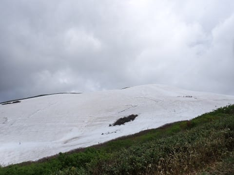
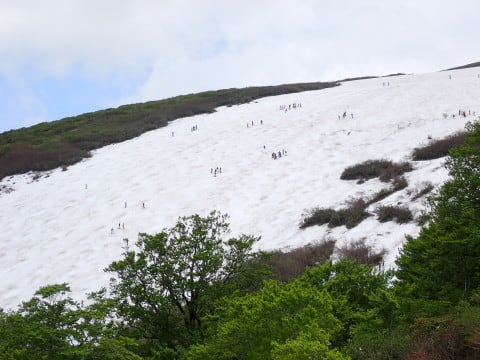

# 2023/6/4(日)の月山スキー場レポート！…リフト乗場・降場ではかなり歩く最終形態ながら，コースの雪はまだ十分！曇り時々ぽつぽつ雨，朝のうちリフトは混んだよ

📅 投稿日時: 2023-06-05 02:12:10

🏷️ カテゴリ: [2023スキー滑走日記](cd943df30cfcc3d0896469e2ff98720cd.md)

えー．

行ってきました，月山日帰りに…

朝…というか深夜1:30過ぎに家を出て，

往復950㎞走って滑って，12時過ぎの

さっき帰って来ました～！！

いや．

往復12時間近くかけて，滑るのは

5時間という強行軍なので．

普通の人はやらないと思いますが．

…というか，やらないほうが身のためだと

思いますが．

でも，今日は行ってよかった～！！

意外と楽しめましたよ～！！！

しかし，1時ごろに起きてから今日の

活動時間が24時間を越えるので，眠い…

明日も仕事に行かねばならぬので，

今日は速報モードにて…！！

まず…今日の天気は駐車場は晴れてるのに，

山に雲がかかるパターンで…

終日ほぼ曇り，時折雨もぱらつく天気(涙)

そして，月山リフトはすでに最終形態に

なっています．

リフトを降りてから，この先の雪のある

所まで歩いて登らないといけないですし…

リフト降り場に滑り込むところも，最後が

もう泥沼湿地化して，ブーツがずっぽり

うまる泥沼藪を数10m突っ切るか．

リフト乗り場まで，下駅の下から歩いて

登るかのどちらかしかないのですが（泣）

下から上るほうがまだマシな感じでしたね…

すでにリフトの乗り降りは6月第1週にて，

最終形態になっています（涙）

そして．天気は悪いうえにリフトはすでに

最終形態なのに…

朝10時ごろまでは，リフトはめちゃくちゃ

混みました（激泣）

リフトに滑り込めないのに，リフトが全く

見えないこんなところまで並んでるの，

見たことないんですけど（涙）

まぁ，でも最大15分待ち程度で，

10時を過ぎると一気に人が減って．

昼前にはほぼ待ちがなくなったので

まだよかったかな…

で．

肝心な雪の量ですが．

リフトが最終形態になっている割には，

まだ雪は結構多い感じ…！！

月山に行ったことがある人が見れば

わかると思いますが，大斜面に向かう

トラバース部分の藪はまだそんなに

立ち上がってないですね～！

大斜面も，まだ幅ひろびろ！！

コブ溝にブッシュが出てきているところも

少なく…

かぐらファイナルよりはずっとマシな感じ…！

上から下まで続くコブラインが，まだ

何本も取りたい放題の幅広さで雪が

残ってます…！

まぁ，6月も始まったばかりだから，

このくらいは雪が残っていて当然って

感じですが…

でも，リフトが最終形態だったのでもっと

雪が少ないかと思ったら，意外と楽しめます！！

そして，沢コースも…

まだ沢コースと大斜面が途中で行き来

できるレベルだし．

沢コースへ落ち込む斜面もいっぱい

コブラインがあってまだまだ滑れて．

沢コース自体はそんなコブになっておらず，

幅も取れるし．整地に近い感覚でカービング

小回りで滑れるよ！！

…これ，かぐらファイナルよりずっと

楽しい…っ！！

雪が少ないと途切れる下の部分も

まだ大丈夫そうだし…

来週までは問題なく沢コース行けますね…！

…ってなことで．

まだ6月第1週ということもありますが．

リフトはすでに乗り場・降り場でけっこう

歩く必要がある最終形態ながらも．

コースの雪はまだたっぷりあって．

かぐらのラストよりはずっと楽しめる，

満足な月山でした～！！！

また明日，元気があれば詳細レポート

します…！←いや，速報と言っておきながら

これで十分長いレポートだけど…？？

しかし明日，25時間活動したあとに仕事して，

詳細レポート書く元気あるかな…

とりあえず．

普通の人は，K奈川県から日帰りで月山に

滑りにいかないほうがいいと思います←お願いされてもやる人いないから
