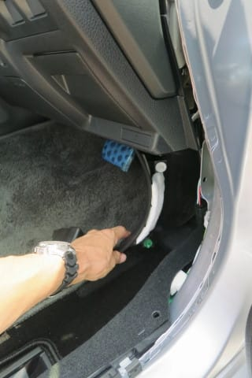

# プロジェクトX2第2章…LEVORG E型にKENWOODナビ取り付け・ナビ本体取付け時，衝撃の事実がっ！！！！

📅 投稿日時: 2018-08-19 06:26:19

ということで．

ナビ取り付けも，リアカメラやETC車載器の取り付け，

各種アンテナ取り付けという大物が終わり．

前回，ナビ繋ぎこみのケーブルも完成したし．

…山場は終わった．

あとは本体を繋ぎこめば終わりだ！！！

残りわずか…

と．

ラストスパート（のはずの）

ナビ繋ぎこみ作業を開始したわけですが…

とりあえず，ナビスペースには．

こんな感じで，

・20ピンオーディオコネクタや

・純正リアカメラ用配線

など，車両ハーネスが

来てますし．

そのほか，自分で取りつけた

・ETC車載器からの配線

・GPSアンテナケーブル

・地デジアンテナケーブル4本

が来ています．

…しかし．

ナビスペースに来ているケーブル．

20ピンコネクタとリアカメラ以外にもいっぱい

あるけど，何だろう…？

まぁ．いいや．

あと，残りで必要なのは．

車速やリバース線を受け取る，

15ピンサービスコネクタだな…

ってことなので．

運転席の足元付近にあるという，

15ピンサービスコネクタを探しましょう．

赤く示した，このあたりにあるはず

なのですが…

とりあえず，ステアリングシャフト回りを

探しますが…

うーむ．

何も刺さってないのはこのコネクタ

だけなんですが．

このコネクタは15ピンコネクタでは

無いですね…

ステアリングシャフト回りには

見当たらないなぁ…

以前のBRレガシィと同じく，運転席右足

あたりに来ているかも？

…めんどくさいけど，運転席右足元の

パネルを剥がしましょうか…

まず運転席側モールを適当にこのくらい外して．

サイドシルカバーを外します．

こいつは真上に引っ張れば，意外と

簡単に外れます．

そして，足元のカバーを外れる方向に

引っ張ります．

ねじ止めはされてなくて，クリップで

止まっているだけなので，引っ張るだけで

あっさり外れます．

で，ここのハーネスを見てみますが…

ない．

無い．

ないのだ．

どこを探しても，この15ピンコネクタの

相手となる，車両側15ピンサービスコネクタが，

見つからないのだ！！！

…どうしたことだ．

一体，どこにサービスコネクタがあるのだ？？？

いろいろ探したけど，全く見つかりません（涙）

もう，どうしても見つからないので，

ネットで調べてみると…

ネットに出回っている情報のほとんどが，

LEVORGのA～C型までの情報だったので，

気づかなかったのですが．

LEVORG D型以降で仕様が変わって．

ステアリングシャフト横の15ピンサービス

コネクタが無くなり，

トヨタと同じ5ピンコネクタが

ナビスペースに来るように

変わったようです…！！

な，なんてこった！！

良く見てみると…

こ…こいつか！！

車速＆リバース＆パーキング線．

この5ピンコネクタになって，

ナビスペースに配線されるように

変わったのか…！！！

どうりで，ナビスペースに来ている

コネクタが多いと思った…

まぁ，車速＆リバース＆パーキング．

ナビには必ず使う線ですから．

いちいち運転席側から引っ張るより，

ナビスペースに配線が来てる方が合理的．

本来こうあるべきだと思うけど…

…でも．

私が持っている，この15ピンコネクタ．

これは…無駄になったということだな…（泣）

これから，どうしよう…

5ピンコネクタのケーブルを切り取って，

ギボシ加工しちゃうか？

…でも．

車両側コネクタは切り取りたくないなぁ…

だったら．

[リアカメラ取り付けと同じよう](e0d61a04608a6a32ac684b08fc69da0f4.md)に．

また，コネクタからピンを抜いて差し込むか…？

…しかし．

こんなごっちゃりしたコネクタ＆ケーブルが，

大量に狭いスペースに押し込まれるナビ後ろ側．

狭いスペースでピンを1本1本差し込むのも

大変だし．

ケーブルを押し込むときに，ピンが引っ張られて

抜けたり，押されてピンどうしが接触して

ショートしたりする可能性もあるなぁ…

いろいろ考えてはみたけども．

ここは素直に．

5ピンコネクタに接続できるケーブルを買うしか

なさそう

と．

諦めの境地に陥ったのでした…（涙）

とりあえず．

5ピンコネクタが届くまで，ナビの取り付けは一旦中断か…

あと1-2時間で終わると思っていたのに．

続きは次の週末になるという．

まさかあと1週間かかることになるとは思わなかったよ…（涙）

…他に足りない部品があったりしないか？？

また来週，続きの作業を始めて．

また足りない部品を買うのに，さらに一週間待ち

という悲劇を繰り返さないよう．

チェックしてみたところ…

良く見ると．

このナビスペース．

ナビ取り付け用のブラケットが着いてないじゃないか

普通の2DINサイズのオーディオスペースなら．

2DIN用のブラケットが車両にくっついてきてるはず

なのですが．

…8インチナビになったD型以降．

ブラケットは車両に着いておらず．

別途注文が必要なようです（涙）．

ってことで．

ナビ取り付け用のブラケットもスバルに注文．

これも入荷に2-3日かかるようで…

なんということだ…

まる一日あれば，余裕で着けられるよね…

と思っていたナビ取り付け．

リアカメラのすったもんだで2日に渡る

作業になってしまっただけでなく．

まさか．

C型までとD型以降でいろいろ仕様が変わって，

さらに1週間待ちとなってしまうとは…（激涙）

と，悲しみにくれながら．

とりあえず明日からの通勤に使えるレベルにまで，

内装を元に戻すという．

無駄に思える作業に取り掛かった，Skier_Sなのだった…

## 💬 コメント一覧

### 💬 コメント by (アル)
**タイトル**: ブラケット
**投稿日**: 2018-08-19 21:32:22

以前は目隠しのカバーにブラケットがついていたものですが、今はナビ取り付け前提で空いてますのでブラケット別途注文が多いですね。ついつい忘れがちです。コネクタはいよいよトヨタと共通化してきたようですね。

### 💬 コメント by (Skier_S)
**タイトル**: アルさま
**投稿日**: 2018-08-20 01:45:32

最近の車はブラケットが着いてないものも多いみたいですが．

LEVORGもC型まではブラケットが着いていたので．

てっきりD型以降もブラケットが着いているものと

思ってました…

コネクタは，トヨタと共通化が進んできたみたいですね…

でも．

オーディオ＆電源コネクタも共通化してほしいですね～．

ってか．

各社ばらばらなのは不便とみんな思ってるはずなので．

トヨタも日産もホンダも，全社共通仕様にしてほしいところですね…

