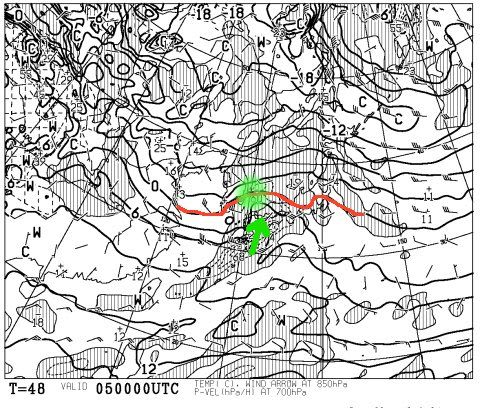

# いつも通り，今週末もヤケビグルグル予定…でも，日曜の天気が微妙になってきた…

📅 投稿日時: 2017-02-03 21:32:49

ということで．

今日は比較的早めに帰宅できた，Skier_Sです．

えー．

ってことで．

今週末もいつも通り，焼額をグルグルしているかと

思うんですが．

まぁ，土曜日は．

水曜時点の予想通り．

朝から太陽が顔を出し．

金曜朝まで降っていた雪がしっかり圧雪された，

柔らかめのいい感じの圧雪バーンを楽しめそう！

…ただ，午後はゲレンデが荒れて，下地の固いのが

ところどころ出てくるかもしれませんが…

そして．

日曜ですが…

すごく微妙になってきました

とりあえず．

昼くらいまでは天気は持ちそうですが．

昼過ぎから…

液体が降るのか，固体が降るのか．

微妙な感じに…（涙）．

そして．

ゴンドラが昼からは減速運転になるかも…？？

＃運休にならないとは思うんだけど…

日曜朝9時の地上天気図を見ると．

昨日は，九州南部の赤矢印部分に，

低気圧が一つあるだけの予想図でしたが．

今日の予想では，緑矢印部分の

九州北部にもう一個低気圧が発生するような

予想に変わっていて…

＃この地上天気図だけでは分かりにくいですが…

だもんで．

850hpa図を見ると．

こんな感じで．

緑でマークした，九州北部の低気圧に向かい，

緑矢印のように，南風が吹き込む予想になってきました…！

うーむ．

昨日の段階だと，日本南岸の低気圧に北風が吹き込む

感じだったんだけど…

志賀高原より北側を，低気圧が通過するとなると．

この低気圧に吹き込む南風で，

昨日の予想より，気温が上がりそう．

そして，南風に弱いゴンドラは，影響を受けそう…

ヤバい．

ヤバいよ…！

だから，南岸低気圧の時の予想は難しいんだよな～（涙）．

この，北側の低気圧への南風が強くなると，

気温が上がって，雪じゃなく雨になる可能性も…

しかし．

まだ分からない．

まだ，どうなるか分からない．

私の祈りで，雪にしてみせるっ！

というか，みんなも祈るのだ！！

このBlog読者の祈りで，日曜を雪にしてみせるのだ！

さぁ，みなさん．

祈るのだっ！！
