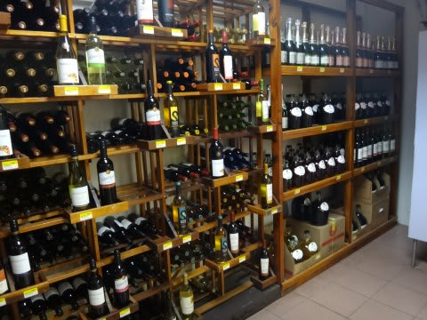

# 2014年10月，小学生の子連れでパラオへダイビングに行ってみた，その2…ホテルへ到着っ！

📅 投稿日時: 2015-07-18 02:31:55

🏷️ カテゴリ: [ダイビング日記](ce3a7a8d424d112fce83ee85c81a0e344.md)

ということで．

血尿を出してしまったけど．

体調は意外と問題ないので．

今日も無事更新…

＃しかし，こんな状態で毎日深夜帰宅して，

＃それからBlog更新…ホントに大丈夫かいな…？？←早く寝ろ（自己突込み）

では，パラオ旅行記，続きます～

---

って感じで．．

深夜12時過ぎ，パラオの空港に到着したわけですが…．

その後，

空港に出迎えに来たツアーバスに乗り…

パラオ滞在中の宿，

「ウェストプラザ・デセケル」

へやってきます．

ホテル到着は，深夜1時過ぎという，かなり遅い時間…

だもんで，娘は到着した途端にベッドで即落ちでした．

＃お出かけ服着たまま，なんつー恰好で寝てるんだ

…しかし．

このホテル．

かなり大きめのベッドが二つ並んだツインで，

十分広いよっ！！！

水回りも，ダウンタウンの激安ホテルに比べれば，

十分きれいだし．

ドライヤーも石鹸もシャンプーもあるし．

冷蔵庫もポットもありましたね～

部屋の前にベランダもありましたが…

（翌朝の写真）

…このベランダ．

景色も良くなく狭いので，滞在中に使うことはなかったです…

…そうそう．

このホテル，Wi-Fiが使えるんですけど．

パラオの国自体，インターネット回線がむちゃくちゃ細いので．

画像のあるWebページなどは表示が遅く，使えたもの

なかったのが，想定外…

でも．まぁ．

このホテル．

お値段の割にそこそこきれいで，

十分広かったし．

1Fは夜10時までやっているスーパーで，

一通りのモノがそろっており．

ワインも…

ビールも…

食料も買えます．

（後日撮影のスーパーの中）

朝食や飲み水，ビールなんかの買いだしに

すごい便利だったし．

我が家にとって，不満はないレベルかな！

とりあえず．

この日はもう，深夜1時過ぎ．

明日からはダイビングなので．

さっさと寝ましょう．

おやすみなさ～い！！

…と，眠りについたSkier_Sなのだが．

…まさか．

3日後．

とある事態により，このホテルから移動する羽目に

陥るとは，この時点では全く予想もしていなかったのだった…

＃なんか，このパターンが続いてる気がする…
