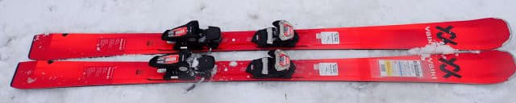
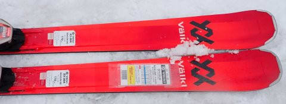
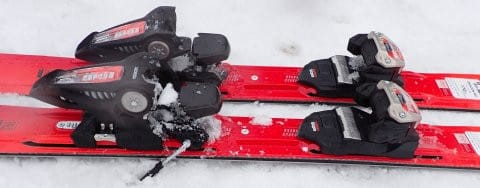
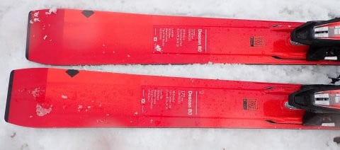
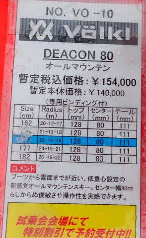

# 2024シーズンモデルのスキー板，試乗レポートその27…VOLKL DEACON 80

📅 投稿日時: 2023-07-13 01:53:59

昨日はスキーネタじゃなくて，久しぶりに

山歩きネタをメインにしたところ．

一気にこのBlogのアクセス数が減少して

しまった今日この頃，皆様いかが

お過ごしでしょうか（時候の挨拶）．

いや…多くの人がこのBlogを，

徒然ドライバー日記

や，

徒然山歩き日記

と誤解しているんじゃないかと思っていた

時期もあるのですが．

どうやらこのBlogはちゃんと，

徒然スキーヤー日記

だと認識されていたようですね～！

だもんで．

本日は本来のスキーネタです！！

…といっても，いつもの2024シーズンモデルの

スキー板の試乗レポートですが…

今回はフォルクル編．

では，どうぞ～！ 

〇VOLKL DEACON 80 172cm

オールマウンテン

以前，センター幅が違う[DEACON 84の
2023シーズンモデル](e87c87f2bbee2ed91188816d77eb1fdb1.md)をレポートしましたが…

こいつはセンター幅80mmのDEACON80の

2024シーズンモデルです．

ただ，このモデルは完成度が高いからか，

コスメチェンジはしていますが，

2022シーズンから中身は変わらず，来シーズンは

3年目の継続モデルとなるようですね…

ってなことで，滑ってみますが．

何度も書いているように，この日は重い春雪が

荒れ荒れになったあと，一気に冷えて

荒れたままガチガチに固まり，その上に

重い新雪が積もっていくという難しい

コンディション．

…だけど．

そんな難しい斜面でも，この板結構いいよ！

DEACON84履いた時も思ったけど．

板に「GS板か？」と思うようなメタルっぽい

しっかりした重さと強さがあるので，

荒れた斜面の凸凹をこのしっかり感で

蹴散らしていくように滑っていけます…！

蹴散らすというより，踏みつぶしていく

感じ．

カタログ数値上はそんなに重くない…

というか，むしろ軽い板なんだけど．

張りと安定感があるので，重さを感じると

いうのではなく，

「足元のしっかり感がある」

という方が正しい言い方なのかも．

幅の広さと安定感で，ほかの板だと叩かれ

ちゃうような荒れ荒れ斜面を，抜群の

安定感で滑り降りていけます．

板がキョロキョロしないので，荒れた斜面を

そんなに荒れてないように滑っていけます．

それでいて，反応の鈍い動かしにくい板かと

いうと…さにあらず．

よく曲がる．

よく曲がるよ！この板！！

荒れた斜面でも雪面をつかんでくれるので，

角付けしていくと思ったより小さい半径で

気持ちよくキレていきます．

角付けしなければ，結構縦目に落とせるので，

回転弧の自由度も結構あります…

この板，トップとセンター，テールで

ラディウスが違う複合サイドカーブなので，

そこが結構回転弧の自由度を高めて

いるのかな？？

そして．

足元の安定感があるし．

ずらしていっても，重みがある中でずらして

行けます．

荒れた雪の上を踏みつぶしていくように

ずらしていけて．

ずらしの安定感も高い！！

普通の板だと負けちゃうような硬く荒れた

凸凹斜面を，デラ掛けするみたいに踏み

つぶしてずらしていけます…

軽快さを感じるSALOMONのS/MAX12より，

ずっと安定感が高いです．

荒れた斜面の滑り心地は，ATOMICのQ9iに

近いかも…

で，ATOMICのQ9iは平坦な整地に行くと

傾いただけで楽に曲がれるお気楽板で，

しっかりガッツリ踏んでいこうという

板ではないけど…

この板は，フラットな整地ではがっつり

圧をかけていきたくなる板．

踏んでいってたわんだ中で，ギューンと

キレていく快感と，いい感じのメタルの

バネ感があるので，たわませていた時の

気持ちよい返りがあり，板の抜け・走りが

よくて…

結構快感度は高いです．

傾くだけで楽に大回り～中回りまで，

傾き量で簡単にコントロールできるけど．

ハイスピードになっても板に余裕があり，

さらにがっつり踏んでいけばカービング

小回りまで持っていけます．

しっかりとした張り，割と早めの反応の

いい返りがあるので，172㎝と思えないほど

小さい半径で曲がるよ！

こういうセミファット板は，普通だと

ガチガチに硬いバーンは弱いけど．

この板は硬くしまった整地をハイスピードで

かっ飛ばしても大丈夫な感じ．

ギューンと切れていく板なのに，幅広さの

浮力と荒れた斜面での安定感があり，

それなのに，滑った感じはセンター幅80と

思えない，普通の板のような自然さが

あって…

まさに1年中，トップシーズンの新雪，

アイスバーンから整地までをガンガン

気持ちいいカービングで切っていけて．

さらに春雪，もさもさ雪の荒れた斜面でも

重さはないのに，重さのある板のような

しっかり感とその幅広さで乗り越えて

いけるし．

どんな雪でもどんな斜面でも行けそうな，

スーパーオールラウンド板．

この板がDEACON72より安いし，

この板は超お買い得なのでは…？？？

この板，もっともっと売れていい板だと

思いました…
