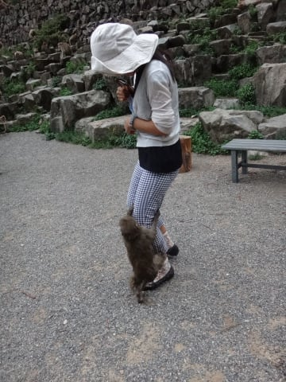

# 夏の志賀高原へ行ってみた…実は初めて地獄谷野猿公苑

📅 投稿日時: 2015-08-28 01:02:54

ということで．

小布施観光の次は．

志賀高原の登り口直前にある，スキー帰りにいつも立ち寄るスーパー，

[ツルヤ](http://www.tsuruya-corp.co.jp/store/ippongi.html)に立ち寄りました．

ここで，夏には我が家の在庫が切れてしまう，娘お気に入りの

ツルヤオリジナルジャムを大量に買い込み．

そう．ここには．

オリジナルジャムやらジュースなど，

ツルヤ独自ブランドの商品がいろいろあって．

ジャムも，数10種類と種類が多く．

くるみバターや，ブドウのつぶつぶが入ったゼイタクな

巨砲ジャム巨峰ジャム．

ラ・フランスのジャムなど結構おいしいので．

いつもスキー帰りに立ち寄って買い込んでいるんです…

このスーパー．

オリジナルグッズ以外にも，地元の珍しいモノが

いろいろ揃っているし．

それ以外の普通の商品も，自宅そばのスーパーより，

安くていいものが買えるので，

志賀高原からの帰りに必ず立ち寄るこのお店．

…志賀高原に行く人は，イオン中野店に寄る人が

多いと思うんですが．

ツルヤさん，おススメです！

…そして，

ツルヤさんでの買い物のあとは，

志賀高原に向かって，いつもの慣れた道を登っていくわけですが…

志賀高原へ直接向かわず，途中でちょいと寄り道．

今回の大きな目的のひとつ．

「地獄谷野猿公苑」へ向かいます．

…これまで．

ホントに数え切れないほど．

もう，何回来たかわからないほど，

志賀高原に来ているというのに．

…毎シーズン50日以上，志賀高原で過ごすというのに．

そのすぐ足元，志賀高原の目と鼻の先にある，

野猿公苑に一度も来たことがないという…

＃だって昼間はずっとスキーしてるんだもん

一度は行ってみたい…と，かねてより思いつつも．

そのためにスキーを早く切り上げるという発想が全くない私．

スキーシーズン以外に，初めてここまでやってきた今回．

ついにようやく，念願かなって，来ることができました～！！

＃いつもは志賀高原でスキー猿をいっぱい見ているので，

＃ここまで来てサルを見なくてもいい，という説もあり←自分自身がサルなのでは？（自己突込み）

野猿公苑へのアプローチは，駐車場に500円かかるけど

徒歩15分で済む渋温泉からの道と，

駐車場は無料だけど，30分近く歩く上林からの道がありますが…

今回は，渋温泉からのアプローチ．

駐車場から，山道をとぼとぼと10分ほど歩くと…

なんだか，周りにサルがいっぱい増えて来ます．

あれ？

まだ有料の野猿公苑敷地内に入ってないんだけど…

野猿公苑に行く途中の道から，周り中，

サルだらけになってきてますよ．

…サルを見るだけなら，有料の敷地に入らなくても

いい気がする（笑）．

こんな注意書きがありますね…

ふーむ．

サルになれなれしくするとダメなのか…

大人500円，子供250円払って敷地に入ると…

中には，サルが入るので有名な温泉がありますね～

そして，右側には，温泉を中継するライブカメラも見えます（笑）．

かの有名な，サルが入る温泉．

こんな，人工的に作った浴槽だったのか…

夏の間は，お湯を引いてないらしく，

暖かくないらしいのですが．

逆に，涼を求めるためなのか，サルたちは

水浴びしています…

しかし．

この公苑のサル．

人に慣れまくっているからか．

すごく近くで写真撮っても逃げないし．

それどころか，逆に人にまとわりついてくる始末…

これは，サルに向かって「人になれなれしくしない」という

看板が必要なのでは…（^^;）．

そして，時間はちょうどエサやりタイムだったらしく．

係員がばらまくリンゴに，群がるお猿さんたち．

そして，浴槽につかりながら，リンゴをかじるサル…

いや．

人間とサルの距離がすごく近い．近づけるという意味では．

世界中でここが一番かも…

外国人観光客がすごく多かったのもわかる．

とりあえず，一度は来てみたかった野猿公苑．

十分堪能したのですが．

…やはり，冬にお湯に浸かっているサルを見てみたい

気もするなぁ…←無理，冬にスキーを早く切り上げてサルを見に行くなんて，あなたには絶対無理

## 💬 コメント一覧

### 💬 コメント by (マルハバ)
**タイトル**: ツルヤ
**投稿日**: 2015-08-28 13:01:03

ここにあったんですね・・

毎年 志賀に行くときはイオンに寄って

酒＆つまみを調達するんですが、

必ず後悔します(笑）

ツルヤの内容は軽井沢の店でよく分かっていますので

来年からはツルヤに決まりです！

（でも20：00閉店か・・）

### 💬 コメント by (はなげ親分)
**タイトル**: し、しらなかった～
**投稿日**: 2015-08-28 23:56:31

ジャム好きの私にはオシッコちびるくらいの情報です。是非ともシーズン前にチェッU+A0クしておきます。

### 💬 コメント by (Skier_S)
**タイトル**: 我が家はツルヤファン
**投稿日**: 2015-08-29 01:22:47

＞マルハバさま

そうなんですよ．

志賀の登り口の目の前にあるんです．

志賀高原ビールなど，地元のビールも

売ってるし，スキー帰りには必ず寄ります．

…行きは朝7時ごろに通過するので，

行きに寄ったことはありませんが…（笑）．

＞はなげ親分さま

あ，志賀高原にしょっちゅう来られている

はなげ親分さまをして，ツルヤをご存知

無かったですか…

長野県内には数多くあるお店ですので，

シーズン前に一度立ち寄ってみてください！

くるみバターと巨峰，ラフランスが私の

個人的ベスト3ですが，それ以外にも

美味しいですよ！

