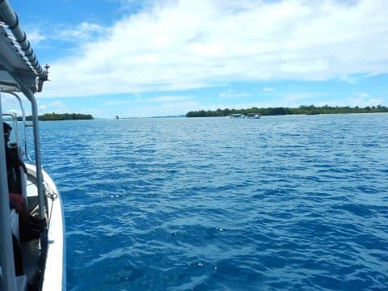
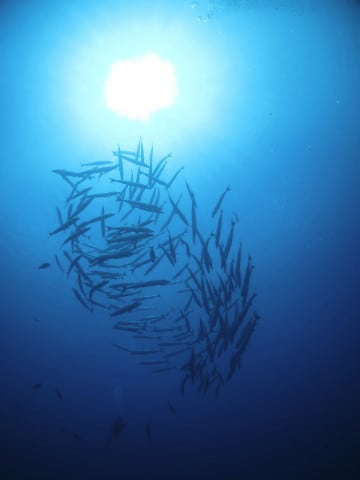
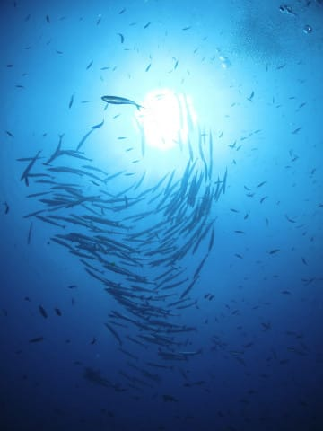
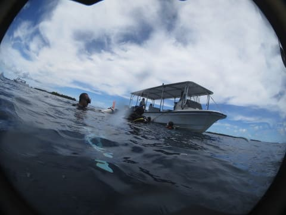

# 2017年8月，小学生の子連れでパラオ再訪！その5…私のパラオ到着1本目，いきなりブルーコーナー！

📅 投稿日時: 2018-09-05 01:25:48

…ってな感じで．

スキーシーズンが近づいているというのに．

ダイビング旅行記は続きます…

本日は，パラオ旅行記です．

では，どうぞ～！

----

今回，妻が1本目を潜ったので．

次の2本目は私が潜る権利があるわけですが…

…次のポイントは…

ふはははは！

そう，ブルーコーナー！

…ここを潜るためにパラオに来ていると言って

過言ではない，世界屈指のダイビングポイント！

では，私のパラオ1本目．

ブルーコーナーへ，エントリー！

流れは下げ潮．

左手にドロップオフを見ながら進みますが…

それほどのカレントではありませんね．

そして，定番のコーナー先端に近づくと．

いつものグレイリーフシャークやら，

大きめのイソマグロやらが通り過ぎていきます…

あとは，根の先端にとどまって，大物がグルグル

するのを眺めるばかり！

もう，こんなのが根の先端でグルグル

泳いでます．

…さすがブルーコーナー…

魚の密度も高いし，グレイリーフやらホワイトチップやらの

サメがグルングルンしてます←ノンダイバーは，ダイビング中にサメに会ったら怖い…！と

思うかもしれないけど，ダイバーはこういうサメを見れると喜ぶ

そして．

その間にも頭上には人に慣れた巨大ナポレオンフィッシュが

通り過ぎていき…

ダイバーたちに遊んでもらってます．

…ホントに人に慣れてるな…

このナポレオン．

そして，根の先端を離れて，棚の上に移動しますが…

そこには…

うむ？

なんだ，この黒い影は…？？？

って，ギンガメアジの群れだ！！

結構近い！

さすが，ブルーコーナーは魚に近づける…っ！！

…そして．

ここでもダイバーにかまってほしそうに

やってくる，ナポレオンフィッシュ．

…ギンガメアジも，ナポレオンも．

ダイバーに慣れすぎ…

そして，ギンガメの群れを眺めた後は．

サザナミトサカハギが舞う，沖の方へ

出ていくと…

ん？またなんかいる…

今度は，バラクーダの群れだ！！

なんだか，徐々に巻き始めてくれましたよ…

不完全ながら，巻いてくれたか…？？

キレイとは言えないけど，巻いてくれた！！

ちょっと群れの密度は薄いけど…

バラクーダトルネード，完成っ！！

でも，トルネードは一瞬でばらけ…

群れは去っていきました…

かに見えたけど．

知らぬ間に，向こうに回っていたガイドさん！

ガイドさんが見事にこちら側に群れを

追い込んでいき…

そして，また目の前で，巻き始めたか…？？

よし，巻いた！

巻いた！

ちょっと不完全ながら，巻いてくれました～！

太陽をトルネードの中心ぴったりに入れられなかったけど．

群れの下に入る形で．

逆光トルネードが無事撮れました～！

でも，今回も巻いたのは一瞬．

また，群れは遠くに去っていきました…

バラクーダの群れを堪能した後は．

深度を上げて．

深度5mで3分間の安全停止の後…

浮上！

いやーーー．

イソマグロやサメがぐるぐるのコーナー先端から，

ギンガメ群れ，バラクーダトルネードと．

1本目からおなか一杯のダイビングでした…

さすがブルーコーナー．

半端ない…

## 💬 コメント一覧

### 💬 コメント by (マルハバ)
**タイトル**: 事前のブリーフィング通りに・・
**投稿日**: 2018-09-05 17:48:54

お決まりの魚たちが

お決まりの場所に

お決まりの順番で登場する・・

何十年？も前から変わらない

偉大なるワンパターン？（笑）

流石は“世界のブルーコーナー”

でございます♪♪

### 💬 コメント by (Skier_S)
**タイトル**: マルハバさま
**投稿日**: 2018-09-06 07:21:22

やっぱりブルーコーナーはいいですね．

定番役者が安定して出るのも安心できます(笑)．

でも，これであと数年はブルーコーナー

潜れないだろうなぁ…

