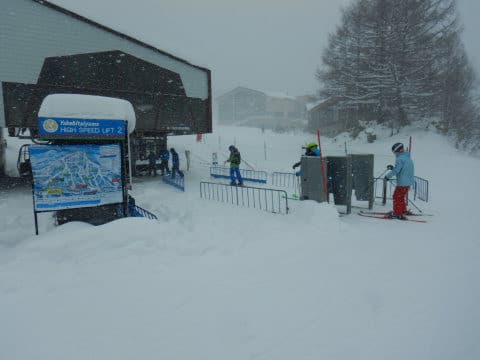

# 2020.12.19(土)の志賀高原，焼額山スキー場は…終日雪降り，冷え冷え雪質最高！ゴンドラ最高5分待たないくらいでそれほど混まなかったよ

📅 投稿日時: 2020-12-20 02:21:30

🏷️ カテゴリ: [2021スキー滑走日記](c2b0fc073d6357d3b786f6ca655147f7d.md)

ということで．

今日も志賀高原を滑ってました～！

えー．

まず．

朝，志賀高原への登り坂は…

予告通りの本格積雪路でのスタート．

かなりいい感じで滑るので，

雪道に慣れてない方はご注意ください…

で．

あさイチの第2ゴンドラ乗り場に並びますが．

列はちょい長めではあるものの．

危惧していた10分や20分待はなく

せいぜい5分ちょいの待ち時間．

ってなことで．

朝8時半に営業開始予定のところ．

今日も搬器のトラブルがあり，3分ほど

遅れたものの．

今シーズン初のゴンドラに乗車！！

ちなみに．

ゴンドラは最大3人乗車となってました…

ただ，家族やグループは3人以上でも

乗れるようです．

そして山頂にやってきましたが．

朝イチは-12℃と予想したところ．

第2ゴンドラ山頂の気温は-9℃．

うーむ．3℃も外れたか…

でも，気温が冷え冷えであることは

変わりなく．

圧雪がかかったコース上は，

圧雪の上にすごい軽い最高雪質の雪が

10㎝弱乗った，トップシーズンの

コンディションで…

コース脇は予想通りの脛パフ！！

そして，天気も予想通りの雪降りながらも，

視界が遮られるほどの猛吹雪ではなく…

これは，ひえひえ最高のゲレンデ

コンディションでは！？？

先週までの人工雪バーンとは

全く違う，ふわふわ天然雪の最高ゲレンデが

お出迎えです！

それも，午前中は時折雪が止み．

一瞬薄日がゲレンデを照らすほどで…

そして，リフトは待ち時間がほぼ0の

状態だし．

ゴンドラも，午前中は待ちがそれほど

長くなく．

ピークでも，駅舎の外まで出るか出ないか，

最大5分待たない程度．

これは…

文句なく，今シーズン最高のコンディション！！

いやーーー．

やっと．

やっと，志賀高原らしい，軽いふわふわ

天然雪で滑れたよ…（感激）

とはいえ．

柔らかい雪がゲレンデ全面を覆っているので，

昼前には，コースはちょいと凸凹の荒れ気味に

なって来た上に…

やっぱり時々かなりの勢いで雪が吹き付け．

リフトは死ぬほど寒く．

そのため．

焼額山のリフトは，第2高速・第4ロマンスとも，

終日ガラガラ！！

…ただ，その反動で．

雪や風を避けられるゴンドラに人が

集中し，午後はゴンドラの待ち時間が

平均5分程度と，ちょいと長めに

なってしまいましたが…（ちょい涙）

でも，予想ほどの激混みではなく．

そして，コースも唐松・白樺・ビギナーズコースと，

一気に複数のコースがオープンして人が分散

したからか，コース上の人口密度は低くて，

気持ちよく飛ばせます！！

そして，私の予想通り←ここ強調するところ

昼間の最高気温も-7℃程度までしか上がらない冷え冷えで．

そして，終日新雪が積もり続ける

天気だったので．

エンドレスパウダー供給というほどではなかったけど，

午後になっても，コース上はうっすらパウダーが

乗っており…

午後のゲレンデは，この新雪が踏み散らされて，

ちょい荒れ気味だったものの．

軽い新雪を蹴散らしながら滑るのは気持ちよく…

ゴンドラがそれほど混まなかったおかげで，

かなり気温は寒かったものの，ゴンドラを

回していれば，凍死するほどの寒さを

感じることもなく．

志賀高原らしい，最高のやわらか雪を

リフトストップの16時まで，たっぷり

堪能できたのでした…

いやーー．

先週までは人工雪バーンでしたが．

ようやっと天然雪をたらふく滑ることが

出来ました！！

やっと本格的にシーズンがやってきた感じです…

今も志賀高原は雪が降り続けているので，

明日の朝までに予想通り，10～20cmの

積雪がありそうだし．

やっぱり明日も，終日雪降りになりそうで．

太陽は拝めなさそうですが…

でも，トップシーズンの最高雪質が

楽しめると思いますよ～！！

…明日も，ゴンドラがそれほど混まないと

いいな…

## 💬 コメント一覧

### 💬 コメント by (ikkun)
**タイトル**: Unknown
**投稿日**: 2020-12-20 05:31:25

おはようございます❗あらあら？雪？吹雪にならなかったのですか？いいですね➰ 確かに志賀高原に繋がる道は怖いですからね  楽しんで下さいませ

### 💬 コメント by (かず)
**タイトル**: Unknown
**投稿日**: 2020-12-20 10:57:33

2ゴンであの程度なら逆に空いてる！かなり意外です  一般の方はやはり自粛でしょうか？

### 💬 コメント by (ヒータロゥ)
**タイトル**: Unknown
**投稿日**: 2020-12-20 18:27:56

今日は朝礼に間に合わずでしたが、途中で皆様と合流でき、楽しく滑れました。現在仕事が立て込んでおりまして不透明なところもありますが、年末年始にはできるだけ参上したいと思います。皆様、またご一緒に爆走させてください！

### 💬 コメント by (Skier_S)
**タイトル**: 今日は終日パウダーデー！
**投稿日**: 2020-12-21 00:58:08

＞ikkunさま

土曜は吹雪じゃなかったのですが，日曜は吹雪であsの登り道路は時々

ホワイトアウトっぽいかんじでした…

＞かずさま

意外とこの土日空いてました．

スキー場が一気にオープンして，人が分散したのかも…

＞ヒータロゥさま

今日もお疲れ様でした～！

年末年始もほぼずっと志賀にいますので，また一緒に爆走しましょう！

