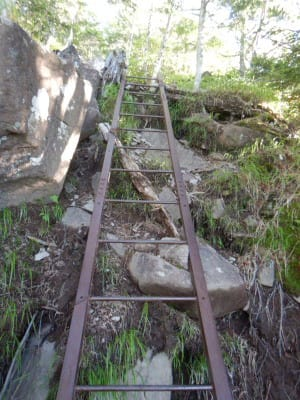
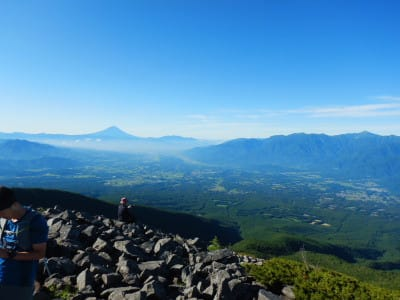

# 2021年7月，編笠山リベンジ＆権現岳へ！その2

📅 投稿日時: 2021-08-18 02:56:13

🏷️ カテゴリ: [登山・旅行](c1d637a11a25b457ac978d197adbdafc5.md)

コロナのおかげで，せっかくの夏休みも

どこにも行けず．

昨年も今年もダイビングに行けてないので，

もう2年間，全く海に潜っていない

ブランクダイバーと化してしまっている

今日この頃，皆様いかがお過ごし

でしょうか（時候の挨拶）

あぁ…

例年の夏休みなら，こんなところに行って

リフレッシュしているはずなのに…

　

　

娘は

「器材のセットの仕方も潜り方も，忘れた…」

と言ってるし（涙）

そもそも，丸2年以上潜ってないどころか，

海やプールにすら行ってないので，私も

泳ぎ方を完全に忘れているかも…！？？

来年は…来年こそ，家族で潜りに行けるよう

状況が落ち着いて欲しいものだ…

　

　

とりあえず．

夏にスキーができない期間に，気を紛らせる

ために始めたダイビングだったけど．

ここ2年では，そのダイビングすら

できなくなり，さらにその気を紛らせる

ために山に登るようになってしまった

わけで．

その，スキーの代理の代理（？）の山登り

レポート．

今回も編笠山リベンジの続きです~！

ーー

ってな感じで，

次のポイント，押手川に向かって，

サポーターの実力確認のため

今までよりハイペースで登り続ける

わけですが…

こんな感じの原生林の中を登って

いきます．

このあたりから日が射して，空が

明るくなってきました！

朝の陽ざしが気持ちいい…

雲海から押手川まで，標準コースタイム

51分ですが…

これもコースタイムの半分以下の24分で到着！

標高差220mを24分．

結構いいペースです…

前回の陣馬山のテストの時は，

飛ばしたのは最後の30分だけ．

それ以外は，膝の痛みを恐れて

大体コースタイムのゆっくりペースで

歩いたので．

今回テストとはいえ，いきなりこのペースで

飛ばして最後まで膝がもつのかな…？？

…と，ちょっと心配しつつも．

このペースをキープしつつ進みます…

押手川は，編笠山に行くルートと青年小屋に

行くルートの分岐点なのですが．

ちょっと道が分かりにくく，間違って

一瞬青年小屋方面へ行きかけたものの．

すぐに気づいて戻って，編笠山方面へ．

ここから編笠山までは，標高差420mほど．

きつめの登りが続きますが…

だんだん木々の数が少なくなり，

岩ゴロゴロの登りになっていきます．

このあたりから，ところどころ

見晴らしが効くようになってきて．

今日は天気がいいので，

時折，木々の間からものすごい見事な

景色が見えるようになってきました！

さらに登っていくと…

途中一カ所はしごがありましたが．

まぁ，はしごが無くても登れるレベル．

さらにゴロゴロ岩を登り続けると．

木々は無くなり，ハイマツが覆うだけに

なって…

一気に展望が開けます！

うおおおお！

今日はすごい快晴！

こんなの，年に何度もない激烈な

快晴！

ここまで来れば，山頂まで残りわずか．

ゴロゴロ岩場を山頂に向かいますが…

押手川からコースタイム93分のところ，

50分で編笠山頂到着！

コースタイム半分は切れなかったけど，

半分強の時間で登り切りました！

…前回の富士見高原ゴルフ場からのコースは，

最後，かなり急な岩場をよじ登る感じでしたが．

今回の観音平からのコースは，全然よじ登る

ようなコースじゃない，めちゃくちゃ楽な

コースでしたね…

駐車場からここまでのコースタイム

3時間37分のところ，途中休憩

時間も含め，2時間で着きました．

ちなみに前回は，駐車場から山頂まで

4時間かかったので．

コースは違いますが，半分の時間で

着きました！

…でも．雪が降った前回，なんでわざわざ

難しい急なコースを通ったんだろう…

素直に楽な観音平ピストンにしておけば

よかった…

けど．

とりあえず．

今日のこの山頂からの景色…

これ，最高じゃない！？？

いや…

ここまで見事に遠くまで見通せる日は，

滅多にないよ…

やっぱり，今日はいい日だ！！

