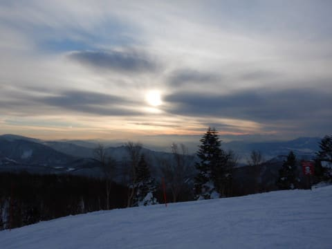

# 2022/1/10(月・祝)，3連休最終日の志賀高原スキー場速報レポート！…今日も晴天，雪質最高，それほど混まず！シーズン最高級の一日！

📅 投稿日時: 2022-01-11 01:41:20

ってなことで．

先ほど志賀高原から帰ってきました～！

…この3連休の志賀高原．

私の日ごろの行いが良かったおかげで

3日とも晴れてくれましたが．←あなたのおかげじゃないから！！！

3連休が終わると同時に「もう晴天は終了！」

と言わんばかりに，志賀高原は明日11日から

また天気が崩れて11日の昼ごろから雪になり，

それ以降は12，13，14日と雪が降り続けます…

でも，12日，13日は西風なので，志賀高原は

正月みたいなドサドサパウダーにはならなさそう…

今の天気図では，一日10cmくらい積もる

くらいかな？

ってなことで．

いつも通りの深夜帰宅なので，

今日も速報モードにて，本日の志賀高原の

レポートをば…

えー．

まず．

本日，あさイチは曇り空で始まりましたが…

今日はこの3日間で文句なくベストな，

いい感じで締まった最高グレードの

シマシマっ！！

そして，さらに．

営業開始から30分も経たないうちに，

志賀高原はすっきり晴れてきました！！

志賀高原は雲の上に出たらしく，

眼下に雲海が広がってます！

うひょひょーー！！

晴天シマシマっ！！

今日も晴天の下，シマシマが滑れる

とは…！

この3連休，ホントに恵まれてる…（感動）

そして．

3連休は2日目に帰る人が多いので，

最終日の今日はゲレンデもガラガラ！

晴天ガラガラで，バーンも締まり気味の

フラットな快適バーンと来れば…

もう，最高の昇天バーン！！

快楽すぎる！！

快楽で死ねるレベルです…（昇天）

そのうえ，ゴンドラは一瞬混んだタイミングも

あったものの，午後は搬器数台待ちの飛び乗りで，

ゴンドラグルグル可能です！

さらに，午後になっても雪質はいいまま…

というより．

午後遅くなればなるほど，むしろ

バーンが締まって良くなっていくという…

もう，ラストまでかっとび大回りができる

最高雪質フラットバーンが続き．

そして，夕方になると，バーンも貸し切り！

いいんですか？？

晴天の中，こんなに最高雪質のフラット

バーンがラストまで続いて，

それを貸し切りで滑れるなんて…

こんなに恵まれてて，いいんですか！？？

ってなことで．

間違いなく今シーズン1番の最高コンディション

だった本日．

当然のごとく，休み時間など取るのも惜しく．

お昼休みもとらずひたすら止まらず，

営業開始からラストまで，歓喜の声を

上げながら滑り続けたのでした…

あぁ…シアワセだった…

3日間とも晴れて，バーンコンディションが

ここまで良かった3連休は，自分の記憶には

無いなぁ…

いや．ホントに良い3連休だった！！

あまりにも恵まれ，快楽に溺れた

3日間を過ごしてしまったので．

もう社会復帰できないかも…

明日から仕事に復帰できるのかな…

## 💬 コメント一覧

### 💬 コメント by (かず)
**タイトル**: Unknown
**投稿日**: 2022-01-11 11:49:43

14日のパウダー予報もよろしくお願いします！

### 💬 コメント by (レインボー74)
**タイトル**: Unknown
**投稿日**: 2022-01-11 15:14:57

火曜日の志賀高原情報

朝の上林-1℃　蓮池も-1℃。強風南風で、奥ゴン、一ゴン、ニゴン、全て討ち死に。

ニ高と四ロマのみの営業。

ニ高は下から吹き上げる風が、私の経験したなかで最強。笑っちゃうレベルでした。

ファミリーは修旅生は多いものの、平坦で快適。エス様ご指摘の偉人(異人？)様お二人とご一緒できましたよ。

期待していたタンネは、見にくいし風ですぐにさよなら。

パーフェクタは仲間はいいと言ってたけど、いいも悪いもその時の風次第なんだとわかりました。

高天が原ホテルでピザのあと、賢い(おかしい)仲間が、壮大な計画を披露。

高天からバスで奥志賀へ。リフトを乗り継いで焼額山頂へ。そして未踏の地、白樺を滑るのだ！

一行５人はそれこそヒマラヤを征服さたちする気分で(バカみたいに)、ゴーto白樺！

誰も踏めていない白樺はといえば、まあそれはそれは極上のお味でございましたよ。

不可能を可能にしたこの優越感、遠回りしたからこその感動！百名山まで残り99山に迫っている山男(？)ならではの武勇伝でした。

明日は烈風予報！動くのは、熊、横、西舘、タンネ、ファミリー(短)、四ロマ、ニ高くらいかなあ。修旅生達かわいそう！

### 💬 コメント by (Skier_S)
**タイトル**: 14日はパウダーねらい目！
**投稿日**: 2022-01-12 00:47:25

＞かずさま

今の予想では，14日は行けます．

冷え冷えパウダーデーです！！

＞レインボー74さま

風も強いけど，気温も高かったんですね…

雪は緩んでダメになってませんでしょうか？

しかし，まさかバスで奥志賀⇒奥志賀リフト山頂からヤケビ白樺コース

ってのは，私も考えが及びませんでした…

それをホントにやっちゃったのがすごい！！

