# 子連れで座間味に行ってみた　その6

📅 投稿日時: 2011-08-14 01:05:46

🏷️ カテゴリ: [ダイビング日記](ce3a7a8d424d112fce83ee85c81a0e344.md)

本日．

11時初のガルーダ航空にて，バリに移動しました．

午後5時ごろバリ着．

いま，夕食食べてホテルでくつろいでいるところです．

…明日，クルーズ船に乗船する港まで飛行機で移動．

朝7時の飛行機なので，ホテルピックアップ早朝の5時15分．

今日は早く寝ないと…

しかし，バリのホテルから座間味レポートってのも

変な感じですが．

＃リアルタイムでレポート書けよ…って声が聞こえる！

とりあえず，座間味レポートの続きを．

--------

ということで，

久しぶりに妻と揃ってのダイビングです．

…とりあえず．

今日のログブックの．

見た魚の欄に，大きく「妻」と書いておこう…

で．

このポイントは．

真っ青な海底に広がった砂漠のような，すごくきれいなポイント．

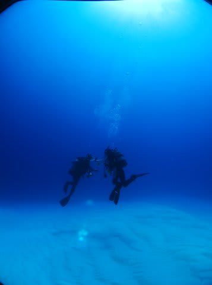

その，砂地のきれいなところに，ガーデンイールやらハゼやらが

いっぱい生息しているという…

去年やってきた際に気に入ったポイントです．

今回，私のリクエストでここに潜らせてもらいました．

あー．

やっぱりここのポイントいいですね～

海底砂漠のきれいな砂地が広がる中…

狙いのヤシャハゼも，

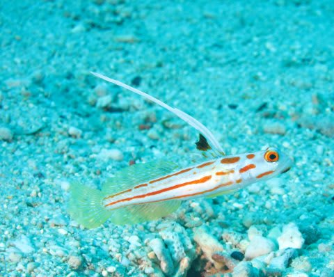

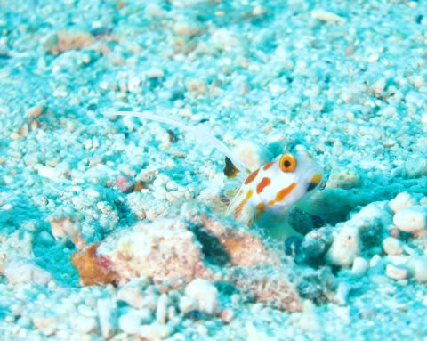

ネジネジ模様がおしゃれなヒレナガネジリンボウも．

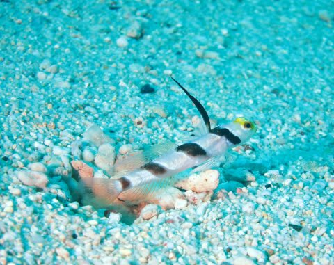

そこら中に大量にいるので，夫婦でそれぞれマイ被写体となる

ハゼを探して，じっくり観察＆撮影タイム！

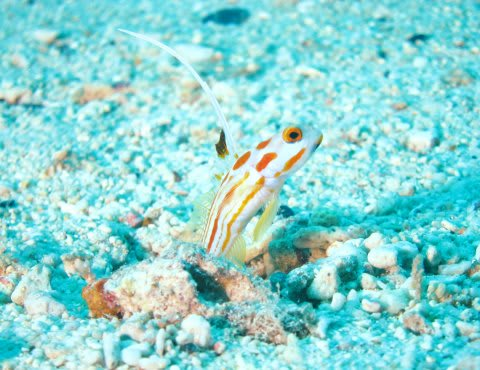

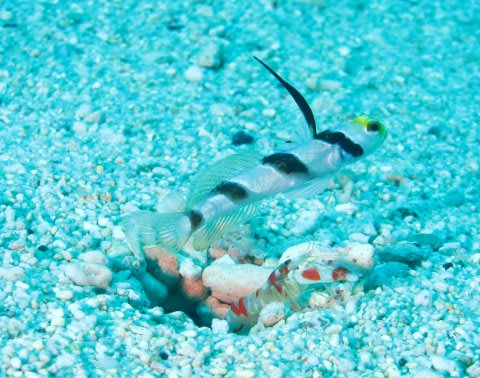

共生エビが砂を掘っているのがじっくり観察できます．

…でも．

どうやら私は，このカメラの特性に慣れていないみたい．

液晶で見るとかなり明るく見えて，部分的に白とびマークが出て

いたのでフラッシュの発光強度を絞ったら…

全体的にフラッシュ強度が足りないなぁ．

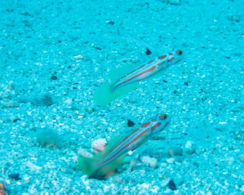

…っていうより，やっぱり私のマクロの写真，イマイチ過ぎますね．

まだまだ修行が必要そう．

とりあえず，妻と私で，それぞれマイヒレネジやら

マイヤシャハゼを勝手に追跡．

そこら中にうじゃうじゃいますから，探す必要すらありません…

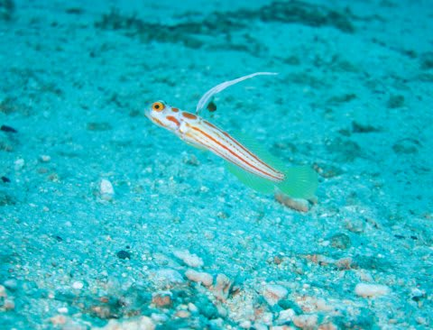

超シアワセポイントですね．

たっぷりハゼを眺めた後は…

きれいな砂地やサンゴの上を流して…

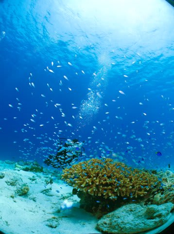

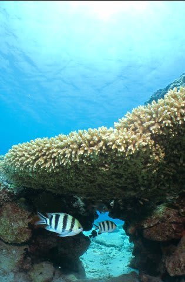

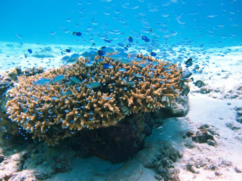

シアワセを満喫して，浮上．

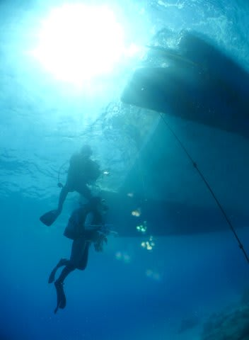

ダイビング中，娘は泣かなかったか？

お姉さんに迷惑かけなかったか？

と心配だったけど．

娘は，お姉さんとズーッと楽しそうに遊んでいた様子．

さすが，今年から幼稚園に行きだしたということもあり．

去年のコモドとは違って，両親と離れても大丈夫に

なったんだなぁ…

と，ちょっと感動．

これ以降のダイビングは，もう娘を預けて

夫婦で潜りにいけそうだなっ! 

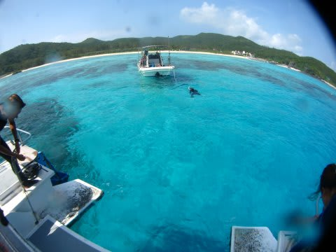
