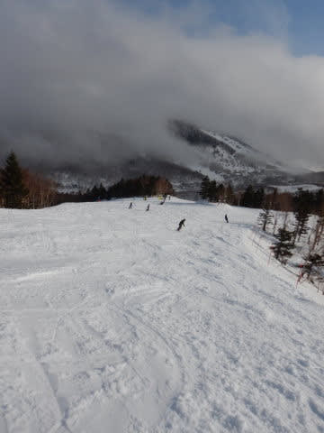

# 2021/3/6(土)，志賀高原へスキーに行った夢を見た…朝は雨，午後は曇り～雪がパラパラ

📅 投稿日時: 2021-03-07 00:24:41

🏷️ カテゴリ: [2021スキー滑走日記](c2b0fc073d6357d3b786f6ca655147f7d.md)

えー．

1都3県の緊急事態宣言が延長されてしまい．

さらにスキーに行けない期間が延びるのか…！！

という絶望感からか，あまりにものスキーへの

行きたさが募ってしまったらしく．

本日，志賀高原へ行った夢を見ました

…いや．

夢です．

夢にしてはかなりリアルな夢でしたが…

まず．

朝，志賀高原へ登るところから夢が始まるわけですが．

うーむ．

雨

ですね…（涙）

まぁ，パラパラ程度でしたが，空からは無情に

液体が降っています…

朝イチは焼額第1ゴンドラが故障のため

動かず，第2高速リフトでのスタートでしたが…

乗り場付近は雨，

降り場付近は雪…

という，微妙な感じで．

ウエアはシットリ濡れてきて．

リフト搬器も雨で濡れてます(涙)

とはいえ．

雪は重めながらも．

あさイチはシマシマ！

天気は悪くても雪！

雨のおかげでガチガチではなく，

ズッシリとエッジが食い込む，

それなりに楽しめる雪！

雪を滑れるだけシアワセ！

第1ゴンドラが故障で，第2ゴンドラも

すごい列らしいので，一の瀬方面へ脱出

しますが…

まぁ，本降りではないながら．

朝9時過ぎごろまではパラパラと

雨が降り続け，雪は完全に4月ごろの

雪…（涙）

でも，雪で滑れるだけシアワセ！！

あさイチは故障していた焼額第1ゴンドラが

運転開始したようなので，焼額に戻ってみると．

雨は止んでいるものの，

ガスで無茶苦茶視界が悪く（涙）

昼間の気温は＋1℃と，朝とほとんど

変わらない高めの気温のままで．

…当然，雪質は4月の春の雪ですね…(涙）

でも，雨で濡れた雪なので．

日差しで融けた雪みたいに，滑りが悪い

張り付く雪じゃなかったのが救いかな．

1ゴンは意外と待ちが短く．

昼間はゲートの外に待ちがあるか

ないか，という程度．

…でも，1ゴンは混まなかったのに．

2ゴンはかなり混んだようで．

最高30分待ちまで行ったようです…

午後1時過ぎまで，山頂付近はガスで

見にくい天気が続きましたが…

午後2時頃には，時折晴れ間が見える

天気になってきました！

雪は重い4月の雪で，かなり荒れそうな

雪質だったけど．

多少凸凹になったものの，人が少なかったので

それ程ひどく荒れなかったのが救いかな…

イチゴン，夕方にわずかに混んだものの．

ラストの30分ほどは，天気もそこそこ

回復してくれて．

…せっかく夢を見るなら，最高のコンディションの

夢を見たかった…

と思いながらも．

まぁ，そこそこ楽しい夢を見れたかな…

という一日でした！

…で．

なぜ，今日こんな夢を見たかというと．

…そうです．

今日は志賀高原で，長岡のエキップさん主催の

試乗会に参加してきた(夢を見た)のでした…！

…ってことなので．

今シーズンは半分あきらめていたスキー試乗レポート．

今シーズンもいつも通りやりますので，お楽しみに…！

## 💬 コメント一覧

### 💬 コメント by (横須賀のウルトラセブン)
**タイトル**: 私も修行が足りない
**投稿日**: 2021-03-07 06:04:40

なるほど～スキー道を極めると、ここまでの境地に

達するのですね！Sさんは正にスキー道の宮本武蔵！

私もまだまだ修行が足りないようす。スキー試乗レポ楽しみにしてます！(笑)

### 💬 コメント by (yumi)
**タイトル**: Unknown
**投稿日**: 2021-03-07 06:35:41

Ｓさぁ～ん😙😴😏

スッゴイ❗️壮大な夢🌃✨😴でしたね☺️

この💭夢の続きが👉️試乗会🙄なのカナ❓️

😁😁😁

### 💬 コメント by (AK)
**タイトル**: Unknown
**投稿日**: 2021-03-07 06:48:54

S様

いよいよ夢で来期モデルを試乗する秘技を習得されたのですね。

試乗レポート楽しみにしています！

私も来期は物欲選手権に出場予定ですので。(既に負けてる)

### 💬 コメント by (まうちゅう)
**タイトル**: Unknown
**投稿日**: 2021-03-07 07:45:48

正夢の記事で再開ですね。

### 💬 コメント by (かず)
**タイトル**: Unknown
**投稿日**: 2021-03-07 10:42:46

やっとですね おめでとうございます 水木金滑って土日はパスして仕事してます！1ゴン停止＆雨でしたか！しかし3月の寒波の気配無しですね…

### 💬 コメント by (レインボー73)
**タイトル**: Unknown
**投稿日**: 2021-03-07 16:15:45

日曜日の志賀高原情報

本日は晴天なり。本日も楽しいなり。

朝の上林ー２℃ 蓮池ー７℃。

朝一は硬めだったけど、ゴンドラの混雑から三高に逃げ込んでいるうちに、ズクズク雪に。

ゴンドラは15分以上待ちなので、10時53分発、2ゴンから寺子屋へバスで瞬間移動。

寺子屋は下界とは別世界の雲上極楽バーン。皆んな考えることは同じで、気づくと２万のメンバー勢ぞろい。

昼過ぎにヤケビに戻ると、ズクズクガタガタ。贅沢に慣れすぎた身には、もはや限界。

今日は湯田中のラーメン屋仲よし食堂です。

明日は人生初の妙高杉ノ原に浮気です。雪がすぐに緩むので、午前中が勝負とか。

### 💬 コメント by (通りすがりの遊び人A)
**タイトル**: Unknown
**投稿日**: 2021-03-07 21:19:33

初めまして。

当ブログを数年readオンリーのものです。

私のホームはグンマ-のとあるスキー場なので志賀高原に行ったことありませんが、毎日(夏を除く)楽しく読ませて頂いております。

私も週末に限って、スキー場に行ったり、山に行ったりする夢をよく見ます。

不思議ですね。

今後ともS様の楽しい夢の話を期待してます(* ﾟ∀ﾟ)

### 💬 コメント by (アツシ)
**タイトル**: Unknown
**投稿日**: 2021-03-07 23:26:38

ご無沙汰してます！コメントも久々ですが、毎日必ずブログはチェックしてます！

一足お先に大阪は緊急事態宣言が解除されましたので、今週末は志賀に！と言いたいところでしたが、日曜日にちょいと用事があったのと、頂き物の木曽福島のリフト券を雪があるうちに、ということで、今週は土曜日帰りきそふくでした。来週からは土日志賀に参戦します！

しかしどうやら私のメインの板も、5シーズン×30日履き倒してついにヘタった！？ような感覚なので(同じカチカチの斜面を違う板と履き比べて滑ってみて、スピードを出した時のグリップのマイルドさ、バタバタ具合、などを鑑みて、これがSさんの言う「ヘタった」というやつか！と愕然としたところです)、来季の主力戦闘機を選定しなければなりません。試乗レポート、楽しみにしています。

### 💬 コメント by (Skier_S)
**タイトル**: たくさんコメント感謝
**投稿日**: 2021-03-08 02:27:45

＞横須賀のウルトラセブンさま

私ほど修行を積めば，この境地に達します（笑）．

試乗レポート，楽しみにお待ちください…

>Yumiさま

ものすごい壮大かつリアルな夢でした（笑）．

夢の中に，Yumiさんも出てきたような気が…？

＞AKさま

おっと．

すでに物欲選手権参加と，そして敗退の予定済みなのですね（笑）．

＞まうちゅうさま

早く夢じゃなく実体が志賀高原に行けるように，

状態が落ち着いて欲しいです…

＞かずさま

土日はやめて大正解です．

せっかく夢で志賀に行ったのに，ちょっと残念んな感じでした…（涙）

＞レインボー７３さま

寺小屋，良かったですよね…！

午後3時過ぎまでひたすら寺小屋回してました．

妙高杉ノ原，楽しんできてください！

＞通りすがりの遊び人Aさま

コメントありがとうございます＆愛読ありがとうございます～！

志賀にいらしたことは無いのですね…

残念．ぜひ一度お越しください．

…夢でもいいので（笑）．

＞アツシさま

お久しぶりのコメントですね…！

…で，30日x5シーズンって…150日ですか！

ヘタッても不思議ではありません．

ほぼ間違いなくヘタってます．

試乗レポート書きますので，レポートを読んで，ぜひ物欲に敗れてください…

### 💬 コメント by (アツシ)
**タイトル**: Unknown
**投稿日**: 2021-03-14 20:36:40

今週はお会いできるかと期待していましたが、お仕事大変ですね。こんなに仕事に追われてスキーに行く夢も見られないとは、Sさんがココロの病に罹らないか心配です。

さてさて、今日西館山で西館さん親子と初めてお話しさせて頂きました。別れ際に写真を撮って頂いたのですが、またSさんにも送るとおっしゃってました。私も板を持って映っています！今日おろしたての、新しい板です（≧∇≦）　乗ってみての感想は、「いやー、昨年のSさんのレポートのまんまですね、素晴らしい！(Sさんのレポートの的確さと板の性能との両方です)」

### 💬 コメント by (Skier_S)
**タイトル**: ＞アツシさま
**投稿日**: 2021-03-15 00:33:56

写真受け取りました～！

西舘さん親子にお会いしたんですね．

…どういうきっかけで知り合ったのかが不思議ですが（笑）．

…そして，あの板を買われて，今日デビューですか…

乗りやすくていい板ですよ．

また，焼額でお会いしましょう…！

