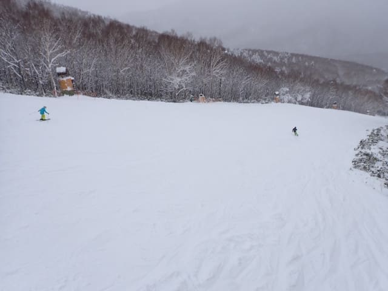

# 2024/12/7(土)志賀高原焼額山スキー場オープン日のレポート！…積雪10㎝，ペアリフト１本だけどゲレンデは幅いっぱい滑れるよ！

📅 投稿日時: 2024-12-08 00:16:23

🏷️ カテゴリ: [2025スキー滑走日記](cacd3fbf84d4a679ee61a5894c3f95e14.md)

ということで．

ついに…

ついに本日．

わがホームゲレンデ，焼額山スキー場がオープン

しましたよ～！！

ってなことで，さっそくオープン日の本日を

待ちかねて滑ってきたわけですが…

まず．

あさイチの志賀高原へ登る道．

中野の町中を過ぎて，上林のチェーンベース

までは雪がなかったものの…

チェーンベースを越えると，一気に

本格雪道にかわってきました…！

うおお！

雪だ！

今シーズン初めての，アイスクラッシュや

人工降雪じゃない，本物の雪だ！

…ってなことで．

志賀高原への道は，本格雪道で，

途中で登れなくなって息絶えていた

車があるほどですので，皆さんしっかり

雪道装備をして登ってきてください…

という感じでやってきた焼額山．

…やってきたというより，戻ってきた～！！

という感じが強いですが．

本日動くリフトは第４ロマンスリフトのみ．

遅いペアリフト１本だけの営業です…（泣）

朝８時半の営業開始前にリフトに並びますが．

すでにかなり長い列が…（涙）

うーん．今日は混むのかな…？？

とりあえず．

8:30ぴったりに，待ちに待った焼額山の

今シーズンの営業が始まりましたが…

リフトの上からゲレンデを見ると．

滑れるのは第4ロマンス沿いのサウスコース

1本だけですが．

その1本のコースは幅いっぱいにしっかり

雪が着いてますよ…！！

山頂付近のコース幅がかなり広いところも，

完全真っ白になっていて．

完全にコース幅いっぱい滑れますよ！！

そして，昨晩からの積雪は10cm以上あったようで…

コースわきは10～15cmくらいのパウダーが

積もってますよ！！

いや…

昨日の金曜まではコース外はかなり土が出ていた

みたいですが…

今日見た感じでは，完全トップシーズンの景色で，

かなりいい感じじゃないですか…！！

ってなことで．

リフトは山頂に到着しますが…

山頂のゲレンデに出ると．

雪質はしっかりした人工雪の下地の上に

天然雪の圧雪が乗っていて，かなり

よさそうな感じ…！！

いざ行かん，わが今シーズン初の志賀高原の

1本目へ…！！

…いや．

これ．

雪もしっかりエッジが噛むいい雪だし．

コース幅いっぱい滑れて，ブッシュの心配も

ないし…

現時点で，かなりいいほうのゲレンデなのでは…？

雪も冷え冷え，いい雪質のトップシーズンの雪

みたいな感じで…

リフト1本しかオープンしてないけど，

12月の第1週としてはかなりまともな方の

部類ですね…！！

ただ…

コース幅が広いので（イエティ比），

コース上の人口密度が低く（イエティ比），

完全に自由なラインで好き放題滑れる恵まれた

状況（イエティ比）だけど．

リフトがペアリフト1本なので，

今日は混むかな？と覚悟したけど．

リフトが混んだのは，団体さんが固まって

入ってきたときの数本のみで．

それ以外は，今日はそれほど待ちなしで

意外とすいてました～！！！

ゲレンデの雪質は，朝イチは人工雪の上に

天然雪が圧雪されたものが乗った感じで

表面が柔らかめだったので，時間がたつにつれ

ゲレンデが荒れていくかな…と思ったけど．

人工降雪の下地がしっかり硬めだったので，

バーンはそれほど荒れず．

かといって，硬い人工雪の下地が出てきて

ガリガリつるつるになることもなく．

午後になっても結構快適！

天気は終日雪降りで．

時折強めに降ることもあったものの，

そこまで強い降りではなく…

昼間に積もったのは2－3cm程度かな？

終日雪降りだったので，すっきり晴れることは

なかったものの．

風も穏やかで，雪の降りもちらちら程度だったので

そこまで寒さを感じることはなく．

午後になると，時々うっすら空が明るくなる

こともあったりして．

晴天すっきりではなかったものの，穏やかな

天気の恵まれた一日で．

気温も終日低かったので，

雪質は全く緩むことはなく，16時の営業ラスト

時間になっても，バーンは凸凹にならず

フラットなままで．

…コース幅いっぱい滑れて，

バーンが荒れてなくて，

人口密度が低くて…

…これまでのイエティと違いすぎる．

シアワセすぎる…！！

ってなことで．

焼額山オープン日の本日．

滑れたのはペアリフト1本のみだったけど．

イエティとは比較にならない恵まれた

コンディションで，

やはりこれまで滑ってきたアイスクラッシュの

紐ゲレンデは，

中毒患者が禁断症状を緩和するための，

本物に似せた白い粉

であったことを痛感し．

これだよ．これがホントのスキーだよ…

と，感動しながら．

今日もリフト営業終了の16時まで，昼休みも

取らずひたすら滑り続けたのでした…

いやーーー．

良かった．

やっと本当にスキーシーズンインした感じ…

ちなみに，本日は昼間もずっと

リフト降り場より上のパノラマコースで

人工降雪を打ち続けていたので．

「明日，第2ゴンドラ動かないかな…？」

と期待していたけど．

まだ積雪が足りないようで，明日のゴンドラ

営業開始は期待薄っぽい感じ…

うーん．

でも，奇跡的に明日の朝までに1m積もって，

明日ゴンドラ動かないかな…？←無理だから．明日の積雪は多分20㎝くらいだから

とりあえず．

満足の焼額スキー場オープン日でした～！！

## 💬 コメント一覧

### 💬 コメント by (レインボー77)
**タイトル**: Unknown
**投稿日**: 2024-12-08 06:18:08

土曜日の事故情報

11時30分頃、下りで、最後のループ手前の、直線が終わって右カーブループに入る所で、下へ大きく転落した車がありました。

スピードの出しすぎかと思いますが、志賀高原では油断は禁物です。気温はマイナス1℃でした。この温度帯は特に危険ですので、皆さまお気をつけください。

また、朝の上りで苦労していた車がいた場所は、昔私がプリウスで上れなかった所で、私らがプリウス坂と呼んでる坂です。私はその時オートバックスまで戻ってチェーンを買い、すぐに四駆を注文しました。

プリウス坂は、坊平橋(1220m)のかなり手前の長い直線です。

### 💬 コメント by (ねも)
**タイトル**: Unknown
**投稿日**: 2024-12-08 06:36:28

Ｓさん　初滑りおめでとうございます！

イエティは覚醒剤？に大笑い(^^*)　今季もスキー中毒昂進の記事アップお待ちしています✌️

私も10日後くらいに白馬に行こうかと😅

### 💬 コメント by (アリス)
**タイトル**: Unknown
**投稿日**: 2024-12-08 09:48:27

skier_S様、レインボー様

ご無沙汰しております😀

志賀高原の連日の情報ありがとうございます✨

画像付きですので詳細まで解ります。

志賀高原の下り道は何度走行しても未だに緊張しますね(^_^;)

来週辺りから参戦予定です😀

毎度おなじみの仕事を平日ズル休みです。

ついでに1ゴン営業開始も願っています😀。

### 💬 コメント by (レインボー77)
**タイトル**: Unknown
**投稿日**: 2024-12-08 12:53:30

日曜日の志賀高原情報

山ノ内は朝から雪が舞い始めるスキー日和。

朝の蓮池-5℃。今日もヤケビへ。

雪も増えてバーンは昨日に増して快適だけど、人が多いので滑りづらい。そして寒い。

明日から毎日がら空きなんだから、もうやめようか？と意見がまとまって、10時15分終了。勿体ないまたいだけど、これもシーズン券だからこそですね。

アリス様、まずは第二ゴンドラからですよ。

### 💬 コメント by (Skier_S)
**タイトル**: 今週末は良かったよ！
**投稿日**: 2024-12-09 02:01:15

＞レインボー77さま

今週末はお世話になりました~！！

土曜の志賀高原へのアクセス道路は，朝も夕方もヤバかったですよね…

日曜の帰りはさらに吹雪でホワイトアウト状態で，結構怖い感じでした．

＞ねもさま

10日後に白馬と言わず，明日にでも滑りに行ってください（笑）．

かぐらもみつまたまで滑れるようになったようですし，白馬山麓の

スキー場は滑れるエリアが一気に拡大しているみたいですよ～！

＞アリスさま

来週から参戦予定ですか！来週は，後半に入ればゴンドラが確実に動くと思います…

週末までいらっしゃるなら，また志賀高原でお会いしましょう！

