# 2024/3/16(土)の志賀高原焼額山スキー場は…最高気温+5℃の快晴なのに，雪が緩まなかった不思議な一日！良かったよ！！

📅 投稿日時: 2024-03-17 00:03:18

🏷️ カテゴリ: [2024スキー滑走日記](c453f687e8a0f05679e95831d0a02cd0c.md)

ってなわけで，本日もいつも通り志賀高原の

焼額山をリフトスタートからストップまで

滑り倒してきたわけですが…

予想した通り，今日は終日晴天で．

そして，気温も朝からぐんぐん上がり…

と．

天気と気温は予想通りだったのですが．

雪質予想を外しました（涙）

いや．

いいほうに外したからいいんですが…

コロコロもそんなにでなければ，

雪も緩まなくて，バーンもほとんど荒れず．

晴天で寒くないのに雪がよい

という，不思議と恵まれた，すごいいい一日でした～！！

…昨日，そこまで雪が緩まなかったのかな？

でも，+５℃近くまで上がって晴天で，

なんでここまで雪が緩まなかったのか…

とりあえず，いいほうに外れたから良し！！←責任逃れ

ってなことで．

本日は朝から気温が高めで…

なんと．高天ヶ原のスキー場の前に来ても

路面積雪無し！！

（あ，トンネル内部とかは凍結しているので，

スタッドレスは必須ですよ～！！）

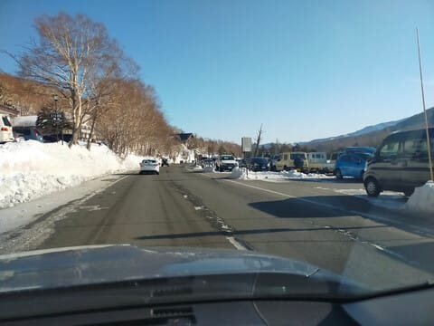

で．

いつも通り，8:30の営業開始前に

焼額第1ゴンドラのオープン待ちに並ぶわけ

ですが．

今日はそこそこの列があったので，

一見混みそうにも見えたけど…

実際は今日はガラガラデーでした！

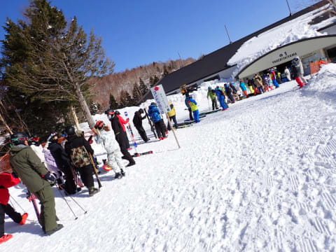

そして．

山頂に行くと…

そこは，雲一つない快晴パラダイス！！

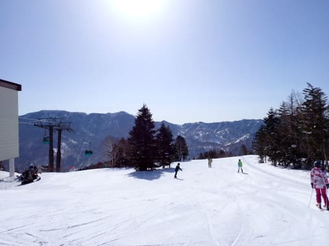

あさイチの山頂の気温は-3℃と，

機能の予想より2度ほど高くて．

この時期で放射冷却が入る晴れとすれば

かなり高めの気温（涙）

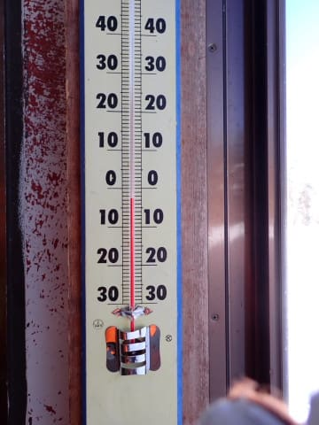

でも．

あさイチのバーンは，高めの気温にかかわらず

いい感じに締まって，柔らかすぎず硬すぎず，

最高のシェフがぴったりに料理したような

絶妙にエッジがかかる，気持ちいいシマシマ

バーン！！

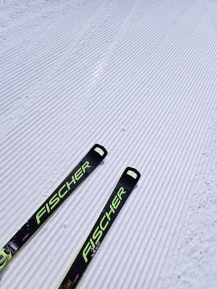

朝の唐松コースはコロコロがかなり

出たらしいけど…

第1ゴンドラのGSコースは，絶妙な

仕上がりの美味なる最高級シマシマ

バーン

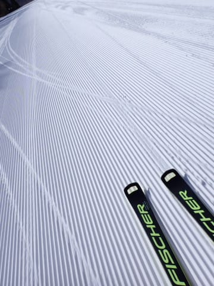

そして，晴天最高で人が少なくて…

こんなガラガラで，気持ちよくエッジが

食い込む，最高級のシマシマバーンを

切り裂いていくこの快感…！！

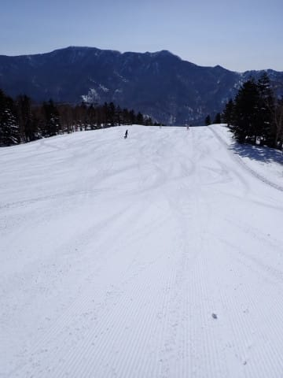

コロコロが出る予想は外した…

予想は外したけど，これはうれしい誤算！！

そして，3月に入ってインバウンドが減った

からか，思ったより人が少なく…

1時間以上，ほとんど人がいない極上バーンを

滑り続けられました～！！

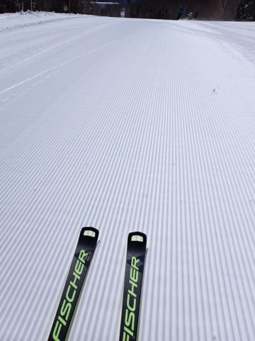

シマシマバーンタイムが終わっても．

気温が高く日が射しているという

天気にもかかわらず…

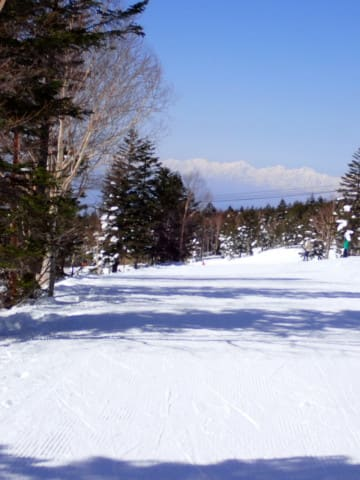

ところどころ，わずかにコロコロはある

ものの，まったく気にならない

締まり気味の雪！

表面がわずかに緩んできても，下地が

しっかりしていて，むしろ滑りやすい感じ…

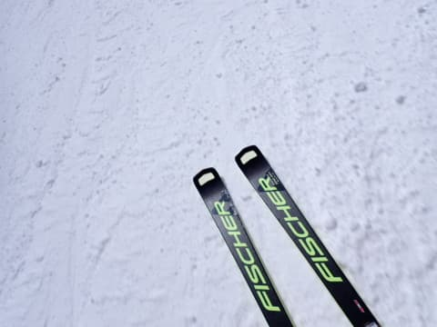

で．

これだけの晴天，いい雪というにも

かかわらず．

焼額第1ゴンドラは，ピークで

せいぜいこの程度の混雑で．

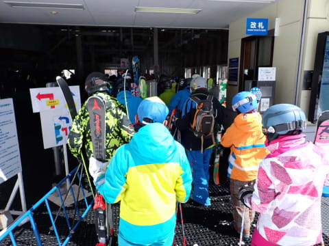

ピークの10時半から11時以外は，

ゲートの外に人があふれることなく．

午後はほぼ飛び降りになることもある

くらいのガラガラ！

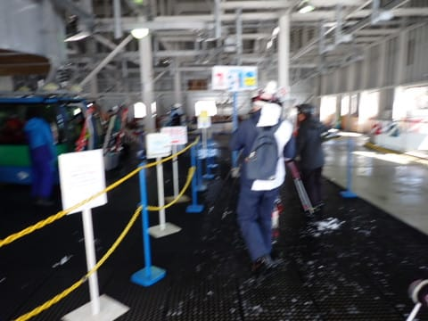

第2高速リフト，第3高速リフトも

それほど混まず…

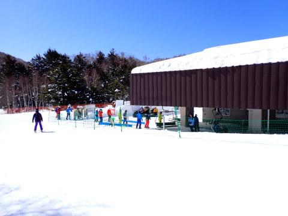

ゲレンデも，土曜と思えないガラガラ

状態！！

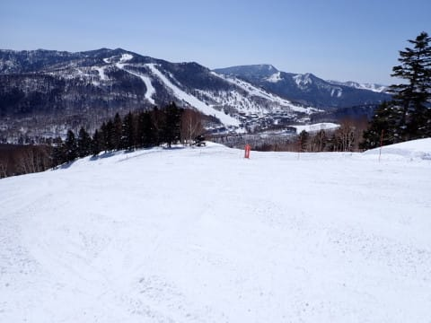

ただ，南斜面で日当たりがよい唐松コースは

午前中のうちからかなり雪が緩んできちゃった

けど…

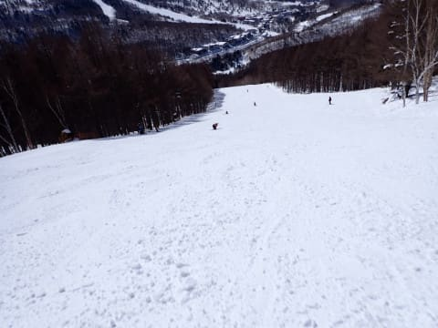

でも．

北向きで，さらに最近も人工雪を打ち増して

いるGSコースは昼になっても緩む気配がなく．

いい感じに締まっていて，凸凹になる

ことなくフラットキープ！

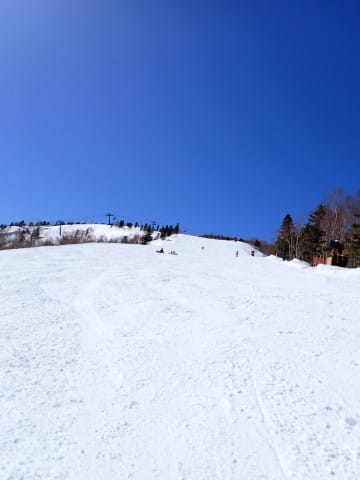

雪も決してがちがちに硬いわけではなく…

いい雪質をキープしたまま締まっている

感じ！！

これはいいよ…！！

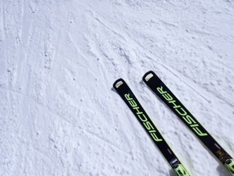

でも．

なぜ，昼間の山頂での最高気温が+5℃近い

高温で．

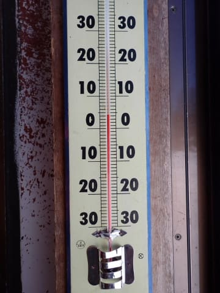

みんながウェアのベンチレーションを開けて

滑るほどの強い日差し＆高温だというのに…

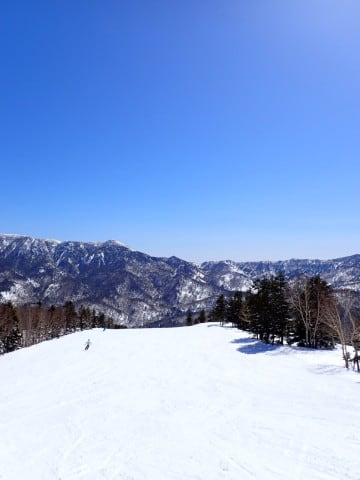

どうして夕方まで，こんな締まったいい雪質を

キープしてくれているのでしょうか？？？

どう考えても，ざぶざぶ雪になる天気＆

気温なんですが？？

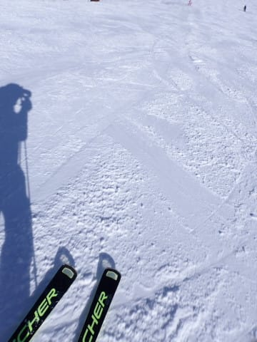

ってな感じで．

高温＆快晴の日差しにもかかわらず，

GSコースはごく一部を除いて，

全く緩む気配を見せず…

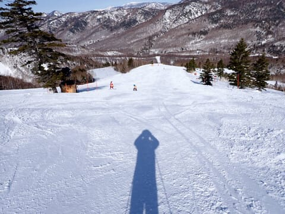

まぁ，唐松コースやパノラマコース，

イーストコースの雪は結構緩んでたけど…

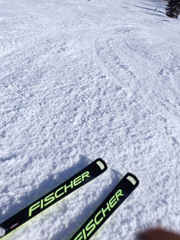

GSコースは夕方になるまで雪が緩んだり，

バーンが凸凹になる気配もなく．

ひたすら大回り板で滑れる

状況をキープしてくれて．

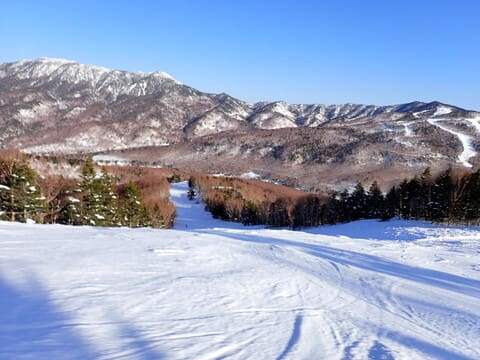

完全快晴で暖かいのに，

ガラガラでバーンも荒れず．

雪が良いまま営業終了まで滑り続け

られたという．

むちゃくちゃ恵まれた一日だったのでした…

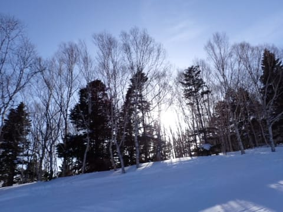

…いや．

外しましたよ．

天気は当てたけど，雪質予想は

外しました…（泣）

でも，今日の予想は難しかったし．

いいほうに外したからヨシ！！！←免罪符のおまじない

明日は朝は晴れそうだけど，昼前から

曇ってきそうな感じ…

午後は完全曇りになるので，日差しで

雪が緩む可能性は低いかな．

あとは午後の天気がガスになったり

しなければ，明日もいい雪で

楽しめそうな予感…！！

明日も志賀高原で滑ってます～！

## 💬 コメント一覧

### 💬 コメント by (地元民)
**タイトル**: Unknown
**投稿日**: 2024-03-16 23:45:53

来週の寒波。

予想天気図での寒気の強さ、寒気の中心の位置、等圧線の形。どれをみても内陸部の山岳地帯、かなりの大雪になりそうな気が・・・。

### 💬 コメント by (大阪のK)
**タイトル**: Unknown
**投稿日**: 2024-03-17 09:54:34

この高温の基では最高のゲレンデを滑り倒しました。

最後に１転びして、ほぼシーズン終了の予感。

ビンディングの誤解放、怖いですね。

右半身をやっちゃいました😱

焼額山の皆様、これからも頑張ってください🙇

### 💬 コメント by (富山県民)
**タイトル**: Unknown
**投稿日**: 2024-03-17 11:12:48

こんにちは。

3月16日は志賀高原焼額山に行かれたのですね。

焼額山も快晴だったのですね。

私は3月16日は八方尾根に行きました。

八方尾根も快晴でした。

雪質はリーゼングラートと黒菱はそこそこ良かったですがベースはかなり緩みました。

また上部のリフトは前日の強風の影響で営業開始がかなり遅れました。リフト料金も春料金で1日券は5500円でした。

### 💬 コメント by (snowman)
**タイトル**: 私も焼額にいました
**投稿日**: 2024-03-17 13:49:01

昨日は暖かく、いい天気でしたね。

パウダーが好きな私には、ちょっと物足りなかったです。

### 💬 コメント by (レインボー76)
**タイトル**: Unknown
**投稿日**: 2024-03-17 15:20:07

日曜日の志賀高原の

朝の上林+2℃　蓮池+5℃。晴れている。

朝イチのパノラマ、唐松は少し硬め。あとはひたすら三高で基本練習に没頭。三高はこの後は20日だけ動かすとか。

ところが10時頃からストップ雪が出現。そんなときのための固形ワックスを、友人に塗ってもらったけど、長持ちしないから買うのはやめとこうかな。

明日は強風と雪で根性が必要なので、どうするかは微妙です。

### 💬 コメント by (Skier_S)
**タイトル**: 今日の志賀高原は高温の曇り（涙）
**投稿日**: 2024-03-18 01:56:46

＞地元民さま

水，木はかなり積もりそうです…！！

このままいけば，志賀はGWまで雪がもってくれるかも…？？

＞大阪のKさま

ちょっと痛そうにしていましたが，シーズン終わっちゃいそうですか？？？

悪化せずに，すぐに復帰できることを祈ってます…

＞富山県民さま

白馬は16日，雪が結構緩んだんですね．

志賀は標高が高いからなのか，気温が上がってもそこまで緩まなかったので良かったです．

白馬は雪の量は大丈夫でしょうか…？やはり例年より早めに終わっちゃいそうな感じですか？

＞showmanさま

今シーズン，あまりパウダーに恵まれてませんから…

私は今シーズンはまだ1度も太板を出動させていません（涙）

今シーズンはこのまま志賀らしい軽いディープパウダーを楽しめずに終わっちゃいそうです（泣）

＞レインボー76さま

あれ？10時からストップ雪でした？

私の板は滑りましたが…

午後はむしろ冷えて雪が良くなって板が走るようになってきましたよ～！！

明日は確かに志賀はちょっと風が強まるかもしれませんね…

### 💬 コメント by (富山県民)
**タイトル**: Unknown
**投稿日**: 2024-03-19 16:18:51

こんにちは。

3月17日の白馬八方尾根ですがトップとベースでは雪質がかなり違いました。

リーゼングラートや黒菱は3月とすれば雪質が良かったですがベースはかなり緩みました。

積雪量ですが白馬は先日大雪が降ったそうで黒菱は3mくらいありました。

ベースも積雪量は50cm以上もあり3月いっぱいはベースまで雪が持ちそうでした。

今年の2月はかなりの高温で雪どけが進みましたが3月上旬は何度も大雪が降ったために雪不足が解消されました。

