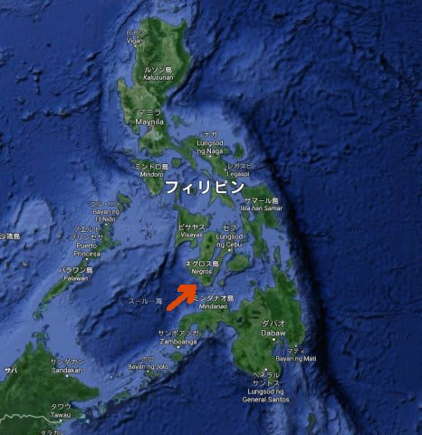
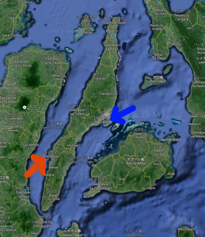
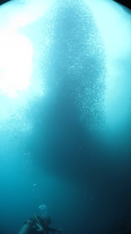
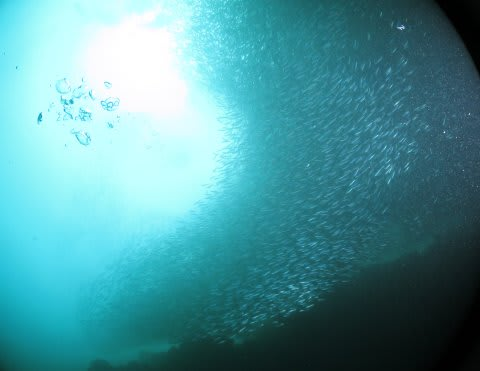
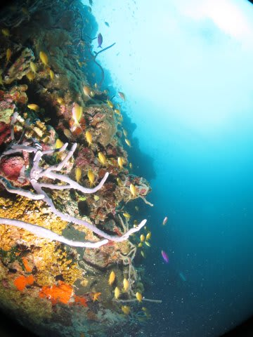

# 2015年8月，子連れでモアルボアルでダイビング…プロローグ2

📅 投稿日時: 2015-10-15 00:08:49

ってことで．

なぜか，西表から帰ってきたばかりというのに．

モアルボアル旅行記です…

…それも，まだプロローグ（汗）．

＃西表旅行記は，やっぱり来年になるのか…！？？

とりあえず．

モアルボアル旅行記へ，Go！

---

モアルボアル…

ダイバー以外は，知っている人はほとんどいない場所ですよね．

…ってか，ダイバーでも知っている人は少ないかも？？？

場所は，こんなところ．

フィリピンのセブ島…

その，西海岸側．

赤矢印の部分です．

…青矢印で示した，セブのマクタン空港から，直線距離で80kmほど．

車で3時間半ほどの場所．

で．

ここは，かなり昔からヨーロピアン向けのダイビングサービスが

いっぱいある場所で．

たくさんのダイビングサービスと数多くのダイバー向けレストランだけで

成り立っているような，小さな集落．

最近は，そこに日本人向けのダイビングショップができてきた…

という状況らしく．

まだマイナーなため，お盆に近い時期でも空いているんだろうなぁ…

という感じの場所です．

んで．

ここの売りは何かというと…

イワシです．

そう，イワシ．

…ダイバーにとっては．

「イワシ？？？」

って感じなんですが．

そう，この海は，イワシの群れが見れる…

というので，有名なんですね～．

私も，行くまでは

「イワシ？」

と思ってたけど．

いや．

ここ．

行く価値あります．

ダイビングショップのある，モアルボアルの街の目の前，

すぐそこの海に，岸辺から見えるほどの

イワシの巨大群れがいついていて．

海岸からのシュノーケルでも，巨大群れが眺められます…

いや，すごいよ，これ．

ダイビングで見たら，圧巻！！

そして．

モアルボアルから，ボートで30分ほどの

小さな無人島，「ぺスカドール島」

この島の周りも，サンゴがきれいな，いかにもフィリピンっぽい

ポイント．

モアルボアルは，イワシとぺスカドール島，この

二つがダイビングポイントのほぼすべて．

どちらもそう遠くないので，ダイビングは朝に出かけても

また昼にはショップに戻って，ゆっくり昼休みをとって，

午後にまたボートで出かけるパターンになります．

リロアンやドゥマゲッティなどのように，

船で1-2時間かけての遠くへの遠征，ってのはありません．

ホテルはいくつかあるけど…

まぁ，高級ホテルってものはありません．

前回行った，オスロブのルビリゾートみたいな，

きれいなホテルはなくて．

まぁボチボチのレベルの宿がいくつかあるかな～

…という感じのところですが．

今回，消去法で選ばれた目的地だったので．

私もあまり事前情報をもたずに出発することになった，

モアルボアル．

今回利用するショップに問い合わせたところ，

「子連れ乗船OKですよ～！」

と快諾してもらえたので．

まぁ，去年のパラオも何も問題なかったし．

今の我が家では．子連れ乗船さえ認めてもらえれば，

あとは何も全く心配はいらんな…

と，出発直前まで，特に情報集めも準備も

することなく，出発当日を迎えたのだった…
