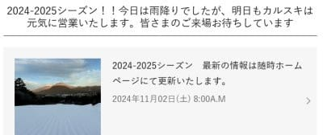
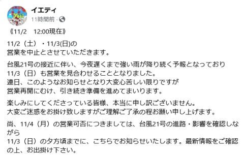
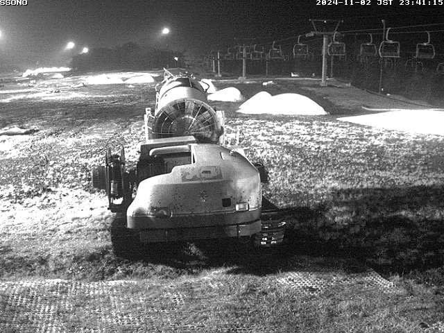

# 軽井沢スキー場は3連休初日の11/2(土)も問題なく営業できたけど，イエティは11/3(日)までの営業中止をアナウンス．3連休に営業できるのか？

📅 投稿日時: 2024-11-03 00:47:30

ということで．

今日はイエティが営業していなかったので，

滑りに行くことができなかったSkier_Sです（涙）

しかし．

3連休初日の今日は，終日雨にもかかわらず，

軽井沢はそこまで豪雨にならなかったようで，

無事営業できたようですね…

（[軽井沢プリンスホテルスキー場ホームページ](https://www.princehotels.co.jp/ski/karuizawa/winter/)より）

それに対し，イエティは金曜の夜から

かなり豪雨になり…

そのせいで，3連休2日目の日曜も

営業しないとアナウンスがありました（泣）

まぁ，これもかなり想定の範囲内ですが…

（[イエティFacebook](https://www.facebook.com/YetiSnowtown/posts/pfbid025hAfA21iwzDC2exqTUdjvs5aJqFCo2nJMfdfiUURqEc8Ygu6fkw3zUP7WLC5WgXDl)より）

私もかなり悲しいけど，イエティとしても，

3連休に営業できないのは痛いだろうなぁ…

しかし．

ライブカメラを見ると…今日の

雨のせいで雪がかなり減ってます（激泣）

雪にシートをかぶせて保護しておけば

もう少し融けなかった気もしますが，

雨ざらしだと融けちゃうよね…（泣）

（[WNIライブカメラ](http://webcam.wni.co.jp/KAC24326/loop.html)より）

…しかしこれ，日曜一日だけの降雪で，

3連休最終日の月曜にコースオープン

させるのは無理なんじゃなかろうか…？？

…ということで．

月曜もイエティは営業中止になり，

この3連休は滑りに行けないという

可能性がかなり現実味を帯びてきたので，

かなりドキドキしてますが…

いや．

結構高い可能性でダメっぽい…（泣）

…まぁ，今週滑りに行けなくても，

来週は5日，7~8日とそこそこ冷えるので，

来週は大丈夫だと思います…

しかし．

果たして月曜に滑りに行けるのか？？

乞うご期待…！！
