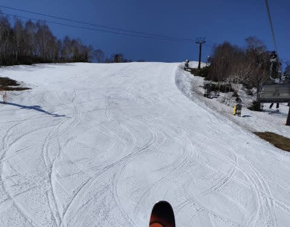
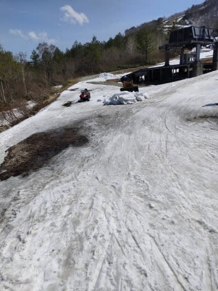
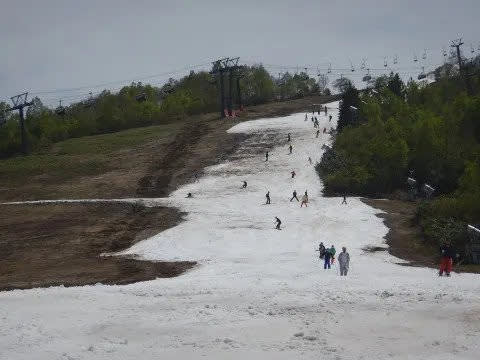
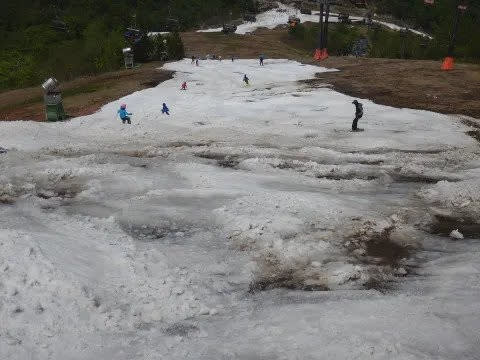
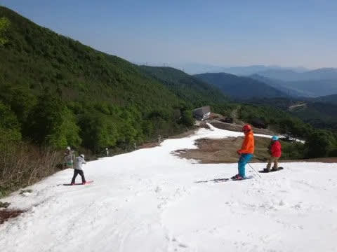
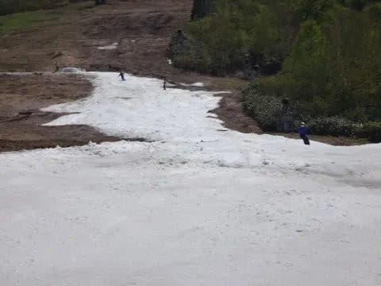
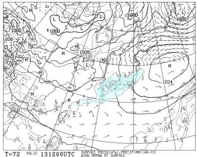
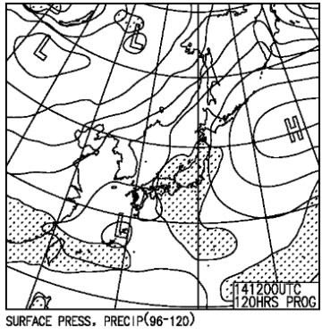

# かぐらは5/13,14の今週末までまだ比較的いい感じで滑れそう．ただ，今週末の天気は土日とも雨っぽい（涙）

📅 投稿日時: 2023-05-11 01:56:30

えー．

本日もかぐらから写真を送ってくれた

特派員の方がいましたが．

かぐらは晴れたようで…

結構バーン状況は良さそうに見えますね！！

…でも．

コース下の方は雪が薄かったらしく…

リフト乗り場付近も一生懸命雪出しして

繋いでいる状況みたいなので…

今週末まではもってくれても，来週の

20，21日の営業は厳しいかな～…

でも，かぐらはかつて昔．

こんな状況になってもオープンしてた

こともあったし…

（[2018年5月27日](eaa2cadad169bdebec761d08f367f5c25.md)）

この時はもう，土が出まくってるのに，

人海戦術で雪を入れながら営業してましたよね…

そして2016年のファイナルかぐらは

クワッドも動かせず，ペア1本．

（[2016年5月22日](e1b1b0bbedf7954674e12476c8a823b3a.md)）

ペアの降り場から上は雪が全くないのが

分かりますよね…

だもんで．

今シーズンも，かぐらは根性を出して

予定通りの21日まで営業しちゃうかも！？？

ただ…

今週末の天気は…

土曜13日の天気図は，嫌がらせのように

本州上空を狙ったように降水域がかかっていて．

これは，土曜はおそらく朝9時過ぎくらいから

ポツポツ雨が降ってきそう…

そして，日曜の天気図も，降水域の

網掛けが見事に本州を覆っているので…

残念ながら，この日も雨になりそうです（泣）

ってなことで，志賀・かぐら共に

嫌がらせのように週末を狙って

降りそうです(涙)

11，12日：晴れそう．

13日(土)：早朝のうちは降らないけど，

　9時から10時くらいにポツポツと雨が

　降り始める．その後，午後まで降ったり

　止んだり．

　夕方近くは，雨が強く降るときもある

　気温は10℃くらいと高めだけど，雨が

　降ってるので肌寒く感じる．

14日(日)：朝から雨．午前中は雨が

　降り続けそうだけど，午後は降ったり

　止んだりって感じか…

　気温は高めだけど，この日も雨なので

　肌寒く感じる

という感じでしょうか…

雨は15日も降り続けそうですが，

3日間ともそれほど強い雨じゃないのが

救いかな…

この3日間の雨で，雪が解けないように

祈るばかりですが．

16日以降は晴れそうだけど気温も

上がりそうなので…

晴れて気温が上がるのも，雪が解けそうで

心配（涙）

とりあえず，かぐら・渋峠ともに，

今週末は大丈夫そうだけど…

果たして．

来週末まで，かぐら・渋峠ともに雪は

もってくれるのか？

乞うご期待！！
