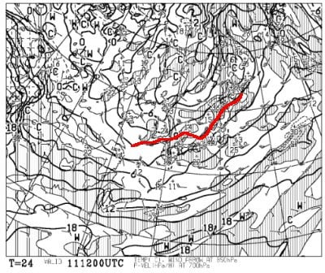
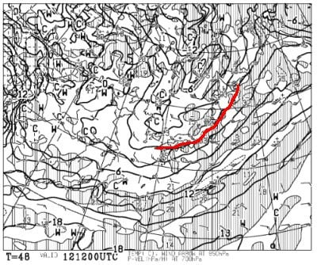
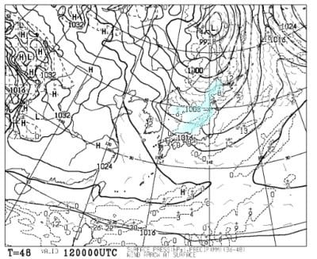
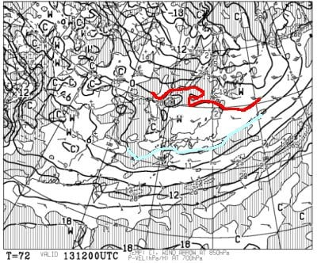
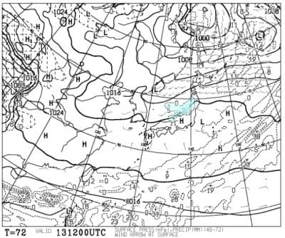
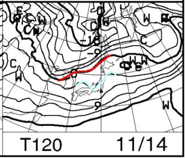
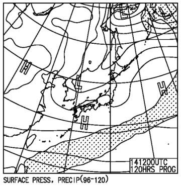

# 11月13，14日の週末のスキー場の天気は…13日までは冷えそうだけど，積雪は無いな．14日以降は微妙…

📅 投稿日時: 2021-11-11 06:22:11

えー．

相変わらず仕事がご無体なので．

とんでもない時間に更新していますが…

ちょっと手短に，これから週末までの

志賀高原の天気を改めて見直してみると．

まず，11日木曜の夜9時の850hpa気温図では…

うーん．

ギリギリ0℃線が志賀にかかるかどうか．

かなり微妙なところだけど…

標高が高い横手なら，朝晩は人工降雪機が

動かせるかな？

次に，12日金曜夜9時の850hpa気温図ですが…

ををを！！

ようやく赤い0℃線が志賀高原の南にまで

下がってくれるよ！！

降れば確実に雪です！

これなら，横手も熊の湯も，人工降雪機が

フル稼働できますね！

ただ，12日金曜朝9時の地上天気図を見ると…

残念ながら，等圧線が横縞で．

志賀高原は西風のパターン…

日本海側に水色降水域がかかってるけど，

志賀は天然雪は降らないパターンです（涙）

そして，続く13日の土曜ですが…

うーむ．

残念ながら赤い0℃線はかなり北に

上がっちゃいます（涙）

…でも，水色の+3℃線は志賀の南．

850hpaの0℃線と+3℃線の間に挟まれれば，

なんとか横手の気温はギリギリ0℃．

この日もぎりぎり人工降雪機が動かせるか…？

地上天気図も，日本海側に降水量が予想

されていますが…

この日も，志賀には雪雲がかからない

西風パターンなので．

土曜の志賀は曇り~晴れ．

時折チラチラ雪が舞うかも？という程度の

天気ですね．

で，14日日曜はというと…

ガーン．

水色の+3℃線が，志賀高原に

ギリギリかかる程度…

…これは厳しい．

この予想が正しければ，明け方に

ギリギリ人工降雪機が動かせる程度か…

この気温だと，昼間の気温が上がった

時には液体が降りかねない気温だけど．

降水域の網掛けが本州にはかかって

ないので．

日曜は降らなさそう．

曇り~晴れ，って感じかな．

ということで．

横手山は，

12日は人工降雪機がフル稼働できそう

13日もなんとか朝晩は人工降雪機が動かせそう

だけど…

天然雪がないので．

さすがに13日オープンは厳しいか…

そして，14日も人工降雪機が動かせるか

どうかギリギリなので．

14日もオープンできない可能性が大です（涙）

やはり，13，14日の横手・熊の湯のオープンは

諦めた方が良さそう…（激泣）

次はいつ冷えるのか…？？

と，気になるところですが．

2週間予想を見ると．

水色で示した，人工降雪機が動かせそうと

予想した12，13日の冷え込みのあとは．

平年並みかそれ以上に気温が上がっていく

予想で．

…20日過ぎまで，冷えてくれない感じ

ですね（激泣）

もしかすると．

20日のオープンもヤバいかも…

ということで．

信心深い1億3000万人のこのBlog読者の

皆様におかれましては．

これから毎日，冷え冷え踊りを踊り続け．

寒いギャグを連発して周りを冷やす

努力を惜しまぬよう，

切にお願い申し上げます…

## 💬 コメント一覧

### 💬 コメント by (Unknown)
**タイトル**: Unknown
**投稿日**: 2021-11-11 09:19:33

西日本最速！

ウィングヒルズ白鳥リゾートが明日オープン予定です。

ライブカメラを見る限り無事にオープン出来そうです。

シーズンインされる方が増えて盛り上がりそうですね～

### 💬 コメント by (Skier_S)
**タイトル**: ＞Unknownさま
**投稿日**: 2021-11-12 01:01:32

おっと．

ウイングヒルズオープンですね！

アイスクラッシュはちゃんと予定通りオープンできますね…

でも，混みそう．

