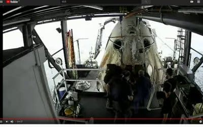

# Crew Dragon，無事地球へ帰還！…次は9月にCrew-1ミッションで野口さんが乗るよ

📅 投稿日時: 2020-08-03 05:25:09

🏷️ カテゴリ: [日記](cc4b5682fb7b8b144980957a978653fb0.md)

ということで．

日曜の朝と夜中．

ひたすらYoutubeを見続けてしまった

Skier_Sです…

日曜の日本時間朝8:30にアンビリカル切断，

8:35に分離！

その後，4回の短い噴射(Departure burn）で

ゆっくり宇宙ステーションから離れ，

分離1時間くらい後に行われた，1分ほどの

Departure Phasing burn で分離のシーケンスが完了．

…だけども，Departure burnはカメラに映らなくて

噴射してるのが分からず，ただ単に延々と

Crew DragonがISSから離れていくのを見ている

だけで，「おお！」とかいう画面では

なかったですが…

しかし．

宇宙船の中とか，コントロールセンターとの

中継とかが全て生で聴けるという，

こんなものが，Youtubeでリアルタイムに

見られるようになったのは，素晴らしい…!

そして，

深夜2:43にDe-orbit SequenceにGOがかかり，

2:52にTrunk分離しましたが…分離をモニターする

カメラが設置されて無いようで，分離の動画は無し（残念…）

2:56から，De-orbit burn実施．

3:08にDe-orbit burn完了，Nosecone close sequence start．

3:16にNosecone close confirmed，

3:40前にBlackout

3:42にBlackoutから通信復活，

飛行機から落下する姿が確認でき…

Drogue chute deploy

Main chute deployと続き

そして…

3:48に無事着水しました！

着水直後の通信，

"Space X and NASA teams, welcome back to the planet Earth,

 Thank you for flying Space X"

で，スタッフの笑いが起きてましたね…

SpaceXのコントロールセンターでは，

イーロン・マスク氏も最前列の

席で見守っていたみたいでしたが．

大気圏突入シーケンス，機上からの

画像が一切なかったのが，ちょっと

残念…

その後，回収船「Go Navigator」に引き上げられ…

サービスモジュールの燃料タンクのパージ

（残念量の抜き取り）に1時間くらいかかって…

4:59にハッチオープン！

クルーが降りてきたのは，

5:08過ぎでした…

(https://www.youtube.com/watch?v=tSJIQftoxeUより）

ってなことで．

ついつい中継をひたすら見続けてしまった

この週末．

…自分の趣味で中継を見ながらこんな記事を

書いてしまいましたが…

このBlog読者で，この記事を面白いと思う人は

少ないだろうなぁ…←そう思ってるなら，なぜこんな記事を書く？

…そうそう，

中継を聞いていて驚いたのが．

この大気圏に突入した，このCrew Dragonカプセル．

再利用するんだって！？？

「防水で，海水にも耐えるようにできてるから大丈夫」

とかコメントしてましたが…

まぁ，耐熱シールドは交換するとして．

黒こげ外観のこのカプセル，次の次のミッション，

Crew 2で再利用するようです…

ホントか…すごい…

で．

次のCrew Dragonのミッションは，

9月下旬に予定されている，

「Crew 1」ミッションです．

日本人の野口さんも乗ります！

4人のクルーで，6か月のISS滞在予定．

次の打ち上げ＆ドッキングも生中継されると

思うので，見ないと！
