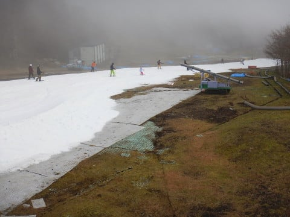
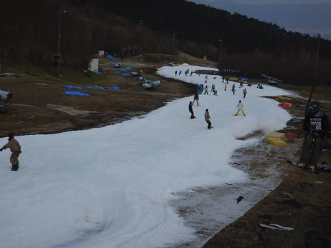
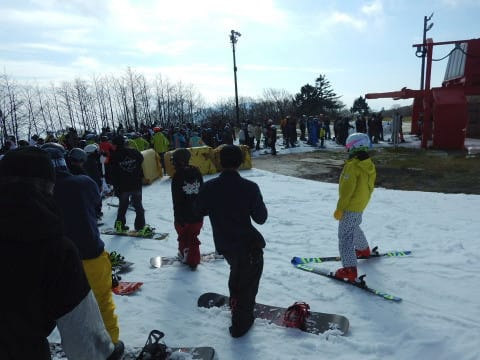
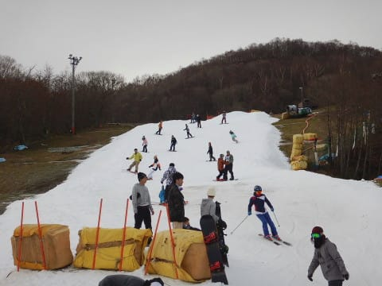

# 11月18日（日）のイエティ速報…2019シーズンももう一か月．そろそろ冷え込みが欲しい…

📅 投稿日時: 2018-11-19 02:37:11

🏷️ カテゴリ: [2019スキー滑走日記](c3e4496fc0fb7f9c17ff21214a35b1ace.md)

えー．

どうやら．

私が無事帰国すると．

「普通に帰ってきちゃったら

　面白くないだろ～っ！！」

…という，不条理なツッコミを受けることが

明らかになりつつある今日この頃．

皆様いかがお過ごしでしょうか．

しかし．

予定通りに帰ってきたとはいえ．

金曜日から土曜日にかけ，乗り継ぎで15時間以上のフライト

＋成田から3時間以上かけて帰宅…という，

ホテルを出てから24時間以上の移動の翌日に．

朝5時に起きてYetiに行っているだけでも，

十分ご無体な日程なのですが…

さらに，自宅引っ越しからまだ2週間しか経ってない状態で，

一週間自宅不在にして，帰ってきた翌日ですから…

常識的に考えれば，これだけで十分なネタ

のような気がするのですが…

そんな状況ですが．

予定通り．

本日も行ってきました．Yetiへ…

でも，ナイターまで滑って，帰宅も

遅かったので．

本日は速報＆動画にて．

えー．

本日．

天気は終日曇り空で．

朝のうちは，ガスも出るような天気でした…

時折日が射すタイミングもあるものの．

気温は10℃以下だったので，日が射さないと

結構寒い感じ…

で．

今日は結構人が多かったです…（涙）

コース上の人口密度は結構高めだし．

リフト待ちも，クワッドリフトは平均的に

5分くらいあった感じ…

とはいえ，並行してかかっているペアリフトは

ほぼ待ち0だったので，リフト乗り降りで板を脱いで，

ちょっと歩く覚悟があれば待たずに済みましたが．

で，コース上は結構混んだけれども．

雪の厚みは先週より厚く，最後の急斜面の

ごくわずか茶色くなったところがある以外は，

穴が開いているようなところが無かったのが，

まぁ良かったかな…

雪質は…ちょいと荒れ気味で，

日が射すと貼りつき気味になるときも

ありましたが．

まぁ大体曇っていたので，板はそこそこ

滑る雪でした…

ってな感じで．

いつもの定番．

リフト降り場から乗り場までの動画です！

午前10時過ぎくらい，ちょうど日が射している

タイミングでの動画です…

まだリフトはそれほど混んでなくて．

コース真ん中は硫安が残って，まだ

比較的締まった感じがある雪ですが．

両端は結構荒れ気味で，

コース上の人は多めです（涙）．

とりあえず．

明日また，詳細レポートやります～！

## 💬 コメント一覧

### 💬 コメント by (もりや)
**タイトル**: お疲れ様でした
**投稿日**: 2018-11-19 19:25:55

先日はお世話になりました。子供達も皆さんと滑る事が出来喜んでいました。今シーズン初日から朝一〜ナイターまで滑ってしまい、かなり疲れました。なんとか日付が変わる前に無事自宅に到着する事が出来ました。次は12月志賀高原でお会いしましょう。

### 💬 コメント by (しんちゃん)
**タイトル**: 祝・無事帰国
**投稿日**: 2018-11-19 22:36:03

無事に帰国されてよかったです。

引っ越しして間もなく一週間も自国を不在にして帰国した翌日に、しかもYetiとは。神様にしかできない所業です(笑)

黒魔術で志賀高原になんとか雪をふらせていただけないでしょうか。よろしくお願いします(笑)

### 💬 コメント by (Skier_S)
**タイトル**: これで今シーズンラストのYetiのはず…
**投稿日**: 2018-11-20 04:15:10

＞もりやさま

日曜はお世話になりました～！！

おかげさまで楽しかったです…

しかし，3時間半運転してやってきて，朝イチからナイターまでとは…

お子さんたちも超人すぎます（笑）．

次は志賀高原でお会いしましょう！

＞しんちゃんさま

皆様の期待を裏切り（？）無事帰国しました．

とりあえず，22日は私の黒魔術で雪を降らせますが…

オープンするほど積もるか微妙です…

また明日，天気予想します～！

