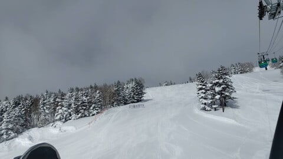
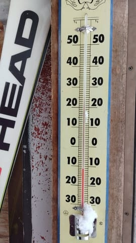
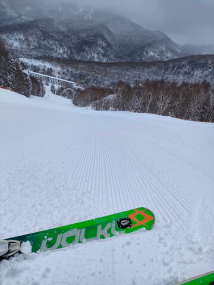
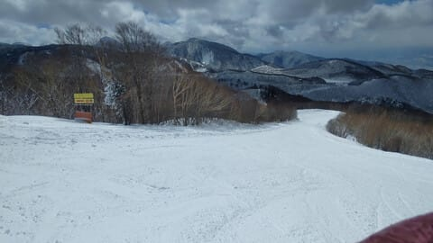
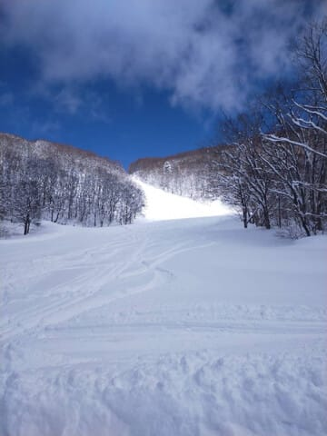
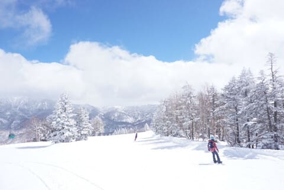
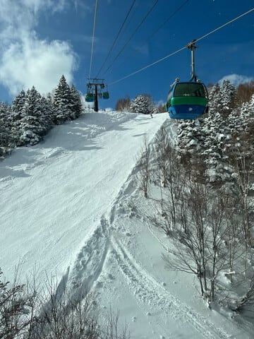

# 3月22日(金)の志賀高原スキー場は，冷え冷えトップシーズン雪で時折薄日も射す最高コンディション！！でも明日から，週末を狙ったように高温になる（涙）

📅 投稿日時: 2024-03-23 00:44:21

ってなことで．

本日も志賀高原の特派員から写真が

送られてきたわけですが…

ふぎゃーーー！！

すごい良さそう…っ！！！

どうやら，あさイチは-12℃近い

激烈冷え冷えで．

昨日までに積もった雪が圧雪された，

2月トップシーズン並みの冷え冷え最高

シマシマバーンだったようじゃないですか！

2月は雪不足で3月はもうだめか…

と思った今シーズン．

まさか3月下旬になって，こんないい雪で

滑れるとは…！！

うらやましい…つ！！

さらに，曇り空だけどそこそこ明るくて

バーンも良く見えて．

時折晴れ間も見えるくらいで…

これ，シーズンでもそうそうない最高の

コンディションですよね…

まさか3月下旬になって，こんな

いいコンディションになるとは…！！

そして，人も少なくゲレンデはガラガラで，

バーンは夕方まで荒れず．

「シーズン毎日こんなだったら…」

というコメントがついてきたくらいの

最高コンディションだったらしいです…

うがーーー！！

今日，滑りに行きたかった…

ってなことで．

この最高のコンディションが明日も

続くはず…！！

と信じたいところですが．

やっぱり明日はヤバいです（激涙）

土曜：朝から気温が高めで雪降り．

　重い雪が積もって，視界が悪め．

　昼近くになると麓から徐々にみぞれに

　なっていき…

　午後は山頂でもプラス気温で，

　液体になる可能性が高い（泣）

　焼額だと，液体になるか固体になるか

　かなり際どい感じ．

　標高が低い西舘・サンバレーとかはアウト．

　時折強く降るかも…

　液体が降ったら，雪質はもう

　春の重い雪になっていく．

日曜：曇り．朝から0度前後の高温．

　ヘタすればあさイチからプラス気温

　朝のうちは一瞬コロコロが出る

　かもしれないけど，気温が高いので

　コロコロがすぐ崩れてしっとりした

　滑りやすい雪になっていく．

　最高気温は+8℃近くとかなり上がる．

　時折日が射すタイミングもあるかも…

　バーンは全面しっとりした重い雪になり，

　3月らしい感じになる

という感じでしょうか…

惜しい．

惜しすぎる．

金曜まですごい良かったのに，

土曜から気温が爆上がりで残念な

感じになるとは…（泣）

せめてあと1日，いいコンディションが

続いてほしかった…

それも，土曜はちょうどリフト営業開始

ごろから降り始め，リフト営業終了ごろに

止みそうという，嫌がらせのような

天気（涙）

一体なぜ…

…きっと．

きっと，この週末に志賀高原に行く人で，

誰か日ごろの行いが悪い人がいるに

違いない！！！←それはあなたでしょ

何とか土曜，

空から落ちてくる水分が液体にならず，

固体のままだとかなり救われるん

だけど…

…とりあえず．

今週末も志賀高原で滑ってます～！

…そして，いつも通りあと3時間半後に出発．

3時間寝られない…（泣）

## 💬 コメント一覧

### 💬 コメント by (レインボー76)
**タイトル**: Unknown
**投稿日**: 2024-03-23 13:29:32

土曜日の志賀高原情報

朝の上林0℃　蓮池+2℃。ニゴンに長蛇の列。パノラマ→唐松はまさに快適。昨日がシーズンベストかと思ったけど、きょうもいい。唐松を何本も回してからオリンピックへ。滑りやすい雪だったけど、混雑とガスで楽しくない。ベタ雪がゴーグルにへばりつくし、視界も悪いので10時に終了。帰路の高天は-1℃。下界は雨でした。明日はさらに気温が上がる予報。この雪、いつまでもつのかしら？

### 💬 コメント by (Skier_S)
**タイトル**: ＞レインボー76さま
**投稿日**: 2024-03-23 21:46:30

今日はゴーグルにつく雪と視界の悪さが惜しかったけど，雨にならなかったので

雪質が壊滅的にならなかったのが救い！！

明日も気温は上がるものの，そこまで雪質は悪化しないと思います…

明日もそこそこの雪質で楽しめると思いますよ！！

