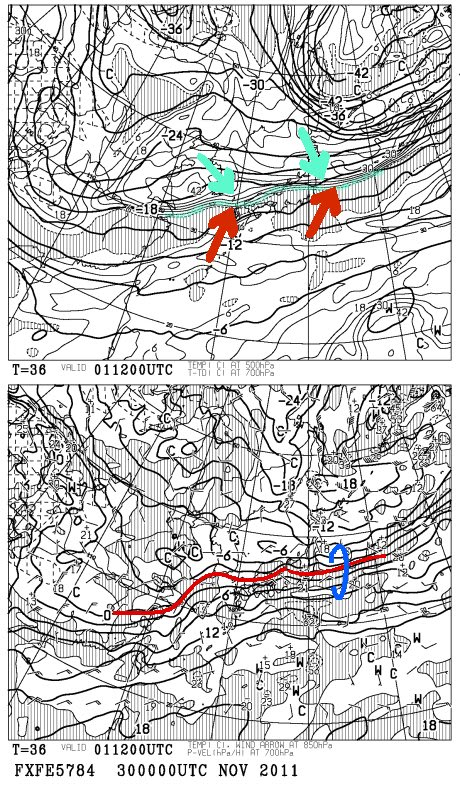
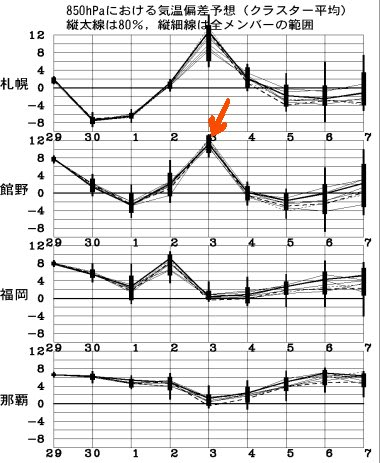
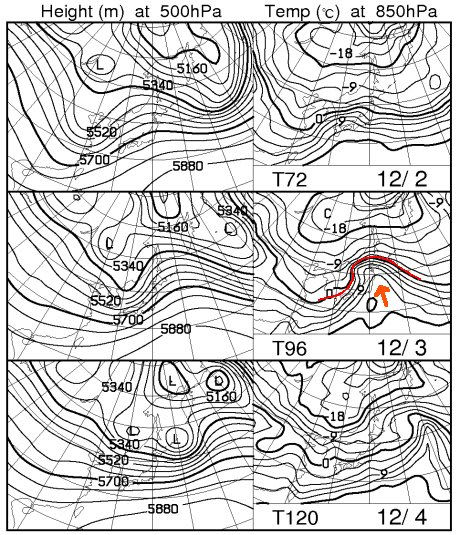
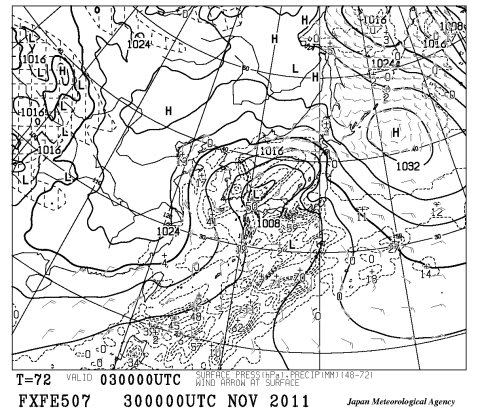

# 今週土日はあまりゲレンデ状態は改善しなさそうだなぁ…(涙)

📅 投稿日時: 2011-12-01 01:12:57

さて．

[ここ](e4d0db8c282d138e72190002d475cffe0.md)や[ここ](e458c2b2ae9596dd4948d6d765a522145.md)で予想したとおり．

28，29，30日は異常に暖かくなり，雪が溶けてしまいました…（激涙)

29日には低気圧が予想より南へずれてくれたので．

なんとか雨にならずにすみましたが．

しかし，高温という予想は外れてくれず．

日差しが雪を溶かしてしまったようで．

熊の湯，丸沼，鹿沢など．軒並みかなり雪が溶けてしまい．

さらに気温が高いので人工降雪機が動かせず，

かなりコンディションは悪化の様子…

がーん．

ショック～．

で．この週末に向けて，後2日間でゲレンデコンディションは回復

するのか？？

…と，天気図を見てみますと．

あ，あんまり期待できない…(泣）

1日木曜，2日金曜は，雨と雪の微妙なところ．

標高が低いところは雨になりそう…

下の図が，1日夜9時の500hpaと850hpa予想図ですが．

下の図の上側，青線を引いた部分．

この線より北側は，湿数が大きいエリア，南側が湿数が小さいエリア．

詳細な説明は省きますが，湿数が大きいエリアは，

冷たい風(青矢印)が吹き込んでいるところ．

網掛けになっている湿数が小さいエリアは，暖かい

風(赤矢印)が吹き込んでいるところ．

青線の部分で，この両方の空気がぶつかってます．

…信州は，南の暖かい空気エリアに入ってるような気が…

＃北海道はー36度の寒気がかかっている…ここだけは大雪ですね．

この図の下側，赤く線をしたところが山で雪になる目安，850hpaの0度線ですが．

うーん．ぎりぎり信州．

…ってことで，信州は雨か雪が微妙なところ．

で，赤い線の付近（青線でくくった部分)は，

暖かい空気とつめたい空気がぶつかっているので，

温度傾斜が強く(等温度線の間隔が狭く)なってます

んだもんで，今後の予想でこのぶつかり合いが

わずかに北にずれるか南にずれるかで，

温度がえらく変わってしまいます．

これも，今後の天気が雪か雨か微妙にしています．

それで．だ．

さらに．

…なんだ，これは．

この，3日の異常な高温は…

例年より10度くらい高温になってしまうんですが．

このまま行くと土曜は

『雨』

なんですが．

あー．

雨，です．雨．

雪じゃないです．

雨．

標高がどれだけ高くても，雨．

それも，結構強い雨．

この図で見て分かるように，12月3日は，0度線は遠く北へ

行ってしまってます…

さらに，この0度線の北への折れ曲がり具合は，

ここに矢印のように南風が入ってくるパターン．

暖かい南風が吹いて…

この，3日朝9時の予想天気図にあるように．

点線で囲まれた降水量をあらわすエリアが，

日本全国を覆う，

…ということは．

あったかーい，かなり強い雨で雪がとけちゃいますね．

…その後，日曜は冬型に入りそうですが．

…あんまり雪は降りそうにないなぁ…

えーっと．

もう，12月だよな．

12月．

12月に入って，こんな天気でいいのかっ！？

（スキーヤーの心の叫び）
