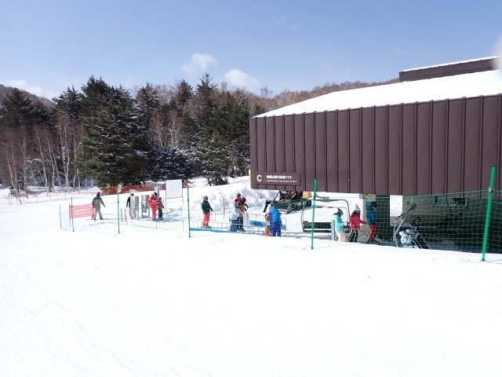
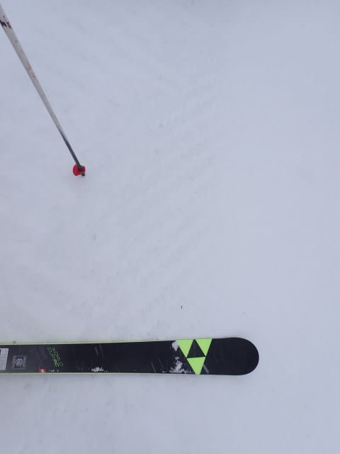

# 2025/3/30(日)の志賀高原スキー場詳細レポート！…朝は晴天でシーズン最高クラスのバーン！午後は曇って下地の硬いところもあったけど冷え冷えガラガラ！

📅 投稿日時: 2025-04-01 02:42:03

さすがに娘が高校生ともなると，

なかなか家族スキーに行くチャンスもなく．

この週末は正月休み以来の家族スキー

だったわけですが…

実に久しぶりに，土日二日続けて

お昼ご飯を普通にレストランで食べる

ということをしてみたわけですが．

…そうだった，普通のスキーってのは

こんな風にお昼休みってものを取る

モノだったなぁ…

と，なんだか懐かしく思ったSkier_Sです．

カロリー摂取するだけならゴンドラの中でも

できるけど，スキー場の食事ってのも，

スキーの楽しみのひとつだったんだなぁ…（しみじみ）

…でも．

食事ならスキー場じゃなくてもできるけど．

スキーはスキー場に来ないとできないし．

平日のご無体仕事のストレス発散のため，

心を無にしてひたすら滑り続けたい

自分としては，リフトが動いている間は

ひたすら滑りたいという思いが強いので…

お昼はご飯を食べるためにリフトも昼休み

という制度になれば，昼ごはんがゆっくり

たべられるんだけどな…←そんな制度はない

ということで，本題へ…

行く前に．

今日，3月31日(月)の志賀高原の特派員情報です！！

特派員からの情報によれば…

今日は朝から終日晴天！

昨日からわずかに雪が積もり，

朝は圧雪の上にうっすら新雪！！

朝はかなりいいバーンだったようです…

そして，天気がいいのに気温がそこまで

上がらなかったようで．

昼になってもコースの雪はほとんど

緩まず，

天気がいいのに雪が良くてガラガラで，

とても3月末と思えないコンディション

だったようです…

うらやましい…！！

ってな感じで，ようやっと本題へ．

昨日速報レポートしたこの日曜の志賀高原，

今日は詳細レポートです…！！

まず．

いつも通り，朝は志賀高原への道を登って

行きますが…

朝からすごい晴天で，昨日あった路面の雪は

ほとんど解けてますね…！！

ただ，蓮池交差点より上は，一部本格的

雪道が残っており．

天気は良くても，スキー場付近は気温が

十分低いことがわかります…！！

ってなことで，いつも通りの8:30営業開始前に

焼額第1ゴンドラに並びますが．

今日は晴天のわりに，列は短いですよ…！

たぶん，今日はガラガラな一日になりそう…

朝イチのゴンドラで山頂に上がると…

山頂の気温は-6℃と，予想よりは気温が

高いけど，十分な冷え込みです！！

そして，冷え冷えなのに気持ちいいほどの

晴天！！！

この晴天の中…

バーンは昨日積もった雪がものすごく良い感じに

圧雪された，締まり気味なのにエッジがガッツリ

食い込む，快楽のシマシマバーンですよ…っ！！！

これは…

もしかするとシーズンベストに近いかも…？？

この時期に，トップシーズンよりいい感じの，

硬すぎず柔らかすぎず，スピードが乗るのに

エッジがしっかり食い込んでどこまでも

傾けるバーンを滑れるとは…！！！

こんな極上プレミアムハイグレード

シマシマバーンを，こんな晴天で，

さらにガラガラで好き放題飛ばせるなんて…

これ，今シーズンベストに近いですよ！！？？

3月末に，こんな晴天でこんないい雪を

滑れるとは…

さすが志賀高原…

すばらしいっ！！

今日はGSコースもパノラマも白樺も，

どこを滑っても最高…！！

ただ，なぜかサウスコースだけちょっと

人口密度が高めだったけど．

それ以外は，唐松コースなんかは貸し切り

かと思うほどガラガラだし…

リフトもピークの時間でこのくらいしか

人がいないし…

ゴンドラも最高の待ちでも，ぎりぎりゲートの

外まで並ばない程度．

ほとんどが飛び乗りか，相乗りレーンなら

搬器2台も待たない程度のガラガラでした…

昼間にGSコースと，ブナコースの一部が

ちょっと雪が緩み気味になったけど．

日差しが一番強くなる昼を前にして，

11時ごろには太陽が雲の影に隠れ初め…

晴天じゃなくなるのは惜しいけど，

日差しが弱まって，それ以降は全く

雪が緩まなかったのがありがたい！！

今回，家族スキーというのもあり，

お昼ご飯を食べに行かねばならないという

義務から，昼前に焼額の呪いを振り切り

一ノ瀬方面へ向かいましたが…

一ノ瀬の上半分はちょいとバーンは

硬めながら，下半分はいい感じ！

東館山はアイスバーンが出ているところが

多く，ちょいと残念な感じだったけど…

ブナ平は，上に乗った雪が削られておらず，

アイスバーンが出ていないいい感じの圧雪！

いい雪で積雪もたっぷりあり，これで

明日で営業終了とはもったいない…！！

でも，ブナ平ゴンドラも東舘山ゴンドラも

ガラガラの飛び乗りだったので…

うーん．

週末でもこれだけお客さんがいないなら，

明日で営業終了もやむ無しかな…

そして，午後2時過ぎに焼額へ戻りましたが…

焼額に戻る直前は，標高が高いところは

雲に覆われてきてるのが見えて．

実際に，ゴンドラ山頂付近はちょっと

ガスっぽい感じに…（泣）

でも．

ガスっぽいのは山頂の一部だけで．

ちょっと滑れば視界は良くなるし．

…何より，焼額も全く人がいなくなって

いるんですが…！？？？

今日は午後2時過ぎで，気温が-5℃と

かなり冷え冷えだったため．

さらにパノラマーサウスコースも，

白樺コースも唐松コースも，

雪は全く緩んでなくていいですよ！！

…ただ，GSコースだけは，ところどころ

アイスバーンの下地が出ていて残念だった

けど…

でも．

なんと．

午後3時ごろには，かなりの勢いで雪が

降り始めてきました…！！

人があんまり滑ってないので，降った雪は

あまり蹴散らされずにコース上に積もって

行き…

硬い下地も隠れ始めて，ゲレンデ全体が

またいい感じの雪になってきました…！！

ってなことで．

今日は朝の晴天で最高．

気温が一番上がる昼間は日差しが隠れて

雪質が緩まずいい感じで，

さらに夕方には-5℃以下で雪も積もりはじめ．

アイスバーンに苦しめられることなく，

予想以上にいい感じで楽しめた一日

だったのでした…

…これから1週間，そこまでひどく

高温にならずに過ぎてくれそうなので…

今週末までこんなコンディションが続くと

いいなぁ…

ちなみに，次の週末は．

焼額は朝6時から第1，第2の2本の

ゴンドラで6時から早朝営業が始まります

よ～！！

焼額限定券なら，日数券でもシーズン券でも

早朝から滑れますよ～！

通常営業も8時からで，いつもより30分早く

始まりますよ～！！

…ヤバい…

次の週末からは，朝早く起きなくては

ならないので，さらに睡眠不足が加速

する…

## 💬 コメント一覧

### 💬 コメント by (アツシ)
**タイトル**: Unknown
**投稿日**: 2025-04-01 12:34:43

３月末と思えない、上々のコンディションてしたね。帰りにまた車で話せるかなと思っていましたが、珍しく先に出られてましたね。家族に合わせつつ「まだリフト動いてるのに...」と後ろ髪引かれるSさんを想像してました。また次の週末でお会いできればと思います。

さて私ですが、まだ今季、いわゆる「春雪」で滑っていません。３月は8、9、15、20、29、30日と、上旬から下旬まで６日間滑りましたが、いずれも冷え冷え雪でした。すごい偶然というか、春雪用にと思って板も用意してるのに、なかなか出番がきません。板つかみさんもちゅかみさんも、まだお見かけしておりません。でも、次の週末あたり、出てくるのかな？？

### 💬 コメント by (副院長)
**タイトル**: Unknown
**投稿日**: 2025-04-01 14:42:49

やっぱり志賀高原はすごかった。30.31ほんとに最後に五竜に行ってきました（夏タイヤ）、日曜日はガスガス。下に抜けたら、重たい春雪。最後のナイターはピステン後の最初だけよかったが、ベースが凍ってないので、すぐにグサグサ。日曜日は快晴、アルプスの景色だけはいいですねぇ、アルプス平は雪はまあまあですが、標高下がるとグサグサから、ザクザク、ザブザブ。疲れる。それに比べれば標高のある志賀はすごい、それなりに良いコンディションだったようですね。時々五竜に行くと志賀のすごさがわかりましたザブザブ滑って、今シーズンの未練は断ち切れましたわ。（白馬愛の強い方には申し訳ない）

### 💬 コメント by (Skier_S)
**タイトル**: まだまだ志賀は冷えるはず…！
**投稿日**: 2025-04-02 00:24:14

＞アツシさま

今回は家族スキーだったので，ちょっと早めに上がりました…まだリフト動いてるのに…（涙）

今週末も4月にしては気温は上がらないと思うけど…土曜は晴れたらちょっと板ちゅかみが出てくるかも？？

＞副院長さま

標高は正義です．やっぱり春は志賀高原に限りますよ～！！

…ただ，GWまでスタッドレスを履いておかないとヤバいですが…

