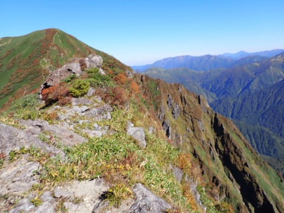

# 2022年10月，谷川岳→茂倉岳に登ってみた…その5　谷川岳→一ノ倉

📅 投稿日時: 2023-08-28 00:17:34

🏷️ カテゴリ: [登山・旅行](c1d637a11a25b457ac978d197adbdafc5.md)

えー．

例の[肋骨骨折](e7dc41681642c5dcac9954a261d3b620d.md)（たぶんヒビ）から早くも

2週間が経ち．

全治3週間目安なら，今度の週末はもう

「治った」といえるはずなのですが…

2週間たった現時点では，

押さえつけるような外力がかかった

瞬間とか，

変な体制になった時とか，

咳やくしゃみをしたときに，

「じんわり鈍痛が来る」という程度にまで

痛みが治まってきたので．

受傷当時からは，かなり回復してきたの

かな～…

という感じ．

今日は結構激しく走りまわったり，

運動してたのですが．

（山に行っていたのではなく，娘と遊んでいた）

走ったり，ダッシュストップしたりしても

全く痛みはなかったので．

もう，運動しても大丈夫っぽい…！！

うん．

次の週末は，山に行って大丈夫かな？←ってか，

受傷1週間で海に潜ってたし，2週間目の今週も

娘とテニスボール打ちあって，ボールを追いかけきれず

転んでひざやひじをすりむいたうえにズボンに穴を

あけるほどの激しい運動をしてたじゃない？

という感じで．

順調に骨折から回復してます～！

ってな前フリの後は，本題へ．

[前回](eff5cc5db51cca569a08ec365db4b5545.md)から続く，谷川岳の

登山レポートです…！

ーーー

ということで．

土合のロープウェー乗り場から歩くこと

2時間42分．

無事，谷川岳のトマノ耳へ到着したので…

トマノ耳からの絶景を眺めつつ，

10分ほど休憩します．

まだ朝8時前なので，山頂はガラガラで．

のんびり景色を堪能できます…！！

で．

次はこの向こうに見える，オキノ耳へ

向かうわけですが．

トマノ耳から，この写真の右下に写っている，

緩やかな道を7－8分ほど歩いたら…

トマノ耳での10分休憩を入れても，

出発から3時間4分後にオキノ耳へ到着！

こちらもまだ朝9時ごろと早い時間なので，

山頂は人も少なく，のんびりできて…

振り返ると，さっき通ったトマノ耳が

見えますね～！

そして，トマノ耳から仙ノ倉方面，

万太郎山に続いていく見事な稜線やら…

これから向かう一ノ倉・茂倉方面もきれいに

見渡せます！

いや…見事な天気．

今日は最高の山日和ですね！！

とりあえず，オキノ耳は写真を撮るだけで

通過して．

向こうのほうに小さく鳥居が見える浅間神社

奥の院を越えて，一ノ倉へ向かいます…

オキノ耳からわずかに行ったところにある，

奥の院を通過したら…

その先にちょっと鎖場がありますが．

そこから先は，登山道は狭くなるものの．

一ノ倉手前までは，比較的歩きやすい

緩やかなアップダウンが続く道で．

景色もいいけど，紅葉がちょうどいい感じ

でした～！！

しかし，この右手がクライミングの聖地，

一ノ倉沢か…

すごいな…

こんなところ登る人がいるんだ…

ってなことで．

一ノ倉沢を右に眺めながら歩き．

鎖場も数か所ありましたが…

紅葉の美しい中，気持ちよく歩いて行ける，

最高の山歩きルートですね！

ただ…

一ノ倉に登る最後の部分は，

ちょいと急登が続きます…

とはいえ．

振り返ると，自分が通ってきたルートと，

向こうにオキノ耳，トマノ耳が見えて…

さらには紅葉がきれいな景色が広がり．

いや…

このルート，いいですね～！！

ってなことで．

無事一ノ倉へ到着！！

…一ノ倉の山頂って，とがったピークではなく，

「え？これが山頂？」

って感じの緩やかなピークで，

道端に山頂の表示が立っている感じ…

一ノ倉到着は，出発から3時間55分．

オキノ耳から50分…

ゆっくり景色を堪能したので，

意外と時間がかかったな…

（続く）

## 💬 コメント一覧

### 💬 コメント by (副院長)
**タイトル**: Unknown
**投稿日**: 2023-08-28 08:59:42

S様、

お疲れ様です。

肋骨の痛み日常的行動では、順調回復と思われます。アスリート的負荷はあと1週間で大丈夫ではないかと思われます。ひょっとして、仕事姿勢が一番苦痛だったりして。ご自愛くださいませ。

### 💬 コメント by (Skier_S)
**タイトル**: ＞副院長さま
**投稿日**: 2023-08-29 02:04:41

順調回復ですか！

ありがとうございます．

アスリート的負荷はまだダメなんですね…

すでに先週ダイビングしてたり，日曜は全力ダッシュを繰り返してたんですが…

まぁ，アスリートレベルではないから大丈夫でしょうか（笑）．

とりあえず，今週末で3週間ですが，今週末もあまり無理せずのんびり山歩き程度にとどめておきます．

