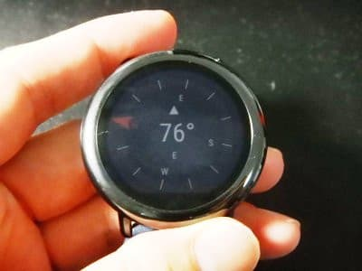
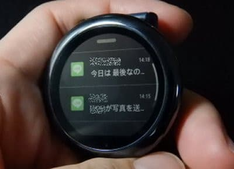

# スマートウォッチ，Amazfit PACEを買ってみた，その7…スキーログ以外の，時計本体の機能を見てみる

📅 投稿日時: 2020-05-20 07:13:21

昨日，19日（火）の志賀高原，横手山＆渋峠は，

終日雨の悪天候となり．

そのせいで，横手＆渋峠のリフトは，

終日運休だったようですね…

（[横手山スキー場ホームページ](https://yokoteyama2307.com/news/9025/)より）

うーん．

この悪天候で，結構雪が解けちゃったんじゃ

ないかな～（ちょい涙）

高天ヶ原のライブカメラを見ても，

先週までは「まだ滑れるんじゃない？」

ってほどの雪がありましたが．

今日は一気に雪が無くなってます（泣）

（[志賀高原索道協会ライブカメラページ](https://blog.goo.ne.jp/admin/editentry/?eid=a509a7c711b06640acb6477bdc2890df&sc=c2VhcmNoX3R5cGU9MCZsaW1pdD0xMDAmc29ydD1kZXNjJmNhdGVnb3J5X2lkPSZ5bWQ9JnA9MQ==)より）

まぁ，この時期なので．

雪が減っていくのは仕方がないのですが，

やっぱり寂しい…

ってなことで，本題へ．

前回は，Amazfit PACEの時計本体で

スキーログを確認する機能について，

細かく書きましたが…

まぁ，かなりいろんな機能がありましたよね．

今回は，運動記録とアクティビティログの確認以外に，

どんな機能を持っているか

書いてみます…

まずは，基本の時計画面．

この画面を左にスワイプし，

一つ右の画面にスクロール

させると…

音楽プレイヤー画面になります．

Amazfit GTRでは，スマホの音楽プレイヤーを

コントロールするだけのリモコンでしたが．

Amazfit PACEでは，本体に

音楽ファイルが保存できるので．

Bluetoothイヤホンがあれば，

この時計単体で音楽が聴けます…！

（この時計にはスピーカーが無いので，イヤホン必須）

Bluetooth接続画面で，

一度Bluetoothイヤホンを接続すると…

それ以降，Bluetoothイヤホンの電源を

入れると，接続確認されるので…

接続OKを押すと，イヤホンと接続されます．

音楽ファイルは，スマホアプリで

スマホから簡単に時計へ転送できます！

時計にコピーしたファイルは，スマホ無しで，

本体だけでプレイできますが…

全曲シャッフルと，全曲リピート，

1曲リピートしかモードが無いのが，

ちょっと惜しいところ…

あ，ボリュームは時計側から調整可能です．

ってな感じが，音楽再生画面ですが．

音楽再生画面からもう一つ右に

スクロールさせると，今度はコンパス画面．

地磁気センサーで，方位磁石がわりに使えます…

さらにもう一つ送ると，タイマー画面．

この画面をクリックすると，何分後に

バイブレータを鳴らすかをセットできて．

設定時間後にバイブレーションで知らせてくれます．

さらに右に画面をスクロールさせると…

今度は，天気予報画面．

スマホと連携していると，スマホから

この先1週間の天気予報を受け取ります．

特定の日をクリックすると，その日の詳細が

出てきますが…

あんまり詳細情報じゃないですね（笑）．

で，もう一つ右にスクロールさせると．

今度は，Data画面．

一日や一週間の運動量を見る画面です．

トップページには，その日の歩数が

表示されていて…

これをタップすると，

今日の何時にどのくらい歩いたかの

グラフが出てきて…

さらに下にスクロールさせると，

本日の歩数，心拍数のデータの他…

過去の記録を見ることができます．

例えば，この画面から5月5日の

データをタップすると…

まずは，5/5の歩数のグラフ，

下にスクロールしていくと，

この日あるいた歩数（1781歩，目標8000歩）と，

階段何段分登ったかの記録．

（この日は7階分階段を上ったらしい…），

そして一日の消費カロリー24kカロリー．

そして，何時にどのくらいカロリーを

消費したか．

さらには，何時間寝て，深い眠りが

何時間だったか…

さらにスクロールさせると，

最後にこの日の心拍数データ．

平均，最大，安静時，最低心拍数を

見ることができます…

そして．

このData画面，週ごとのデータも

見ることができて．

「今日の歩数グラフ」の画面を

右スクロールさせると，

今度は週ごとの記録確認画面に移ります．

こいつのボタンをタップすると，このように

どの週のデータを見たいかを選べて…

まずは選んだ週の何曜日に何時間

運動したかのグラフ．

さらに下にスクロールすると．

その1週間に，29656歩あるいて

目標の8000歩に達した日が2日あって．

328階分，階段を上ったことが

分かります…

さらに下にスクロールさせると，

1週間で14832kcal消費したことが分かって，

何曜日にカロリー消費したのかも

グラフ表示されてます．

そして，最後が曜日ごとの平均心拍数の

グラフと…

一週間の最高心拍数・最低心拍数が

見れます．

うーむ．

このデータだけで，かなりの情報量ですね…

で，このデータ画面から，

さらに一つ右にスクロールさせると．

Activities画面ですが…

これは，スキーモードや登山モードで

記録したデータを後から見るモードで，

前回詳しく紹介したので飛ばして．

その次に右スクロールさせると出てくるのは，

Sleep画面．

こいつは，睡眠記録を確認するモードですね…

この画面から，過去の睡眠記録を見ることが

できますが．

今日の記録をみてみると…

5時5分に寝て，10時52分に起きているという，

すごい不健全な睡眠時間が分かりますね（笑）

睡眠時間は5時間47分．

そして，深い眠りが2時間6分，

浅い眠りが3時間41分，

寝てる途中に目覚めている時間は0ですか…

さらに．

睡眠画面から，右に一つ画面を送ると…

今度は，心拍数画面．

時間を追っての心拍数グラフが見られて…

そこから下にスクロールすると，

本日の平均心拍，安息時心拍，

最大心拍，最小心拍数が確認でき…

さらに下にスクロールすると，

今日一日，心拍数がどのくらいの

エリアに入っていたかが分かります．

今日は80%は睡眠していて（起きてすぐの記録を見たので…）．

活動無しの心拍数の時間が17％，

軽い運動をしていた心拍数の時間が3％…

という事みたいです．

さらに，一週間の平均心拍数グラフも

見れます…

って，この時計，過去1週間着けてなかったので，

過去のグラフはありませんが…

まだまだ機能がありますよ～！

心拍画面から，さらに右にスクロール

させると．

次は，アラーム画面

何時何分にバイブレーターを鳴らすか，

設定できます…

アラーム画面から右にスクロールさせると，

次はLocation画面．

GPSで現在地を測定して，

緯度・経度・高度が確認できます…

さらに，Lacation画面から右にスクロールさせると，

今度は最後，ストップウォッチ画面．

…ってな感じで．

かなり盛りだくさんの機能がありますが…

まだ，機能はあります．

肝心なメッセージ確認画面．

メッセージ着信のたびにバイブレーションで，

スマホへのLINEのメッセージやメール着信，

電話の着信を知らせてくれるのですが…

Amazfit GTRだと，絵文字は「？」で表示される

ところ．

なんと，Amazfit PACEは，絵文字がちゃんと

表示されます！

すばらしいぞ，Amazfit PACE！

これだけ盛りだくさんの機能があるのに，

本体9000円でお釣りが来るって…

すごい．

かなりのコストパフォーマンスなのでは…？？

…しかし．

これだけでもすごいけど，

まだこれだけじゃ終わらない．

次回以降は，スマホ連携機能について

レポートです！
