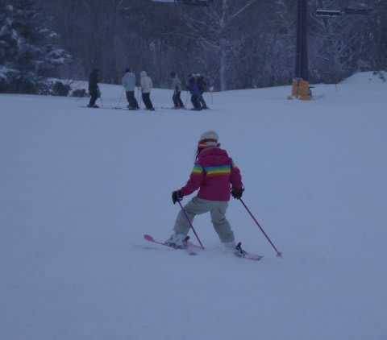
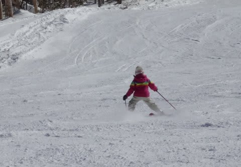
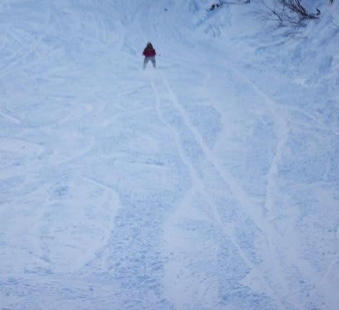
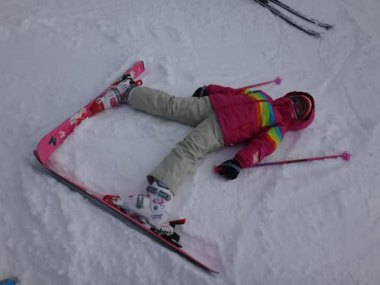
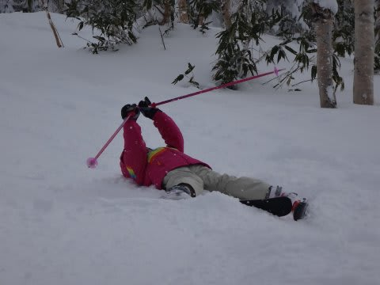
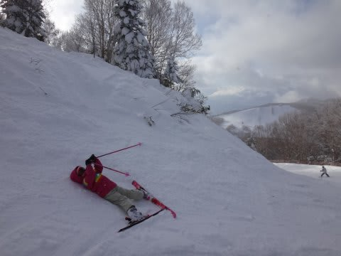

# 娘，そんな格好でくつろげるの？？

📅 投稿日時: 2014-01-29 00:07:19

えー．

わが娘．

幼稚園年長さんになり．

体力が上がったらしく．

…天気がいいと，朝から夕方まで滑り続けられるように

なってきましたね～．

去年までは，午前2時間，午後2時間も滑ると満足してたので．

それ以外はフリーで滑れたんだけど…

なんだか，娘がたくさん滑れるようになってくれるのは

いいけど．

…自分のフリーの時間が減っていくので，

うれしくもあり，うれしくもなし…

といった，微妙な感じ．

でも．

何も教えてないわりに．

なんだか．

プルークスタンスとはいえ．

異常にいいポジションで滑るようになってるんですが…

そして．

ときどき．

クローチング爆走モード．

あー．

まぁ．

うちの娘だし．

こんなもんかな，という気がするんだけど．

でも．

うちの娘．

「ちょっと休憩～」

って言ったとき．

こんなポーズで休むんですけど…

…これって，私には絶対できないポーズだけど？

私がこんなポーズとろうと思ったら，膝関節外れちゃうけどっ！？？

これが，楽なの？？？？

…子供は体が柔らかくて，いいなぁ…

## 💬 コメント一覧

### 💬 コメント by (ひろりん)
**タイトル**: Unknown
**投稿日**: 2014-02-03 11:01:47

うん、綺麗なプルークですね♪

再来年くらいには技術ｓ（ｒｙ

しかし、子供ってありえない動き（関節）しますね。

見てるほうがゾクゾクとします（爆）

### 💬 コメント by (Skier_S)
**タイトル**: ひろりんさま
**投稿日**: 2014-02-05 00:42:38

いやホントにゾクゾクしますね(笑）．

4枚目の写真とか，見てるだけで

「関節外れてない？？」

って思いますよね…

180度開脚とか平気でできちゃうので，

転んだときの怪我とか少なくてよさそう…

子供がうらやましいです．

### 💬 コメント by (KENKEN)
**タイトル**: うちも爆走モードになります。
**投稿日**: 2014-02-05 20:26:38

うちの娘も同じような事します。

本当子供の関節は柔らかくていいですね。

娘もスキー上達して初心者コースだともう楽勝です。

トライスキーも外してしまいました。

たまに爆走モードになるのでヘルメットも買いました。

今年は西日本も雪が結構降っているのですが、

週末度に雨となってスキー場に行けてません。（涙)

自分も先週末から風邪で、未だに体調悪いままです。

娘が同タイミングでインフルだったので、やばいと思ったのですが幸い普通の風邪でした。

Skier_Sさんもお大事に。

### 💬 コメント by (Skier_S)
**タイトル**: KENKENさま
**投稿日**: 2014-02-05 22:23:01

いやー．

やっぱり爆走モード＆関節ぐにゃぐにゃ系ですか…

そして，トライスキー卒業ですね！

私はもう体調は復活です．

今週末は飛び石4連休，間をうめて

3泊4日で家族で志賀に行ってます！

