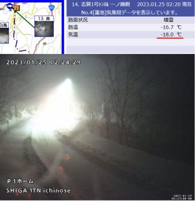
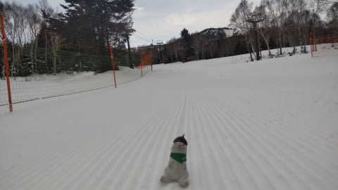
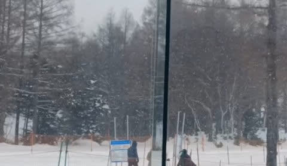

# 志賀高原に降っている雪は25日夕方には弱まって，26日は積もらないけど穏やかな天気でねらい目．27日からまた降るよ！！

📅 投稿日時: 2023-01-25 02:57:03

🏷️ カテゴリ: [日記](cc4b5682fb7b8b144980957a978653fb0.md)

えー．

物欲選手権に負けて，今シーズンGetした

新しいウェアを，年明けからデビュー

させたのですが…

スキー場では，誰かを見つける目印は

スキーウェアなので，ウェアを変えると

しばらくは誰か分からず，発見されない…

というのはよくあること．

だもんで．

私もしばらくはみんなから見つからない

だろうし．

みんなに見つけられるまで，こちらから

声をかけず隠れていよう…

と思っていたのに．

速攻で発見されたSkier_Sです

いや．

滑りを見て発見されたならまだしも．

常連メンバーには，滑る前に一瞬で発見

されて．

「ゴンドラの乗り降りの動きで分かった」

とか，謎の理由でバレたようです…

うーん．

滑りに特徴があるってならまだしも．

ゴンドラの乗り降りにそんな特徴が

あったとは…

そして，リフト係員の皆さんにも

「あ，ウェア変えたんですね」

とあっさり見破られる始末．

なぜこんなにすぐに見破られるのか…

うーん．

私は他の人がウェアを変えたら

すぐに分からないのに…

とりあえず．

これまで私に声をかけてくださった方．

私のウェアが変わってますので，ご注意

ください．

ってなことで，本題へ．

なんだか，予想通り長野もそこそこの雪に

なっているようで．

志賀も降ってますね～！！

志賀高原のライブカメラを見ると．

道路に雪が積もって，除雪が間に合って

ない様子が見れますが…

そして，気温が-18℃と，かなりの

冷え冷えですね！！

で．

25日の2時現在，以下の高速が通行止めに

なってます…

上信越道　長野IC－上越IC

中央道　諏訪IC－伊那IC

長野道　岡谷JCT－塩尻IC

明日スキーに行く方は，交通情報に注意

してください！

そして．

昨日の24日(火)の志賀高原は，

いつものおこみん特派員情報によると…

朝は，「今日ホントに雪が降るの？？」

って感じの穏やかな天気だったみたいで．

あさイチの気温も-6℃程度と，

これまでよりは暖かく．

これからの荒れ荒れ天気を全く

感じさせないスタートだったようです…

で．

日曜日から積雪が無いので，

バーンは結構締まってきたみたいですが．

それでもトップシーズンのシマシマ！

ただ，9時半ごろから曇りはじめ．

昼ごろに，雪が降り始めて…

それも，午後1時過ぎまでの1時間で

10cmくらい積もるほどの激しい降りに

なったみたいです…！！

もう．

これは，私の予想の

24日(火)：朝は西風で降りません．

　昼のどこかのタイミングで北風になり，

　それ以降ドサドサ降ります

というのが大当たりですね．

朝は西風で降らないってのを正確に

当てたのがすごい！！←自画自賛

この雪は，本日25日(水)の昼までは激しく

降るけども，夕方には弱まり，

夜には止みそうで…

志賀の26日の朝は，それほど新雪が

積もらなさそう．

うーん．26日の朝の積雪，10～15cmかなぁ…

でも，26日は曇り時々晴れで穏やかな天気なので，

ブーツ～脛パフ，コース脇は24日に積もった

太ももパフを楽しめるねらい目かも！！

で．26日の深夜か，27日の朝からまた降ります．

27日は一日積もりそうなので…

28日の土曜はやっぱりパウダーの週末に

なりそうですよ～！！！

…積雪量はまだ正確に予想できませんが…

また明日，週末の詳細天気予想やります～！！

## 💬 コメント一覧

### 💬 コメント by (副院長)
**タイトル**: Unknown
**投稿日**: 2023-01-25 08:42:10

昨日、1時までパフパフたのしんでたら、未だ、家から40キロの新名神で、9時間とまっています。よくテレビで見るやつです。自衛隊も、山崎パンもいませんけど。飲み物、お土産の食料、防寒具あり。朝からピーカンで、切迫感はないですが、よいけいけんです。

京都は終わってるので、仕事も、あまり責められそうにない様子。

4日後には、また、行くんだけど。

### 💬 コメント by (地元民)
**タイトル**: Unknown
**投稿日**: 2023-01-25 14:17:56

長野市内は14㌢。

小布施あたりまで来ると40㌢くらい。軽い雪なので、吹き溜まりは60㌢軽くこえてます。

### 💬 コメント by (Skier_S)
**タイトル**: 今週土曜も積もるよ！
**投稿日**: 2023-01-26 00:44:36

＞副院長さま

あら…新名神で9時間ですか！！！

お疲れ様です…

無事帰宅できましたでしょうか．

そしてまた4日後に志賀高原に復活ですか…

次の移動が28日土曜に移動だったらまた積雪でヤバかったけど，日曜なら大丈夫です！

＞地元民さま

小布施で40cmですか…！

長野市は南と北で全然積雪量がちがったみたいですね…

街に降ると大変なので，降るのはスキー場だけがいいんですが．

でも，これで雪が少なかったのが少しは解消されたかな…？？

