# コドモとコモド！子連れダイブクルーズ16　ブラックマンタと泳いだ日

📅 投稿日時: 2011-07-19 00:37:31

🏷️ カテゴリ: [ダイビング日記](ce3a7a8d424d112fce83ee85c81a0e344.md)

あー．

実は，今日から夏休みPart1で，沖縄に来ています．

私は台風を呼ぶ男と言われ．

行くと行くとこ，台風が追っかけてくるんですが．

今回も，沖縄行きの18日，どんぴしゃ台風が襲いそうで，

「やっぱり…」

と思ったけど．

なんとか無事，台風はそれてくれて．

予定通り，沖縄入りできました．

明日から潜りに行く予定…

何ですが．

ちょっと風邪気味…

明日ホントに潜れるかな～．

とりあえず．

コモド日記に戻ります…

--------

で．

K村さんのおかげで，お昼ごはん前に本日2度目のマンタアレイに

潜れたわけですが…

エントリー直後．

いきなりきたー！！

マンタフィーバー！！

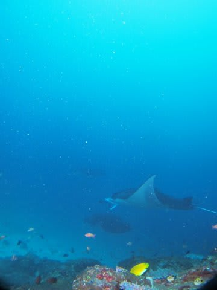

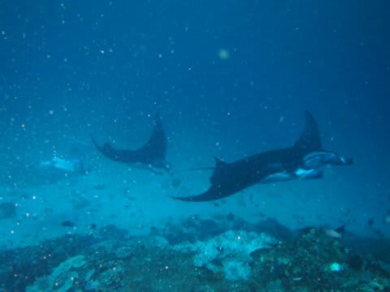

4枚のマンタが一列に連なってこっちにやってきてます…

うはー．すごい．

1本目のようにマンタが通過していくのではなく，

クリーニングポイントでクリーニングされている間，

じっとしているのを数m先で見れます．

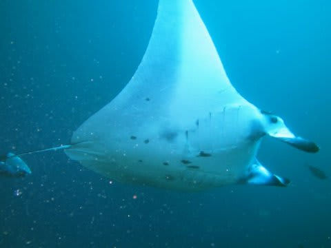

これで3m以上の大きさかなぁ．大きいですね～．

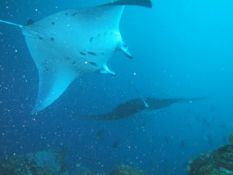

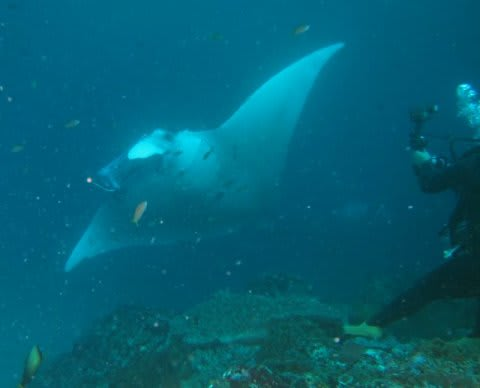

すぐ目の前を通過してくれます．

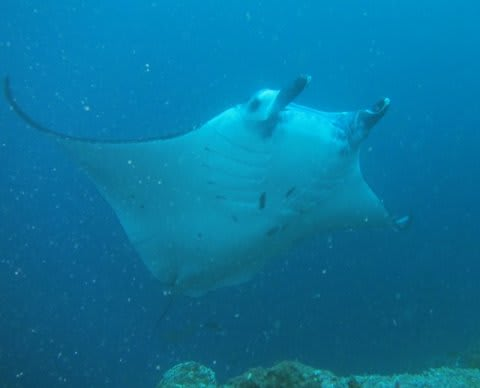

いやーー．

マンタがクリーニングされているのをはじめてじっくり見たけど…

なんと．

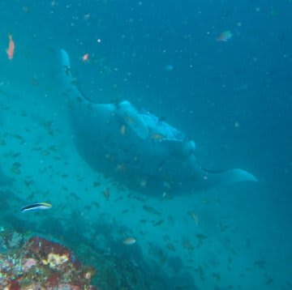

こんな感じで，ミゾレチョウチョウウオがいっぱいとりついて，

マンタをつつきまくってるんです．

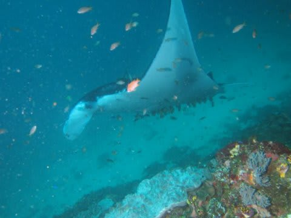

こんな大量なミゾレチョウチョウウオを引き連れてます…

…はじめて見た．こんなクリーニングシーン．

こんなのを，数mの間近で見れます．

クリーニング中は，マンタはあんまり動きません．

その場でほとんど静止です．

もう，かぶりつきです．

で，かぶりつきで見てたら…

何を思ったか，マンタがまっすぐこっちにやってくる！

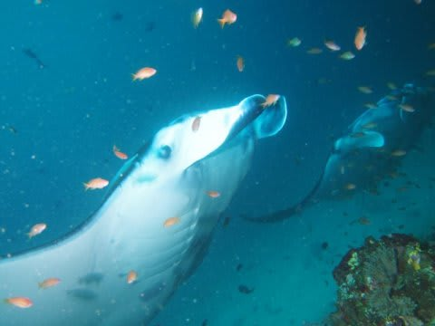

えええ！ぶつかる！！！

と，着底して低めの姿勢をとっていたのにかかわらず，さらに

低い姿勢を取ったけれども…

マンタ．ぶつかってきました．

いや．

よけたんです．

しかし．

おそらく，完全に岩に伏せてしまわないと避けられなかったでしょう…

そのくらい低空飛行されたら，避けようがありません．

その直前に撮った写真．

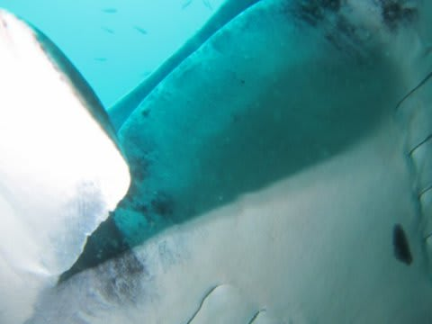

トリミングなし．

ワイコンのワイド端でこれだけのドアップの写真が，

カメラに残ってました…

（ぶつかった後に，何事も無かったように去っていくマンタ)

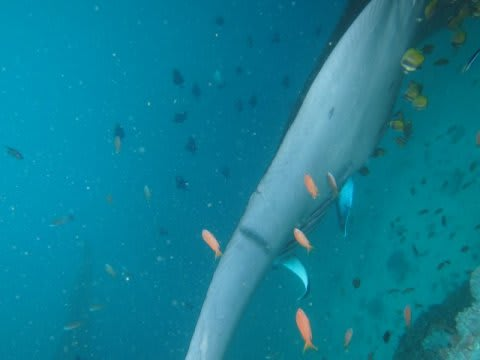

という感じで．

フレンドリー（？）なマンタたちもいなくなった最後に，

ガイドのK村さんが岩場に沿って移動し始めました．

私一人，グループの上のほう，岩場に近いところを泳いでいたのですが…

なんか，

来た．

私より浅いところ，左手．

完全に平行に泳ぐ形で．来た．

ヤツが，寄ってきた．

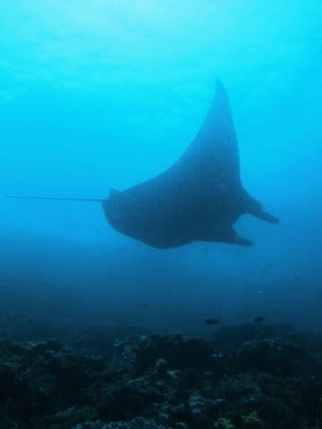

ブラックだ～！！！

私はマンタを呼び寄せるパワーがあるのか？？？

他のみんなは気づいてないようだ．

この位置は…

完全にブラックのおなかがいっぱいに写るポジションへ

移動できる！！！

「影で真っ黒なんじゃない？」

って言う写真じゃなく，すぐそばからフラッシュを当てて，

ちゃんとおなかが真っ黒に写ったブラックマンタの写真を撮る！！！！

というのが今回のクルーズの宿題の一つ．

この宿題が，間違いなく果たせるポジションだっ！

ばしゃ，ばしゃと連写．

ポジションはバッチリ．

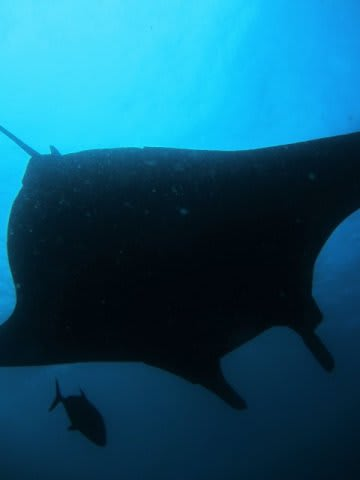

…でも．

あれ？？

フラッシュが光ってない？？？？

思わずフラッシュを確認すると…

で，で，電池切れっ！

今朝，電池かえたばっかりなのに…

あれかっ！

1本目終了後，フラッシュの電源を切り忘れていたんだった！

で，2本目の直前に気づいたけど，普段なら3日は電池交換せずに

問題なくつかえるし，大丈夫だろうと思っていたけど…

おそらく．

1本目終了後，しばらく，ターゲットライトがつきっぱなしだったんでしょう…

ががっがっががががーーーーーん．

人生，おそらくこれから．

ブラックマンタに，これだけの絶好ポジションで．

1分以上平行して泳ぎ続ける機会があるだろうか？？？？

あああああああーーーーーーーーーーー．

なんで～！！！

なんでこんなときに限って，フラッシュ電源切り忘れるかな～！！！！！

ショック～～～!!!!！！！！！！！！！！！！！！！

1分ほど，たっぷりと長時間マンタと平行で泳ぐという珍しい体験の後．

ブラックマンタちゃんは加速して，我々を置いてきぼりに

していきました…

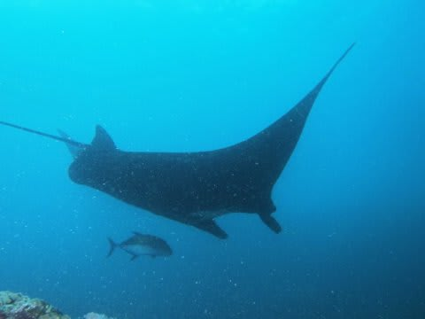

ぐやじい～～～っ！！！！！！

あああああ．この悔しさ．

筆舌に尽くし難い．

エグジット後．

これから，ダイビング後はフラッシュのスイッチを「絶対に切る」と

心に強く誓ったのだった…
