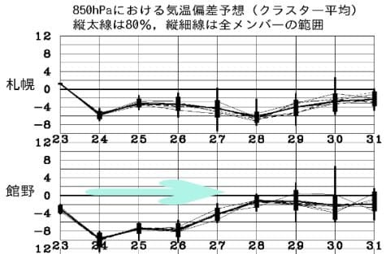
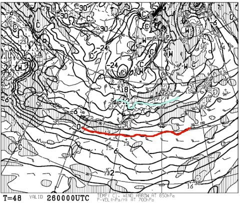
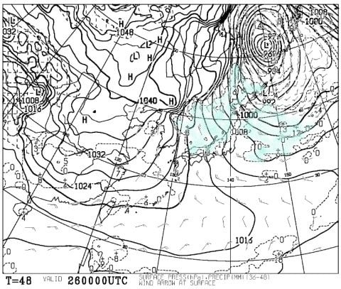
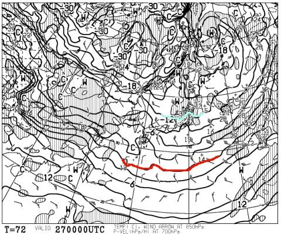
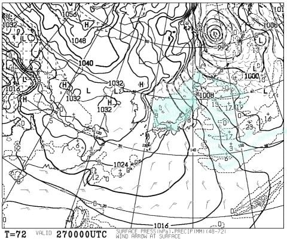
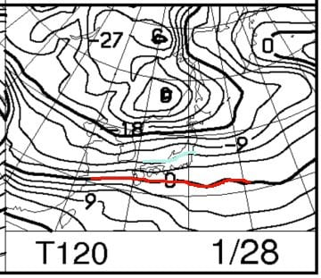
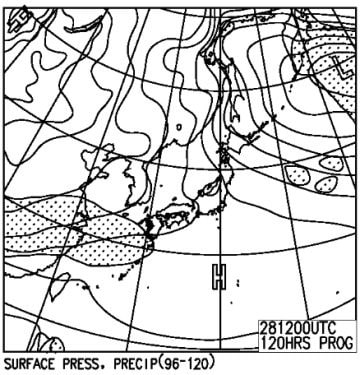

# 1月27，28日の週末の志賀高原スキー場の天気は…土曜は雪降り，日曜は曇り時々雪が降る感じか…

📅 投稿日時: 2018-01-25 01:02:04

ということで．

志賀高原も24日の本日，そこそこ雪が積もったようで…

でも．

まだ明日も積もりますよ～！

硬かったゲレンデコンディションも，

これで回復ですね…

…なんてったって．

見てくださいよ，この24日から27日の冷えっぷりっ！！

24日なんて，平年比-10℃まで冷えてますよ！

いやーー．

この1月，気温が上がって雨が降ったかと思ったら．

また極端に冷えたもんだ…

ってなわけで．

水曜夜定番の，今週末の天気予想をするわけですが．

まず，金曜26日の850hpa気温を見てみると．

天気図を見てみると．

うは．

赤くマークした0℃線は沖縄近辺まで下がっちゃってるし．

志賀高原は水色の-12℃線が掛かってますよ！

これは…志賀高原は朝は-15度くらいに冷える，

冷え冷えデーですね．

そして，金曜の地上天気図は…

うわ．

水色の降水域が日本海をすっぽり

覆ってます…

専門的には，日本海の寒気の吹き出しの雲の

「離岸距離が小さい」と言いますが…

普通ならもう少し大陸から離れたところから

降水域が始まるけど．

こんな大陸のそばからもう寒気の雲が

出ているとなると…

…これは，すごい積もりそう．

で．

肝心の土曜，27日の850hpa気温ですが．

うおぉ！！

赤い0℃線は沖縄より南に行っちゃってますよ…！

そして，水色の-12℃線が志賀高原にかかってます．

これは…沖縄でも雪が降りかねないほどの

強烈な寒気だし．

土曜の朝の志賀高原，また-15℃まで冷え込みそう…

そして，土曜の地上天気図は．

うはー．

この日も日本海がほぼ雪雲で覆い尽くされている感じ…

この日も，26日ほどではないと言え．

降りそうです…

で．

日曜の850hpa気温図を見てみると．

…この日は土曜ほどは冷えなさそうですね．

志賀高原にかかっている水色の線は，-6℃．

まぁ平年並みでしょうか…

朝の志賀高原は，-8～9℃程度ですかね．

そして，日曜の地上天気図は…

うむ．

弱い冬型が残りそう．

だもんで…

概ね曇り．

雪がぱらつく感じかな．

ということで．

まとめると．

土曜：終日雪降り．軽く吹雪気味の一日．

　朝の気温は-15度クラスの激冷え！

　…朝イチは脛パフくらいの積雪かな？

　昼間もうっすらゲレンデに雪がかぶるくらいの

　雪降りか…

　気温は，昼間も-10℃くらいまでしか上がらない

　冷え冷えデー！

　午後は柔らかい雪が蹴散らされた，

　凸凹気味バーンになりそうかな…

日曜：曇り，時折雪がぱらつく一日．

　朝の気温は-8～9℃と，土曜よりは気温が上がるけど

　寒い一日．昼間も-5℃程度までしか上がらず．

　朝イチは圧雪バーンは柔らかいシマシマ圧雪の

　上にうっすら新雪かな…

　非圧雪のところは…ブーツパフくらいの積雪が

　あるかな．

　午後になると雪は弱くなり…

　運が良ければ，夕方は日も射すかも．

　この日も雪が柔らかいので，土曜ほどでは

　ないにしろ，午後は急斜面にコブが出てくるか…

ってな感じで．

先週悩まされたアイスバーンは，もうほぼ完全に

隠れちゃって．

今週末は，志賀高原らしい軽い最高雪質に恵まれるかな！

## 💬 コメント一覧

### 💬 コメント by (おぶせ)
**タイトル**: 1/25 志賀状況
**投稿日**: 2018-01-25 20:28:57

全般に曇りでしたが、時折薄日が差し込む天気でした。昨晩の降雪30-50cm ぐらいあったかと思われます。風は山頂でやや強め。第１ゴンドラ11時、山頂温度計-17℃でした。一ノ瀬12時、上部は風強く、雪飛ばされ少々固いバーンでした。下部とダイヤモンドは修学旅行さんだらけ。第2ゴンドラ15時、山頂温度計-12℃でした。

焼額は雪質良く、人少なく、気持ち良かったです。小生、相応ヘタっぴーですが、志賀ならではの新雪も楽しめました。

現在20時、焼額の宿泊先から一ノ瀬の灯りが、ハッキリ確認できます。この週末は、仰せの通りまずまずのコンディションかと思います。

### 💬 コメント by (かず)
**タイトル**: Unknown
**投稿日**: 2018-01-25 20:32:09

無理矢理明日休みにしました　低温WAXも仕込みましたよ　板走ってくれるといいですが　また報告します

### 💬 コメント by (Skier_S)
**タイトル**: コメント遅れました…（涙）
**投稿日**: 2018-01-26 23:10:17

＞おぶせさま

25日は，かなりのディープパウダーを楽しめたのですね…

うらやましいです．

明日からの週末，いいコンディション楽しみです！

また志賀高原にお越しの際は，ぜひお会いしましょう…！

静岡県民の皆さんが出迎えてくれますよ（笑）

＞かずさま

金曜は…意外と積もってなかったのではないでしょうか．

風が完全に西風に回ってしまったので…

せいぜい20～30cmくらいでしょうか．

土曜もおそらくその程度の積雪っぽいです．

では，また週末お会いしましょう！

