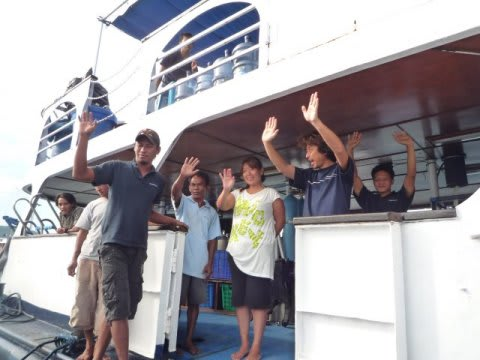

# コドモとコモド！子連れダイブクルーズ29　そして，下船．

📅 投稿日時: 2011-08-02 00:50:19

ついに…

ついにやってきてしまった下船日．

ああー．この日が来なければ…

といつも思うんですが．

かといって，ボートスタッフとしてこの船に残るのもいやなので，

日本へ帰らねば．

今日の飛行機は，朝8時半過ぎ発という早い出発なので，

6時半朝食の7時下船です．

昨日は3時近くまで飲んでいたというのに，6時起きで器材を

片付けます…

最後の朝食のあとは…

下船です．

毎度まいど，寂しい瞬間ですね～

さよなら～！！

しまじ！

娘も無事，5日間過ごせたよ．

ありがとう～！！

空港まで見送りにきてくれた，K村さんとお別れして…

8時過ぎに飛行機に乗り込みます．

娘は機内で配られたお菓子をばくばく食ってました．

もう飛行機に慣れたのか，寝てなくてもおとなしく

乗ってくれるようになって来ましたね～

午前10時前，1時間ほどでバリのデンパサール空港へ．

今日の帰りの飛行機は深夜23時55分．

ということで，夜の飛行機まで，なんとか時間をつぶさないと

いけないので…

今日も車をチャーターしてお出かけすることに．

（続く)
