# 2024年8月，5度目の子連れモアルボアル，コロナ後初の海外へ！その4…モアルボアルで愛用のCabanaホテル，全く変わっちゃった…

📅 投稿日時: 2024-10-09 01:41:37

🏷️ カテゴリ: [ダイビング日記](ce3a7a8d424d112fce83ee85c81a0e344.md)

え？

今週末も3連休？

今年後半，3連休多くない？

また11月にも2回，3連休あるよね…

しかし．

これならいっそ，毎週3連休にならないかな？

仕事4日やったら，週末は必ず3連休…

…いや．ちょっと待て．

どうせ週休3日なら，土日休みで，週の

真ん中の水曜も休みってのが，月曜の

絶望感がなくていいのかも…？？？

うーん．

もし週休3日なら，3連休派と，週の真ん中

休む派と，どっちが多いのかな…？？

しかし．

9月の3連休2連発はほとんど家から出ず

仕事漬けだった自分には，3連休もへったくれも

関係ないですが（涙）

ってなことで，本題へ．

今日もモアルボアルダイビング旅行記です～！

ーーー

（[前回はこちら](ed4e531d8311ac81bdcfdaf9aaa677e24.md)）

ということで．

夜10時過ぎにやっとホテルに到着しましたが…

今回利用したのは，いつものCABANAホテル．

部屋自体はいつもと変わらず．

最大3人で泊まれる部屋ですが，

ベッドはセミダブル2台で，3人で

泊まるときは一つのベッドをダブルベッド

として使うことになります…

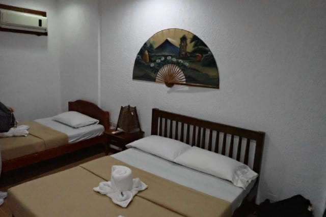

バスルームはこんな感じで，バスタブはなく

シャワーのみです．

5年ぶりなので，バスルームが改装されて

新しくなってたりしないかな…と思ったけど

全く変わらず，シャワーも簡易湯沸かし器で，

湯温が安定しないのは，これまで通り．

アメニティは固形石鹸のみで，

タオル・バスタオルが準備されてます．

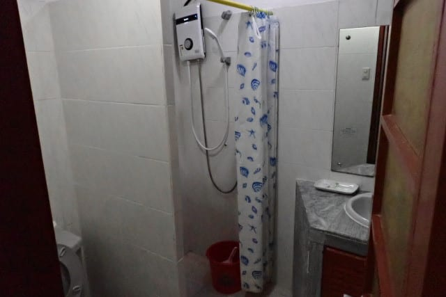

トイレは水洗ですが…

紙は詰まりやすいので，ゴミ箱に捨てる

タイプ．

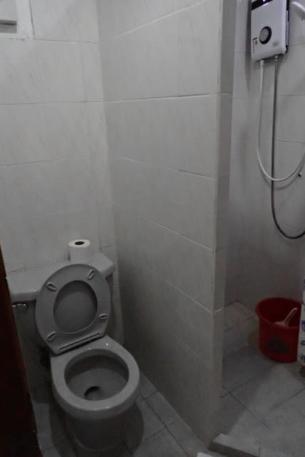

部屋には，湯沸かし器とインスタントコーヒー，

一人ペットボトル1本の水が毎日ついてます．

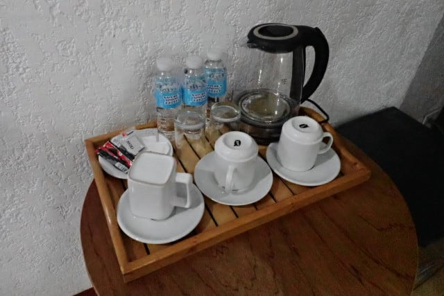

あとはこの写真の手前の黒い箱が冷蔵庫で，

壁の上の方に壁掛けのテレビがあり，

エアコンもついてます．

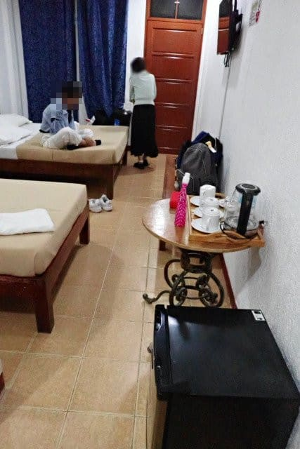

ハンガーがかけられるスペースと

棚がありますが…

セーフティーボックスはないので，

貴重品は自分で管理するか，フロントに

預ける形になります．

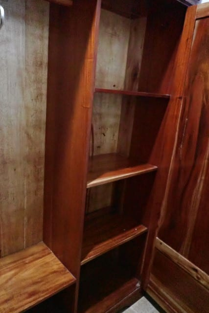

ってなことで．

部屋に入るといつも通りだったこのホテル．

あぁ…5年ぶりに帰ってきた…

という安心感がありつつも．

なんだか，到着時に違和感を感じていて…

その違和感が何かわからないまま，

明日のダイビング用の荷物を準備し，

カメラを組み立てたら，

深夜1時近くなので，ぐっすり眠りについたの

でした…

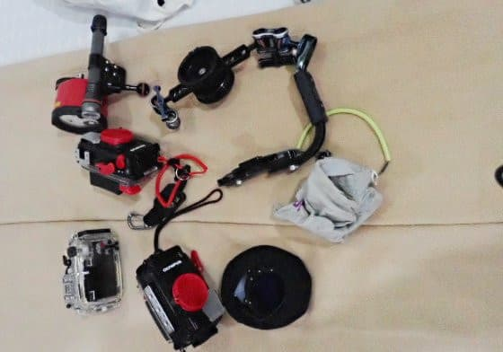

…そして，翌日の朝．

このホテルは朝食付きで申し込んでいて，

朝7時から朝食なので，

朝食へ向かうため，部屋の外に出ると…

昨日の到着時に感じた違和感の理由が

分かったのでした…！！！

部屋の中は全く変わってなかったけど．

部屋の外が全く変わっている…！！

昨日の夜の到着時は暗くてよくわからなかった

けど，日が昇って見てみると．

「これ，今までと同じホテルか？」

と一瞬思ってしまうほど，目の前の

景色が変わってました…！

いや．自分たちの部屋は，海に面した部屋で．

これまでは，海に面した部屋からは，目の前に

こんな感じでビーチチェアが並び，

その向こうに海に突き出た黄色い水上デッキが

あったのに…

（2019年の写真）

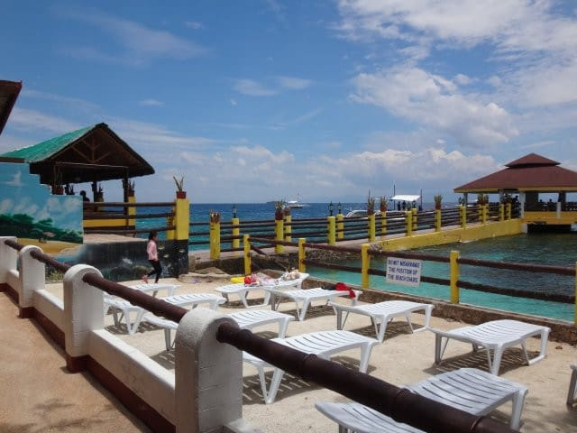

うぎゃーーーー！！！

なんてこった！

CABANAのシンボルだった，黄色い水上デッキがない！！

それどころか，ビーチチェアがあったスペースも

消え去り，痩せた砂浜になってる！！

とても上の写真と同じ場所から撮った写真と

思えない！！

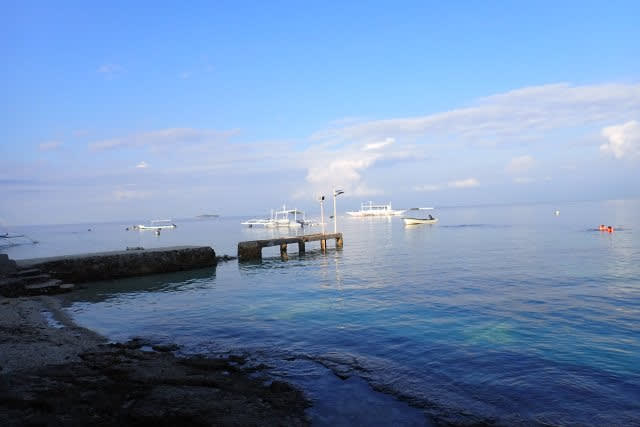

いや，部屋の目の前からこんな景色がみえて

いたのに…

（2019年の写真）

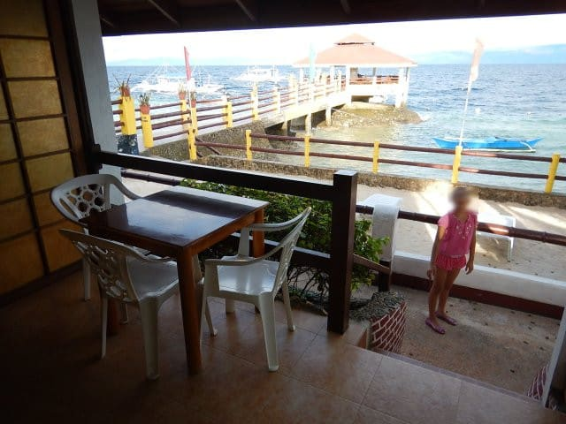

今は同じアングルで写真を撮るとこんな感じで…

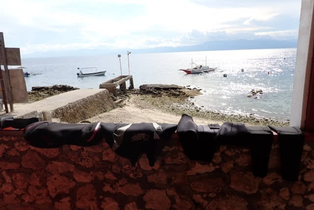

そして，泊まった部屋を前から見ると．

以前はこんな感じで，目の前の砂地に

向かって降りられる，おしゃれな階段の

上にデッキがある感じだったのに…

（2019年の写真）

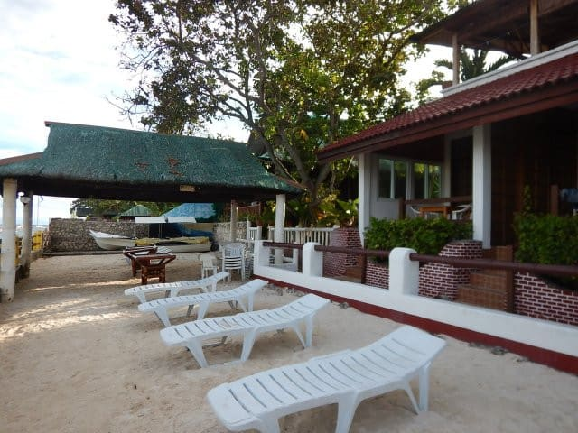

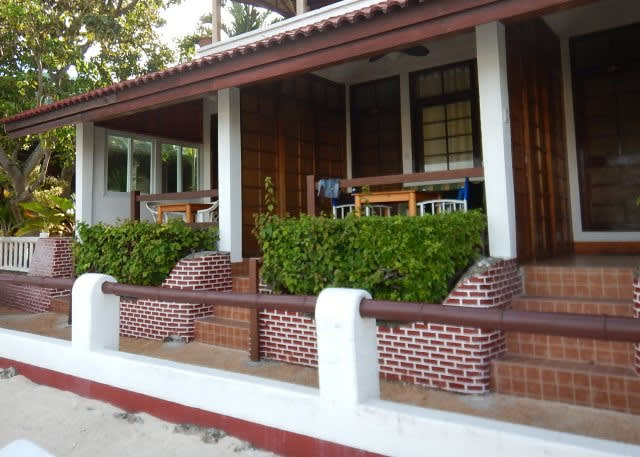

今は部屋の目の前は，殺風景な石垣で

仕切られていて，外から見ると

こんな感じの壁になっていて．

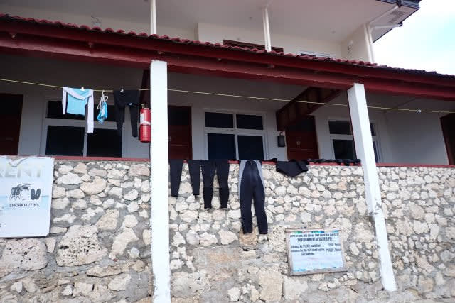

目の前の海から見ると，こんな高い石垣の上に

自分たちの部屋がある形になってます…

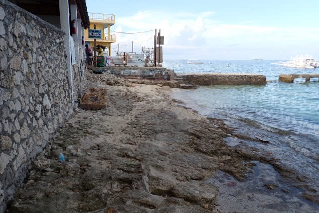

ぐはぁ…！

変わった…

変わったよ！！

あまりにも変わりすぎている…

ビーチフロントという部屋だけど…

あんまりビーチフロント感がない…（ちょい涙）

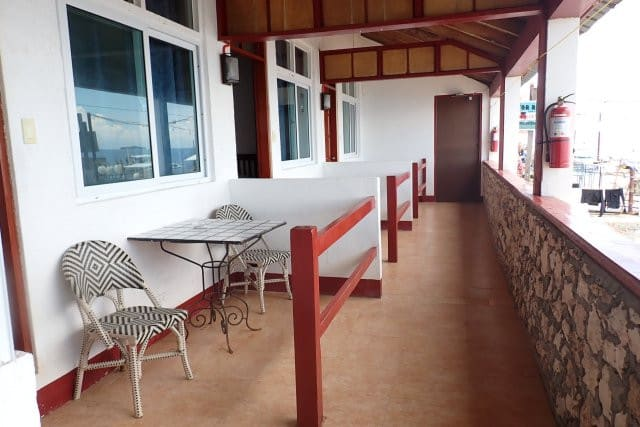

この，あまりにもシンボリックだった

水上デッキと…

（2019年の写真）

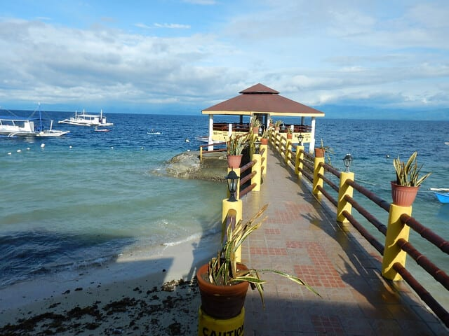

ビーチフロントの部屋の前の，

このリゾート感がなくなったのは，惜しすぎる…（泣）

（2019年の写真）

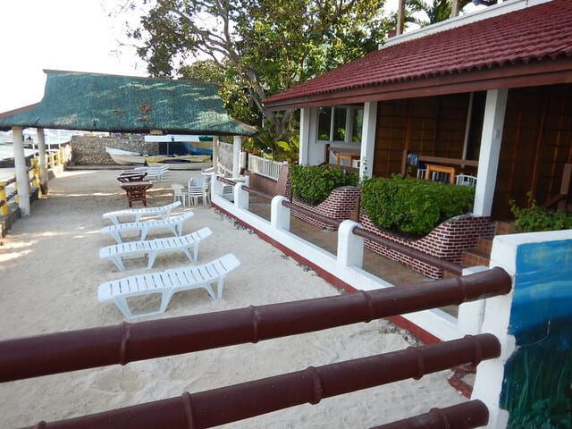

しかし．

CABANAホテル．

変わったのはこれだけじゃなかったのだ…！（涙）

（上の写真と同じ場所とはとても思えない…）

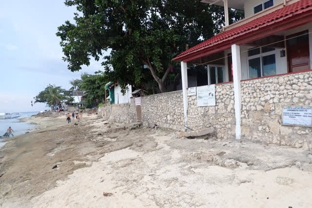

（[続く](e76e32de38e28de6d6ae036f9faa218b8.md)）

## 💬 コメント一覧

### 💬 コメント by (新米パパ)
**タイトル**: Unknown
**投稿日**: 2024-10-09 09:50:15

セブついて市内に泊まるのかと思いきや、直でモアルボアルなんですね！さすがです。

モルジブやら、メキシコのコスメルとかまで行きましたが、正直、パラオ、慶良間、石垣にS様オススメのモアルボアルあれば、他いく必要ないですね。コスパもタイパも。

パラオもちよいちよい、チャーター便企画復活してますねー。

ダイビング記事、楽しみにしてます！

### 💬 コメント by (Skier_S)
**タイトル**: ＞新米パパさま
**投稿日**: 2024-10-10 02:14:26

セブ市内に泊まっちゃうと，翌日モアルボアルで潜るのが遅くなっちゃうので…

ダイビング的には，その日のうちにモアルボアル行きがベストです！

そして，パラオチャーターも復活しましたか…

私としては，パラオもいいけどモルジブダイブクルーズもまた行きたいなぁ…と思ってます．

コモドも良かったですよ！

